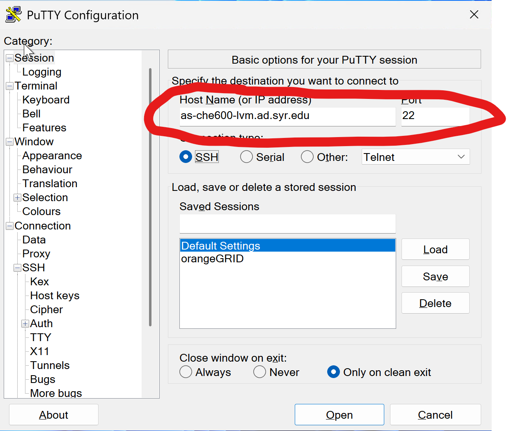
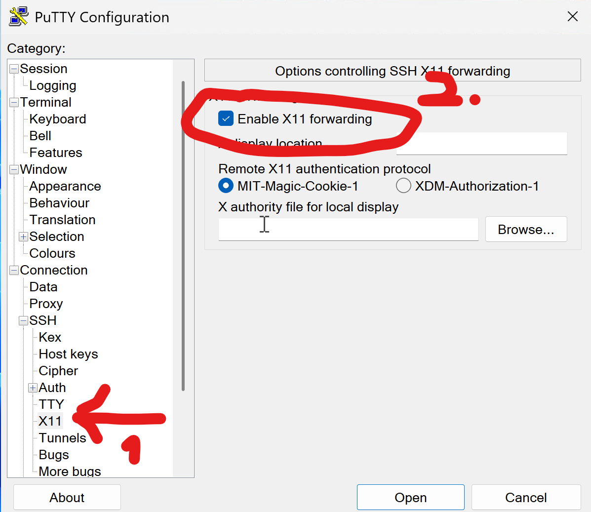
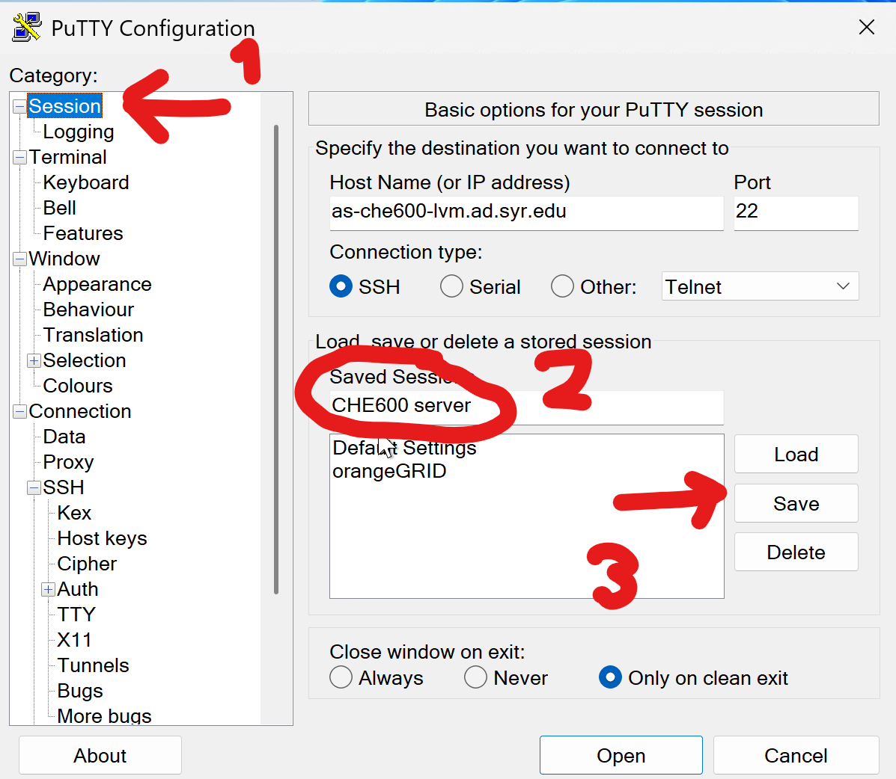
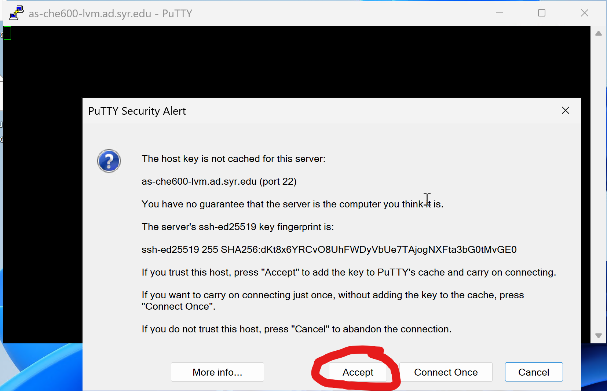

# CHEM260 F23 Class 1

## WELCOME!

What we’ll cover today: Introduction, syllabus, and mutual expectations

## **I. Introduction – about me**

My name is Shahar Sukenik (please address me as Shahar). I started as faculty at UC Merced in 2018, and moved to Syracuse University in 2024. My lab is part of the Chemistry department. We use simulations, in vitro experiments and live cell microscopy to study how the cellular environment regulates protein function.

I have learned how to code out of necessity - the need for rapid data analysis, dealing with large datasets, and testing my hypotheses using simulations prompted me to learn how to code. I hope to provide anyone taking this class with the basic tools and concepts needed for their own research. Learning to code can be transformative not just in the way you analyze and understand your data, but also in the way you think about and plan out your research project. My hope is that by the end of this course you will be able to beautifully present your data, analyze and fit it, and come up with models to explain why your data looks the way it does.

Please keep in mind that this course is always a work in progress, and some parts may not work as well or be as clear as others. I would like to hear your comments, questions, and suggestions at any point in the course!

You can contact me any time via email: [ssukenik@syr.edu](mailto:ssukenik@syr.edu). Be sure to include CHEM260 in the email subject! Since my lab is on campus, I meet students before or after class. Best to coordinate this with me via email.

## **II. Course logistics (**grade weighting for each activity given in posted policies**)**

1. **Attendance is mandatory**. You can’t pass the course if you miss more than 3 classes (and don’t do the makeup assignments).
2. Class **assignments must be completed the same week.** The classes are designed in a way that lets you work independently and finish the tasks within a week. Some students may finish them in class, others will need to spend some time at home to get it done.
3. **All students must complete and present a project by the end of the course**
4. Lots of reference materials will be posted to CatCourses.
5. Tons of relevant resources online, including entire courses and textbooks at no cost (e.g. coursera.org, edx.org, codeacademy.com, codeschool.com)
6. I’m available all semester to help with this course—**be sure to seek help as soon as you feel lost.** I can help with homework assignments only after you’ve tried to write some code and do not wait until the last minute.
7. Note that there are many different sets of tools and ways to solve the problems we’ll discuss, but during this class be sure to use the tools we’re covering
8. All policies are written explicitly in the [course policy document](https://github.com/sukeniklab/CHE600/blob/main/Class%2001%20-%20intro/CHE600_S25_Policy.pdf)

## **III. Introduction – about the course**

1. This course will teach you how to use a set of tools. Much like learning to play an instrument or how to use a piece of hardware, you need to learn by doing. The course moves rapidly, and shifts between different programs and coding environments. Be sure to keep up!
    1. The course is designed to help you with your research!
    2. These are excellent job skills
    3. These skills give you access to the real power and versatility of your data
2. Scope & level: This course is **meant for students with little or no experience with programming** for scientific applications. If you are above this level, you might want to consider a more specialized programming course. If you already know well a topic we’re covering, let me know and I can try to provide some more advanced materials for you.
3. There are different tools we’ll cover in this class, but we will only learn the basics of how to use them. If you think of something that may be useful to you but isn’t covered – ask!
4. Coding is a language, and just like any language it takes practice and time to become fluent. **Be patient!** Everything we will learn has a learning curve. Approach the tasks with an open mind, and again if you feel completely stuck reach out to me or to other students.
5. We will use a lot of command-line interfaces (i.e. no mouse or trackpad)
    1. Means that you type commands at a “prompt”
    2. Why is this good?
        1. Scripting & programming—once you touch a mouse or click a button you’ve lost (most) programmability
        2. Simplifies using remote computers, especially “queued” systems
6. Computers come in different flavors.
    1. Linux—an open source operating system
    2. Large set of open source tools (editors, programming languages, etc.)
    3. **Note:** For most users, Linux is not a satisfactory replacement for also having a Windows or Mac system for music, video, games, (standardized) document preparation, etc.
    4. **You can use any computer and OS you would like in this course.** Keep in mind that there may be some compatibility issues. All students in the course will also get a login to a linux server that is hosted on campus.

## **IV. Syllabus**

1. The syllabus is designed to cover the following:
    1. Linux command line basics – with the goal of performing quick and efficient manipulation of text-based data (like the one that comes out of the measurements you take!)
    2. Python basics – with the goal of plotting and fitting data
    3. Algorithms for scientific computing – with the goal of giving you some ideas of how to come up with a model for your data
2. The sullabus is likely to change based on how quickly we proceed through the materials, and your own interests. An updated version of the syllabus can always be found on CatCourses.

## **V. Logging in to the course server:**

1. The course has a dedicated server (a.k.a Virtual Machine or <b>VM</b>) managed by IT. To log in, you will need to use either:
    1. the Remote Desktop Server (RDS) (see details [here](https://su-jsm.atlassian.net/wiki/spaces/ITHELP/pages/159941534/Remote+Desktop+Services+RDS))
    2. A computer in the computer room
    3. Another computer managed by SU IT
2. Connecting to VM using the RDS:
    1. Open the start menu and type in "putty" - you can pin the app to your start bar
    2. In the first ("Session") window, insert the VM's ip address: as-che600-lvm.ad.syr.edu 
    
    3. Next, go to the "X11 option in the option tree, and mark "Enable X11 Forwarding". This will allow Putty to transmit graphics 
    
    4. Finally, go back to the "Session" window. Type "CHE600" in the "Saved Sessions" textbox, and hit "Save" 
    
    5. Now, double click the CHE600 session, and a window will open up 
    
    6. You should be able to log in using your SUID and password!
3. If you are using a manged computer running OS/X or Linux you can use your own shell and connect directly with: 
    '''bash
    ssh as-che600-lvm.ad.syr.edu
    '''
