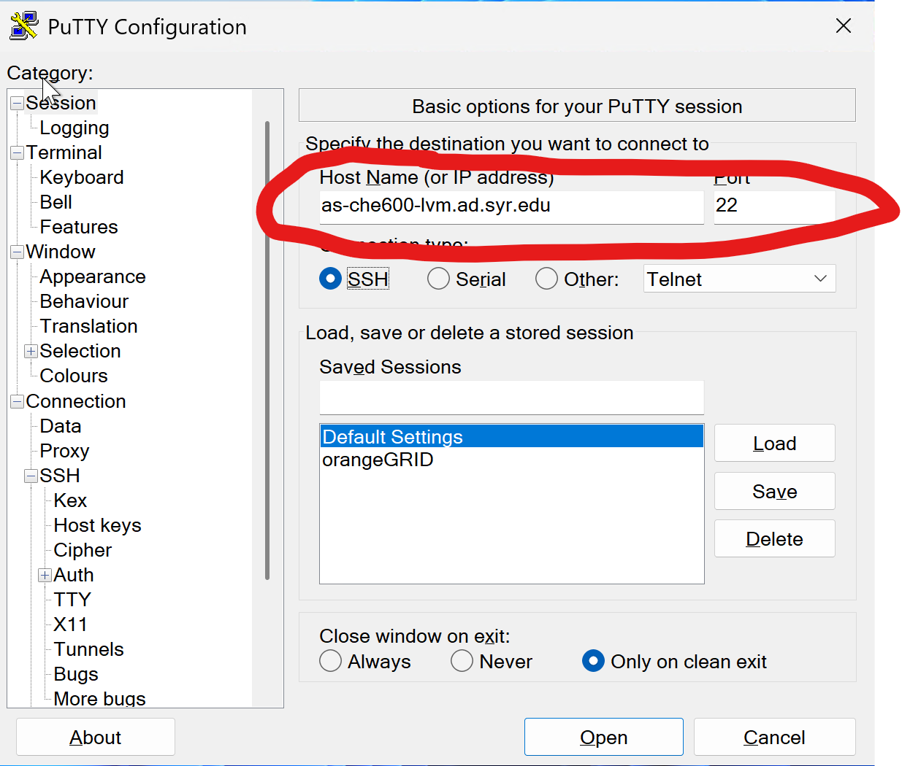
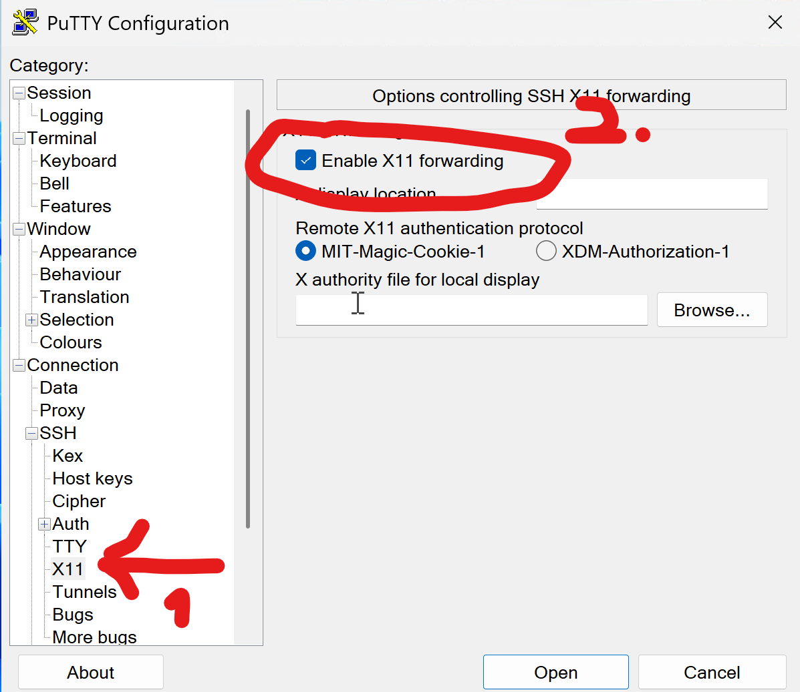
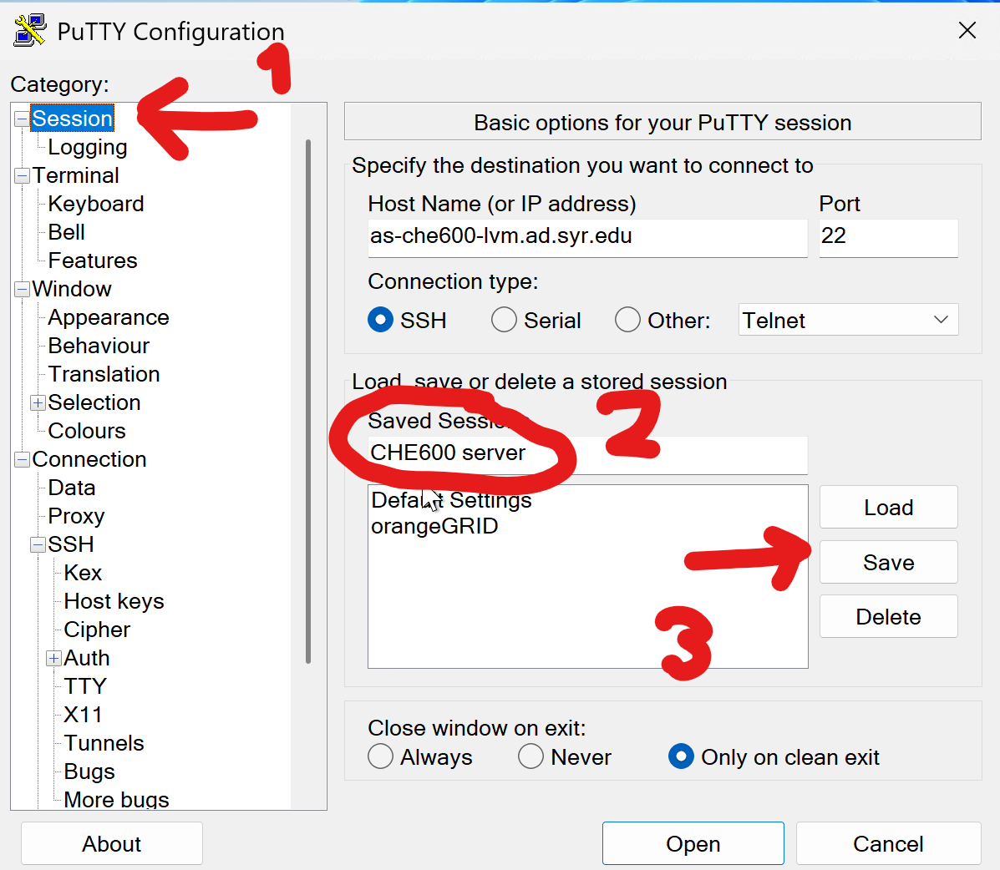
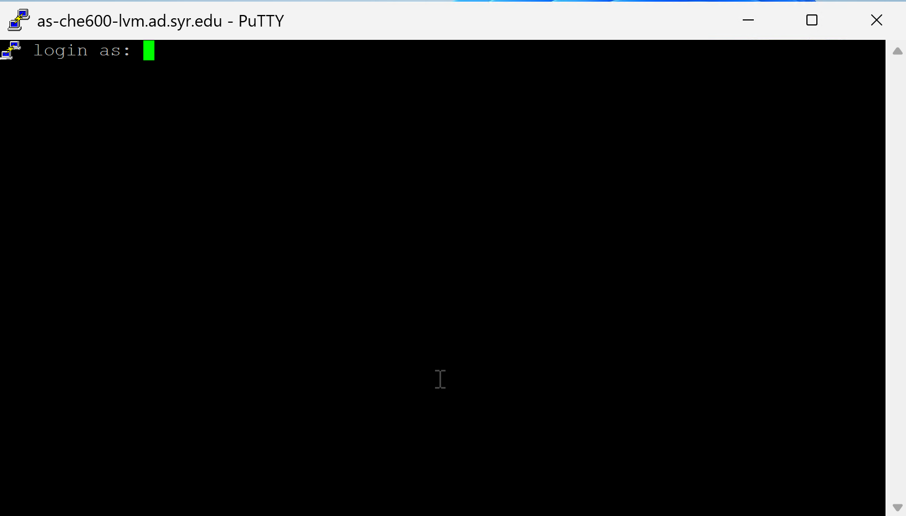
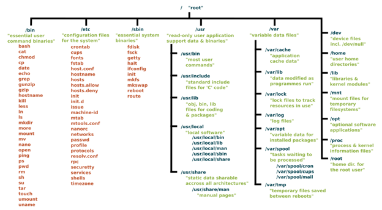
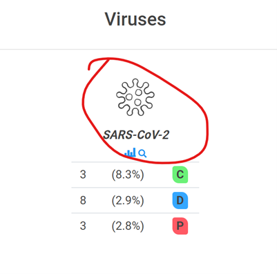

# CHEM260 F23 Class 2

What we’ll cover today: 
* [resources](#resources) you should you use during this course
* [logging in](#logging-in) to the remote server
* [first taste](#first-taste-of-linux) of linux command line


# **Resources**

## **I. Google searches**
Googling how to write code is easy and convenient. Google now integrates results from it's LLM Gemini into the search, so that is also helpful (see below).
1. A useful thing to google is the syntax of linux commands or python functions. To do this, simply write the function name (with the language if there's multiple hits). [Example](https://www.google.com/search?q=echo+linux)  for the linux echo command
2. Another useful thing to look up are errors. For this, you will want to search the error in quotes. Sometimes (especially in python), error messages can be very long, and it will take some skill to identify the cause, which you can then google. We will go over this.
3. Identifying how to fix errors is probably one of the most useful things to google. In general it will bring you to a website that details questions from other coders, like [Stack Overflow](https://stackoverflow.com). It is worthwhile going over the structure of this website to understand where to look for the answer. See example [here](https://stackoverflow.com/questions/38835483/confusion-about-pandas-copy-of-slice-of-dataframe-warning)
4. Googling specific tasks (e.g. plugging in a homework assignment to the google search bar) is generally very ineffective. LLMs are much better for open ended questions.

## **II. LLMs**
In the past two years LLMs have entered every aspect of our life. Coding is no exception - programming itself is a language like any other, and with countless examples on line, this is one of the best uses of LLMS.
1. Since LLMs like [Claude](https://claude.ai/new) or [chatGPT](https://chatgpt.com/) have a conversation history, it makes sense to keep your coding conversation in the same window. It will remember past code, libraries you used, and variables.
2. Make sure you specify what language you want your code in! (bash/python/something else)
3. When asking an LLM for a bit of code, it's important to break the task down into smaller bits. Think of each coding task as a function, explain what the input is (including syntax) and what you want the output to be (including syntax).
4. Once you get a bit of code from the LLM, try running it. If any errors are thrown, you can report these to the LLM in the same conversation, and it will try to debug it.
5. Finally, make sure you can test that the code works the way you want it. In many cases, you will be able to run "sanity checks" to see if things work as they should.
6. For complicated tasks, or when you use uncommon libraries or commands, LLMs may not be able to help. Even when that's the case, they will try to, by making up code that won't work as intended or using commands that don't actually exist in the code.

## **IV. Text books/online documents**
* There are a few good online textbooks for [bash](https://books.goalkicker.com/BashBook/) and [python](https://pythonbooks.org/free-books/) that are available as free pdf's.
* There are good books printed on dead trees - but I'm not sure you need to use those. If you really want to have a hard copy, O'Reilly books are highly recommended.

# **Logging in**
1. Our first task is to log in to the CHE600 server. This has been an issue on Tuesday, but should have been sorted out!
2. The dedicated server (a.k.a Virtual Machine or <b>VM</b>) is managed by IT. Unfortunately, because of security concerns, you cannot log into it from anywhere. 
3. To log in, you will need to use either:
    * [the Remote Desktop Server](#i-remote-desktop-server) (RDS, see below)
    * [A computer in the computer room](#ii-a-computer-in-the-computer-room)
    * Another computer managed by SU IT (see me for details)


## **I. Remote desktop server**
1. SU provides all faculty and staff with a "remote desktop" - a windows computer that is housed on a server and to which you can log in to from anywhere using your netid.
2. You can log in through a [remote desktop web server](http://rds.syr.edu), or through a [dedicated app](https://su-jsm.atlassian.net/wiki/spaces/ITHELP/pages/159941283/Connecting+to+RDS+using+the+Windows+App) that will run on your computer (available for Mac or Windows)
3. Use your netid and password to log in
4. The server should have a program called "Putty" that will let you connect to the server (see item III)
5. If Putty can't be located, please come see me.

## **II. A computer in the computer room**
1. The lab takes place in LSC 215 which is a computer class
2. You can log in to any of the computers using your netid and password - this will log you on to your remote desktop
3. It doesn't matter whcih computer you use - the desktop is associated with your account!

## **III. Connecting to CHE600 server (aka virtual machine, VM):**
1. Once you are on one of these "IT-managed" computers, you will need to connect to the VM. To do this, we use a protocol called ssh (acronym for "secure shell"). This is a network protocol that allows secured communication between two computers.
2. While there are many ssh commands, I recommend you use a software called [Putty](https://www.putty.org/) to connect to the VM. All remote desktops and classroom computers should have Putty installed. If not - please let me know!
3. Open the start menu and type in "putty" - this will search for the [putty app]. you can pin the app to your start bar
4. In the first "Session" window, insert the VM's ip address: as-che600-lvm.ad.syr.edu <br>
5. Next, expand to the "SSH" option in the option tree, then to "X11", then on the righthand side mark "Enable X11 Forwarding". This will allow Putty to transmit graphics<br>
6. Finally, go back to the "Session" window. Type "CHE600" in the "Saved Sessions" textbox, and hit "Save"<br>
7. Now, double click the CHE600 session, and a window will open up<br>
8. You should be able to log in using your **netid** and password!<br>

# **First taste of linux**

## **I. The linux philosophy **

1. Commands do just one thing, but do it well
2. Commands can be stringed together to perform powerful operations
3. Commands are meant to be run with all parameters provided. In this way, commands never wait for user input.

## **II. The linux file and directory system**

1. In any operating system (OSX, Windows, or linux), files are stored in directories. 
    - Any directory can contain multiple files.
    - Any directory can contain other directories, which will be <i>subdirectories</i> of the that directory.

2. Most linux systems have the following directory structure:


3. When you log in to the VM, by default you will be in your own home directory. To make sure you are there, print out your current directory using ```pwd``` (aka "print working directory") - a specialized linux command that does one thing: it prints out the full <i>path</i> of your current directory. The output from pwd should be a directory like ```/home/&lt;your username&gt;```.

4. Next, we will create a subdirectory for the course. To do this, we use the ```mkdir``` command, and move into it (using ```cd```, the change directory command)

```bash
mkdir CHE600
cd CHE600
```

5. We'll make one more subdirectory in the /CHE600 directory called class02.

```bash
mkdir class02
cd class02
```

6. Make sure you’re in the right place by printing the working directory (using pwd again). This should return something like (yourname will be your own netid)

```bash
/home/yourname/CHE600/class02
```

7. In the directory structure / is the main directory (aka the "root" of the directory tree). 
    - Then home/ is the directory that holds all user folders
        - yourname/ is your own home directory. 
            - CHE600/ is a subdirectory in your home directory 
                - class02/ is a subdirectory within that subdirectory! 

All this directory structure is important because you'll need to keep it in mind as you navigate. For example:

```bash 
cd ..
```

will bring you up ONE directory. When you type pwd, you should be in the CHE600/ directory.

```bash
cd ../..
```

will bring you up ANOTHER TWO directories. You will now be in the home/ directory! The ~ sign is a shortcut for home directory, so any time you want to return to your own home directory, you can simply type ```cd ~``` to go home! 

8. Finally, you can specify exact folders to go to. For example, to go back into our class02 directory from any directory you're currently in, simply type:

```bash
cd ~/CHE600/class02
```

9. Note that you only have full permissions in your own home directory – which means that you can delete all your work, but you can’t delete anyone else’s work (or the entire filesystem or the root!) without admin privileges.

**III. Task 1: Example of real-world scientific workflow using Bash and Python**

1. We will pull data from an online database and calculate the average disordered in the SARS-CoV-2 proteome
    1. On the workstation open a browser and go to:

[https://mobidb.bio.unipd.it/](https://mobidb.bio.unipd.it/%20)

- 1. Scroll down to “Proteomes”, and click on the SARS-CoV-2 proteome



- 1. Look at the list of proteins – there are 15 proteins listed. Click on any one of them
  2. The entry contains information about the sequence – primarily whether the sequence is disordered.

1. The MobiDB website contains a RESTful API (application programming interface). Essentially, this allows you to access this database from the linux command line by formatting the correct address string. Many bioinformatic databases use this format.
2. We can use this interface to look at the dirsorder prediction for a single protein. For example, the SARS-CoV2 nucleoprotein. Enter the following address into your browser: (ok to copy and paste or just click the link!)

[**https://mobidb.bio.unipd.it/api/download?proteome=UP000464024**](https://mobidb.bio.unipd.it/api/download?proteome=UP000464024)

1. This output is just barely human-readable, and if we had to parse dozens of these it would be very difficult. Instead, let’s do this programmatically! We will now download the entire SARS-CoV-2 proteome to a subdirectory within our home directories. (**Note that when you see mono-spaced fonts** like_this_one **this is a command to type into the terminal!**)
2. Let’s get the proteome from MobiDB using the curl command. This command pulls up data from a HTTP address. Type (all in one line):

```bash
curl -o CoV2.dat <https://mobidb.org/api/download?proteome=UP000464024>
```

1. Look at the available files

```bash
ls (first character is a lower case “L”)
```

1. You can also see more information about the files with some flags:

```bash
ls -ltrh
```

1. We will now have a look at the file you downloaded using the more command. This is a viewer for text files:

```bash
more CoV2.dat
```
(press space to scroll down)

Seems like a mess, right? Do you identify anything in this? Turns out using some handy bash commands. I’ve compiled some parsing commands into a handy script called **getProteomeDisorder.sh**. This is available in /usr/CHE600 directory.

1. To copy the script to your class02 directory, use the copy (cp) command. This will copy from the source (first argument) to the target (second argument):

```bash
cp /usr/CHE600/getProteomeDisorder.sh ~/CHE600/class02
```

1. Type ls in your **/CHE600/class02** directory. The file should be there.
2. In the shell, let’s look at the contents of this script by typing:

```bash
cat getProteomeDisorder.sh
```
1. **getProteomeDisorder.sh** is a bash shell script (indicated by the “shebang” notation in the first line: **#!/bin/bash**.

The script runs several linux commands which we will cover later, including **sed**, **grep**, and **cut**. Each of these commands manipulates the initial download to extract some information. In the end we use the paste command to attach everything together. Notice that in several places in the script we use the wildcard **$1** – this is a reserved variable name for the first argument passed to this program (see below).

1. Before running this script, we need to tell linux that it can be executed (is an executable). We do this with the change mode (chmod) command. Make sure you are in the /class02 directory and type:

```bash
ls -ltrh
chmod +x getProteomeDisorder.sh
ls -ltrh
```

1. Notice that before and after the change mode an “x” was added to the file permissions in the file list. Now run the Bash script to get the proteome of the SARS-CoV-2 virus and map protein names and disorder:

```bash
./getProteomeDisorder.sh UP000464024
```

Note that ./ is a notation meaning “this directory”. This will only work if **getProteomeDisorder.sh** file is in the current working directory.

1. What is the output of this script? Check by looking for new files in your directory (using the **ls -ltrh** command)
2. The output file **UP000464024.dc** is a csv (comma separated value) file with protein ID, protein name, length, and disordered amino acid fraction fields. Type it out with the **more** or **cat** command.
3. What happened? Using a few simple one-line commands and access to a well-curated online database we downloaded relevant bioinformatic data, parsed it from its initial, barely readable format, extracted the information we wanted. This was all done by **creating a custom tool that can be used again to extract the proteome of any organism**!
4. We now want to get the average disorder fraction in all these proteins. To do that, paste the following command into your shell:

```bash
awk '{FS=",";sum += $4; count += 1}END{print sum/count}' UP000464024.dc
```
1. This command uses the awk program. We will learn all about it in the coming weeks – this is just meant as a demonstration of the power of bash! What is the average fraction of disordered proteins in the SARS-CoV-2 proteome?

**III. On your own: The bash shell**

1. Before we start, we need to know how to kill or exit running programs so we don’t get stuck. Some keys to press when you find yourself stuck on a Linux system:
2. ctrl-c (i.e. hold the Ctrl key and hit “c”; kills current command)
3. :q (To exit certain programs like vi, less, and man)
4. Esc (i.e. the Esc key on the upper left of your keyboard; escape input mode)
5. Ctrl-z (put current process in background)
6. Ctrl-d to exit some applications (eg python shell)
7. Your prompt is customized to tell you the name of the computer you are on and the directory you are currently in:

ssukenik@as-che600-lvm:~$ (“ssukenik” will be your own username, “@as-che600-lvm” is the server name, and “~” means your home directory)

ssukenik@as-che600-lvm:~/CHE600/class02$ (same as above but you’re in the /CHE600/class02 directory.

1. You can scroll through your previous commands by using the “up” and “down” arrows on the keyboard. You can edit a command using the “left” or “right” arrows and the “Delete” and “Backspace” keys. Try it now.
2. You can look through your entire history by typing history. This will be powerful in conjunction with some text finding programs like grep which we will learn later in the course.
3. You can also use the reverse-i-search by hitting “ctrl-r” – this will search through your history for the most recent command the contains the string you type into it. Keep hitting ctrl-r to go further back in history.
4. To find out about any Linux commands use one of the options below (won’t work on everything!) (**note that when you see italic text you need to replace the text with your own input to run the command!)**
5. google search on “_command_” or “_command_ tutorial”
6. man _command_
7. _command_ \--help
8. _command_ -h
9. Directory based file system (a “directory” is the same as a “folder”)
10. Directory names
    - 1. Any combination of letters, numbers and symbols (avoid /><:&|\*)
      2. **You cannot use spaces** in folder or file names!! Underscore “\_” is a common replacement.
      3. Everything in linux is case sensitive! That means directory is not the same file as Directory
      4. In most situations hitting the tab key will complete dir or file name or give you options
11. Paths:
12. Absolute paths (relative to root “/” directory)  
    **/home/CHE600/ssukenik  
    /usr/local/gromacs**
13. Relative paths:  
    **../** (one directory up)  
    **../../** (two directories up)
14. Home directory:  
    ~ (Home directory)  
    ~/class02 (Directory under home directory)
15. You have full access to your home directory and subdirectories, but many directories that do not belong to you are write protected or sometimes even read-protected.
16. Changing your directorycd _path_  
    cd - (return to last directory)  
    cd ~/_directory_ (go to directory in home directory)  
    cd (go to root directory)
17. Go back one directory:

cd .. one directory up

cd ../../ two directories up

cd ../../../ well, you get the point.

1. Print current directory:**  
    pwd**
2. Make a directory:**mkdir _directory or directories_** (separated by space)
3. Remove a directory (which must be empty):  
    **rmdir _directory or directories_** (separated by space)
4. Try out some combinations of these commands:

**cd ~/class02  
mkdir results  
cd results  
mkdir expt1 expt2  
mkdir expt1/data  
cd expt1/data  
pwd**

**rmdir ../../expt2**

1. Programming example, make 200 directories under current directory. Take note that this is the first time we’re using a for loop – this is an essential tool!:

**cd ~/CHE600/class02**

**for i in {1..200}  
do  
mkdir dir.$i  
done**

**l**

1. Programming example, make a hierarchy of 10 directories under current directory:

**  
for i in {1..10}  
do  
mkdir rdir.$i  
cd rdir.$i**

**done**

**pwd**

1. Great! Now how do you clean up this mess??
2. Working with files
3. Filenames
4. Any combination of letters, numbers and symbols (avoid /><:&|)
5. You cannot use spaces in file names!! Underscore “\_” is a common replacement.
6. Everything is Case sensitive
7. Suffixes don’t matter, but are helpful when used to indicate the file type, for example:
    - - 1. .sh (Bash shell script)
            2.  .py (Python program)
            3.  .c (C program)
8. In most situations **hitting the tab key** will complete the filename or give you options
9. An asterisk “\*” is a wildcard for any number of any characters – you can use this to make multiple matches for a single command
10. More on wildcards later
11. List files:**ls** _path/filename/pattern_  
    **ls –lh** _path/filename/pattern (_A more informative file list. Will tell you if a file is a directory and its permissions)

**ls -ltrh** _path/filename/pattern (_same as -lh but lists in reverse chronological order (most recent file last))

**l** (a non-standard but useful shortcut for **ls -ltrh)**

**ls -d \*/** (list only directories)

1. Copy files:**cp** _filename destination_ (note there are 2 arguments)
2. Remove files:**rm** _filename/pattern_ (remove file or files)**rm -r** _directory/pattern_ (remove all files and directories below _directory_)

**rm -rf** _directory/pattern_ (force remove all files and directories. Careful with this one‼)

1. Size of a file (line/word/character count):  
    **wc** _filename/pattern_ (number of lines/words/characters in the file)

**wc \-l** _filename/pattern_ (number of lines only in the file)

Scroll through a file:  
**cat** _filename/pattern_

**more** _filename/pattern_

1. Filename auto-completion (**Tab** or **2xTab** for list of matches)
2. **Now use these commands to get rid of all the directories you made!** Make sure you don’t delete everything in your directory! (Though if you do it’s not a big deal – we can restore it easily!). Also make sure you are running your commands in the right directory!
3. One of the reasons linux is so powerful is that commands can be strung together. We will use this ability extensively throughout the course.
4. Pipes transfer the output of one command into the next command:  
    _command1_ | _command2_

In the example below, the results of the directory listing shortcut **l** are piped into the word count command **wc** (you can always type **wc --help** to see more info about the command)  
**l | wc**

1. Redirects direct the output of a certain command to a specific location or file instead of to your screen  
    _command_ > _outfile_ (Makes new outfile)  
    _command_ >> _outfile_ (Appends to existing outfile)

In the example below the output of the directory listing shortcut **l** are directed to a file called wc.out

**ls > l.out**

1. In the **getProteomeDisorder.sh** there are several pipes and redirects used to format the output from the proteome files. We will make extensive use of them later over the next few classes.

**IV. In-class Mini Project—collecting data from multiple proteomes**

- - 1. Please make sure you read the line, think about what it will do, then type it into your terminal. If you don’t know what a command does, or expected something but something else happened, please scroll back and review what we learned, or use google the command/use the **man** command/type the command with the flag **\--help** at the end
        2.  Create and go to a subdirectory called proteomes:

**cd ~/CHE600/class02**

**mkdir proteomes**

**cd proteomes**

- - 1. Download proteomes.dat from Canvas, and place it in this directory. I can help with this if you don’t know how to find the correct directory!
        2.  In the terminal, use the **cat** command to see the contents of that file and do the same for another file:

**cat proteomes.dat**

- - 1. We want to feed the output of the cat command into our **getProteomeDisorder.sh** script to extract the disorder for the proteome of different organisms. To do this, we iteratively feed the **proteomes.dat** file into the variable **i** with a **for** loop. Let’s first print out the variable **i** just to get a feel:

**for i in \`cat proteomes.dat\`**

**do**

**echo "this proteome code is $i"**

**done**

The echo command prints a string to the terminal (kind of like a “print” command)

- - 1. Next, adapt this loop in such a way that instead of printing out the value of **i**, we will use it as a parameter for **getProteomeDisorder.sh**. Make sure you have the script in your current directory, or otherwise call it from the correct directory.
        2.  If you ran it properly, the command should take a little while to run as you pull entire proteomes off the MobiDB website!
        3.  Once the script has finished running, report how many proteins exist in each proteome using the **wc -l \*.dc** command. Redirect this result into a file called **proteomes.len**
        4.  Next, calculate the average disorder of each proteome by using the **awk** script we’ve used in class (it’s still in your history! No need to type it in from scratch again). You can do this manually, but it would be best if you can do this with a for loop! How can you do that?
        5.  One you’re sure your awk script works properly, **redirect** (**\>**) the results into a file called **proteomes.dc**
        6.  Paste all the files starting with “proteomes” together using **paste:**

**paste proteomes\* > proteomes.all**.

- - 1. Print out proteomes.all using the cat command. Which proteome is most disordered? Which is least disordered? You can always look up which proteome is which by googling the proteome code! Upload proteomes.dc and answer these questions using the submission link for class 2 in Canvas.

Didn’t finish the exercises? Please be sure you are finished with everything by next week! I’m **always** happy to help once you’ve given it a few tries!