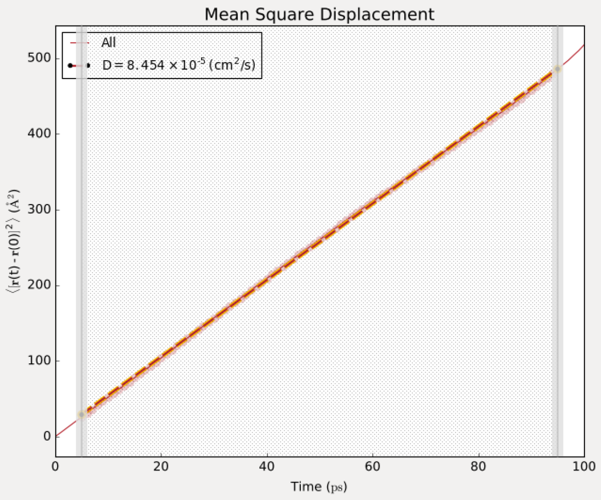

# CHEM260 F23 Class 5

Today's class will increase the complexity of tasks we're doing with bash. What we’ll cover today: 

* [Parameter variation with nested loops](#running-executables-with-multiple-parameters)
* [Multiple file processing](#processing-multiple-files) (Using the ```awk``` command)
* [Install VSCode](#installing-vscode)


# **Running executables with multiple parameters**

Researchers often use servers to run computational simulations. These are essentially experiments where the behavior of a complex system is defined, parameters provided, and the result - which is normally too complex to calculate analytically - is calculated numerically by the computer. In this exercise we will do exactly this: we will run a simulation of an ideal gas, providing a range of experimental parameters (namely density and temperature), to **simulate** the diffusion constant of a single gas molecule. We'll validate the result of the simulation by looking at the pressure - the simulation should obey the gas law!

1. The diffusion coefficient is a measure of how quickly an object moves in an isotropic environment (one that is the same in all directions). Here we are simulating an ideal gas, so every particle should be the same and the isotropic environment holds. To calculate diffusion, we will use the Einstein relationship:

$$\langle r^2 \rangle = \langle (r(t) - r(t_0))^2 \rangle$$

$$ D = \frac{1}{6} \lim_{t \to \infty}\langle(\frac{d}{dt}\langle r^2 \rangle)\rangle $$

2. Here, D is the self-diffusion coefficient, t is the time, and r(t) is the 3D position of the molecule at time t. The diffusion coefficient is obtained from the slope of the displacement (in area units) vs time. We will simulate a box of ~ 100 gas particles in a range of conditions, and the software will calculate the $$D$$ paramter by averaging over all displacements for all particles for the entire trajectory.



3. The simulation program is called "MDSS", and it sits in the ```/bin``` folder. This means we can execute it from anywhere we'd like. Let's use ```nano``` to look at the code. Notice it is written in python, and contains many lines of code.

```bash
nano /bin/MDSS
```

4. Make a new directory using ```mkdir```, ```~/CHE600/class05```, and ```cd``` into it. Try running ```MDSS```. Look at the message, and try changing your parameters until you get the simulation to run. Notice the output - and notice also the output only goes to the terminal window - no files are written (verify by typing ```ls```). You will need to extract information from this output. How would you do this?

5. Your task is to write a bash script called ```runMDSS.sh``` in your ```~/CHE600/class05``` directory that will iteratively run MDSS providing **all combinations** of the following temperatures and densities. This task should be completed with nested ```for``` loops. One for loop for each temperature, and another for loop for each pressure. Try simple examples using the ```echo``` command to figure out how to do this.


| **Temp (K)** | **Density (mg/mL)** |
| --- | --- |
| 10 | 0.1 |
| 50 | 0.5 |
| 100 | 1 |
| 200 | 1.5 |
| 300 | 2 |
| 400 | 2.5 |


<details>
<summary> <b>Hint on creating your iteration lists</b> </summary> 

We've seen two ways of creating iteration lists. One uses a bash command:

```bash
for i in $(ls); do echo $i; done
```
Another just uses a user provided list, seperated by spaces:
```bash
for i in WORD1 450 WORD3 ORANGES; do echo $i; done
```

Pay attention to the ```$()``` on the first option, and the lack of the in the second ```$()```. Which one should you use here?
</details>

6. Beyond the provided density and temperature, the script will also need to extract the pressure and diffusion constant provided at the end of the run in the output (e.g. "Average pressure=XX"). The average density (which you provided), temperature, pressure, and diffusion constant of each simulation (from the output) will need to be inserted into a csv file called ```simulations.csv```.

7. Look at your results and answer the following: 
    * Does the pressure make sense with the ideal gas law? 
    * How does the diffusion constant change with pressure and temperature? 
    * Write your answers in a file called ```~/CHE600/class05/ideal_gas.txt```

# **Processing multiple files**

## **I. Explanation of the scenario**

We have a series of experiments where the data files are text based (csv or tsv) and all structured in the same way. We need to process each of these files in the same way, perform manipulations, and produce some kind of output from these files. 

1. For our dataset, we will use a collection of simulation results. These are results from simulations of a single polypeptide chain in the presence of spherical "crowders" that take up space, limit its movement, and hopefully compress its dimensions (this is what we want to see). First, let's copy this dataset using ```cp``` to your ```class05``` directory. The dataset is in:

```bash
/usr/CHE600/class05/ree.tar.gz
```

2. The dataset is archived in a compressed "tarball" - these files generally have the suffix ```.tar.gz```, and include one or more files that are bundled together and compressed to take up less space. **note** Compression is very effective for text files, but not so effective for binary files. T

3. use the ```tar``` command to untar the file. We use this with the ```-xzvf``` flag: x to extract, z to unzip (decompress), v for "verbose" - show the output of the command, and f to force overwriting if a file already exists in the current directory:

```bash
tar -xzvf ree.tar.gz
```

4. Check out the content of your directory. There are now a bunch of files in this directory. The parameters used to generate the simulation are embedded in the filename (```XX_XX.dat```): The first number is the radius of the monomers in the box; the second number is the number of inert spheres in the simulation box. All boxes contain the same polypeptide (16 repeats of Gly-Ser).

5. Use ```more``` to look at one of these output files. Each file contains a header with a ```@``` prefix. The header is followed by two columns: the frame number and the end-to-end distance of the peptide chain - which represent one metric of the dimensions of the chain. 

<!--
6. Try a linux-native plotting program - xmgrace - to visualize the data. 
    * First, download the [X410](https://apps.microsoft.com/detail/9PM8LP83G3L3?hl=en-us&gl=US&ocid=pdpshare) X-windows server from the microsoft app store 
    * The X-windows server will display graphics from the linux server. 
    * Next, type in the following command. Note that it will take some time to open up. Once it does, you will need to either ctrl+z or close the xmgrace window to return to the prompt.

```bash
xmgrace 30_2.dat
```
-->

6. Your task is to calculate the AVERAGE and STANDARD DEVIATION of the end-to-end distance of each file, and make a csv file with the following header:

```bash
crowder_radius, crowder_conc, Re_avg, Re_std
```

## **II. AWK to the rescue**
As we've seen, linux contains some very powerful programs to manipulate text files. Awk is one of the most powerful. It is essentially a command-line based excel sheet, capable of parsing tabulated files and performing calculations on rows and/or columns, all using a single command. This of course lets us execute the same command on dozens or thousands of files quickly. Let's see how it works.

1. Like the bash shell, awk can be run from the command line directly or using scripting language (in which case the hashbang will have a ```#!/bin/awk``` header!). We're going to primarily use awk from the command line, in a "flat" notation.

2. Let's prepare some files to understand the general format of awk. Paste the following into your shell, but think about what this does before running it. **note:** The ```$RANDOM``` variable is a protected variable name and generates a random integer every time you call it:

```bash
seq 200 > col1
for i in $(seq 200); do echo $RANDOM >> col2; done
paste -d "," col1 col2 > sample.dat
```

3. The awk syntax goes like this:

```bash
awk 'BEGIN{PRE-RUN COMMANDS};{MAIN RUN COMMANDS};END{POST RUN COMMANDS}' filename
```

* The BEGIN block is processed once before the file is processed. You can use it to define variables, limits, etc.
* The main block processes every line, one line at a time.
* The END block is processed once after the last line has been processed. 

4. Remember that rather than working on a specific file, we can set awk to work on the output of another command using pipe:

```bash
command_to_generate_text | awk 'BEGIN{PRE-RUN COMMANDS};{MAIN RUN COMMANDS};END{POST RUN COMMANDS}'
```

5. Let's try and use awk to calculate the average random number generated by bash by analyzing the ```sample.dat``` that we generated. Copy and paste the following to the shell:

```bash
awk 'BEGIN{FS=","; sum=0; print "index,random number,cumulative_sum";};
{sum+=$2; print $1","$2","sum};
END{print "average random number is "sum/NR}' sample.dat
```

Here:
* The BEGIN block defines the Field Seperator (```FS=","```), then defined a variable called sum with a value of 0, (```sum=0```) then prints out a header (```print "index,random number,cumulative_sum"```). Notice that each command is separated by a semi-column (```;```)
* The main block increments the sum variable by the value of the second field (```$2```), then prints out the first field, the second field, and the value of the sum variable seperated by commas.
* The END block prints out text and the average, taken by dividing the value of the sum variable by the Number of Rows (```NR``` - a protected variable name in awk).

6. As usual, the only output for this command it to our terminal - if you want to save it direct (```>``` or ```>>```)it to a file.

## **III. Using awk to get average and std**
So now let's remember our main goal - we want to take the numbers in our extracted files, and calculate their average and standard deviation. We now have the power of awk to do this, but we may need to clean these up a bit. We will first work on the entire chain of commands to clean up a **single file**, then calculate its average + std. Then we'll put these commands in a loop that goes over all the files in one swoop! Pick one and only one file to perform these operations on. You can pipe commands through to other commands if you'd like.

1. Cleanup: Remember that all the files have a header - write a code to remove the first few lines of the header so we stay with only two columns.

<details>
<summary>spoiler</summary>

Remember you can use the ```tail``` command to look at all but the top N lines:
```bash
tail -n +5 30_5.txt
```
</details>

2. Averaging with awk: On the cleaned up file, run awk to calculate the average. You only need to print it out at the end. Remember that this command needs to operate, either on the file or on the output of another command through a pipe ```|``` 

```bash
awk 'BEGIN{FS=" ";sum+=$2};END{print sum/NR}'
```

3. Calculating standard deviation: Rememver that stdev is the square root of the variance, which is calculated by (sumsq / count) - (mean)^2. Let's add this functionality into our awk code. Notice that awk recognizes the function sqrt (square root):

<details>
<summary>spoiler</summary>

```bash
awk 'BEGIN{FS=" "};{sum+=$2;sumsq+=$2*$2};END{mean=sum/NR;var=sumsq/NR-(mean*mean);stdev=sqrt(var);print mean","var","stdev}'
```
</details>

4. You should now have a one-liner ready to process any of the data files. The next part is to run your command on each file and generate the information requested. Some of the information is stored in the filename, so we will need to extract it. For this, recall the ```cut``` command that can seperate based on a delimiter!

```bash
echo 50_3.dat|cut -d "_" -f 1
```

Remember that you can place the value of the command into a variable and recall it later. Now write the code to extract the sphere size (first number in filename) and concentration (the second number in the filename) to two variables, and then you're ready to loop over all files and prepare your final csv!

<details>
<summary>Pseudo code hints</summary>
Note that this is **not** actual code - you will need to turn this into runnable commands.

```bash
for filename in filelist:
do
    crowder=$(code to extract first number of filename)
    conc=$(code to extract second number from filename)
    avging=$(awk command to print out mean and standard deviation seperated by a comma)
    echo "crowder,conc,avging"
done
```
</details>

5. Save the results (preferably by redirecting) to a filename called ```summary.csv``` - please make sure this is in your ```~/CHE600/class05``` directory for checking!


**Reminding you that all output should be placed in ```~/CHE600/class05``` directory!**

# **Installing VSCode**

For those that have completed today's tasks: we will be moving to python next class. Because IT couldn't help support us working on the server, we will be working locally. This can be done either on your own laptop, or on class computers - whichever you prefer. We will be working with VSCode - a powerful editor for python and other programming languages.

## **I. Installing VSCode on your own laptop**

Download page available [here](https://code.visualstudio.com/download). Pick the download that works for you.


## **II. Installing VSCode on classroom computer**

VSCode can be installed through the "Microsoft store", which lets you installed it on the classroom computer. Link [here](https://apps.microsoft.com/detail/XP9KHM4BK9FZ7Q?hl=en-US&gl=US&ocid=pdpshare)

## **III. Installing functionality**

You'll need to install python and jupyter notebooks in VSCode. Those are both avaialble in the plugins tab (see me for details, or wait till next class)