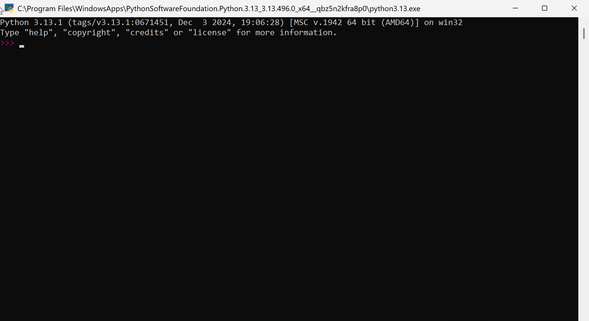
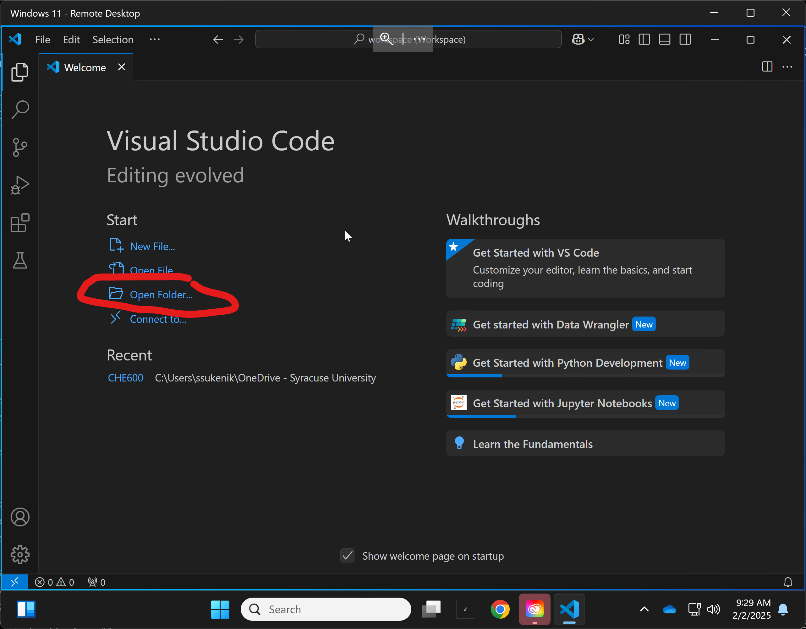
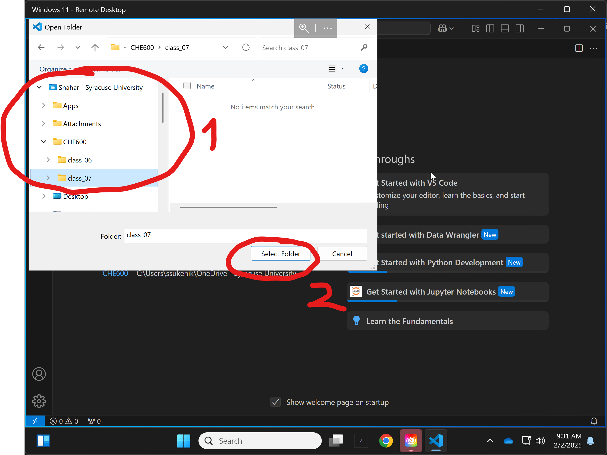
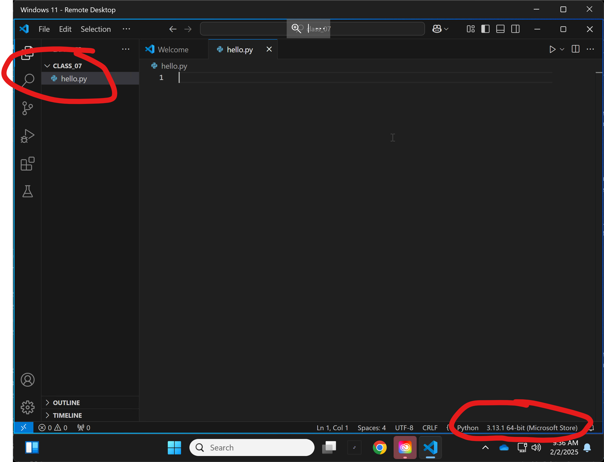
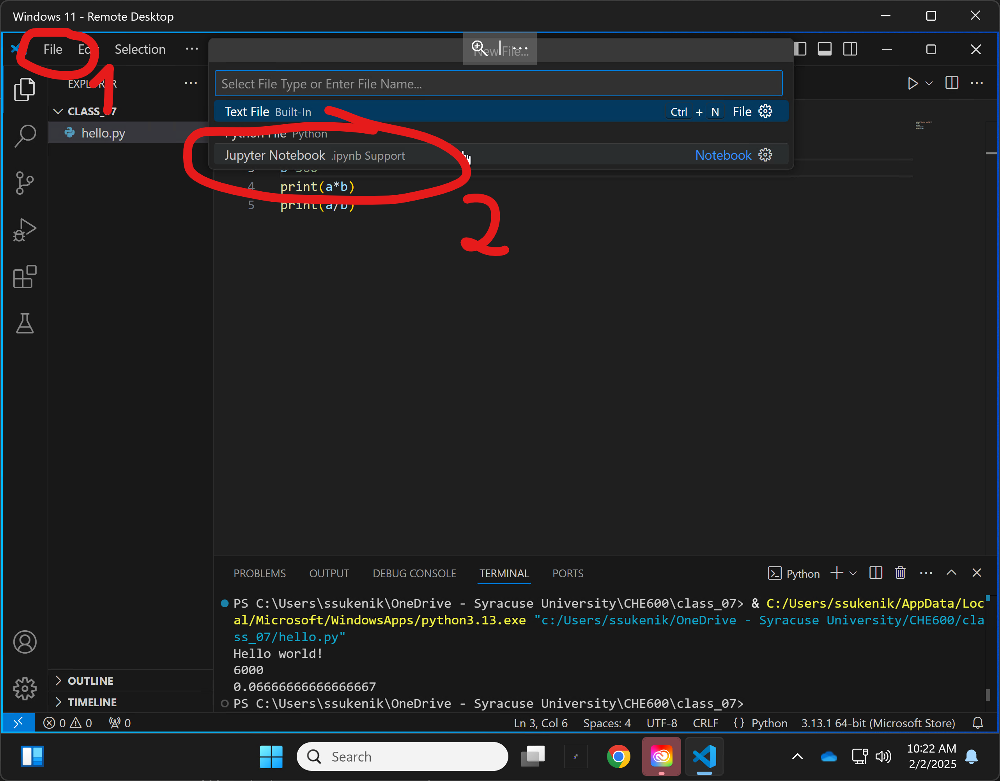
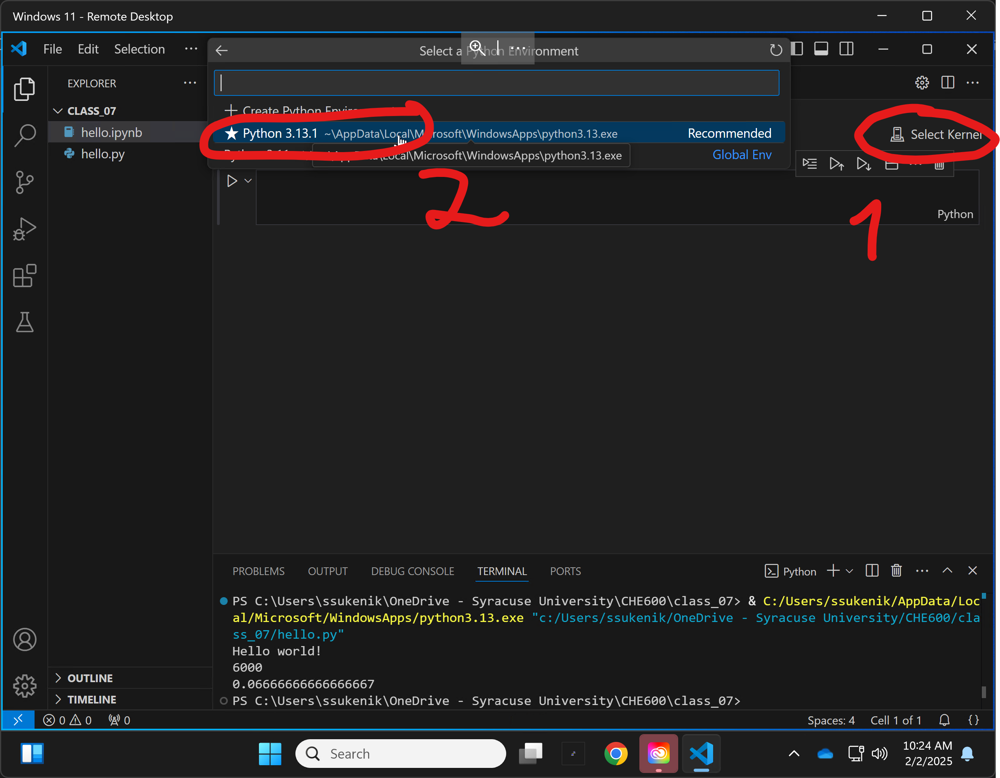
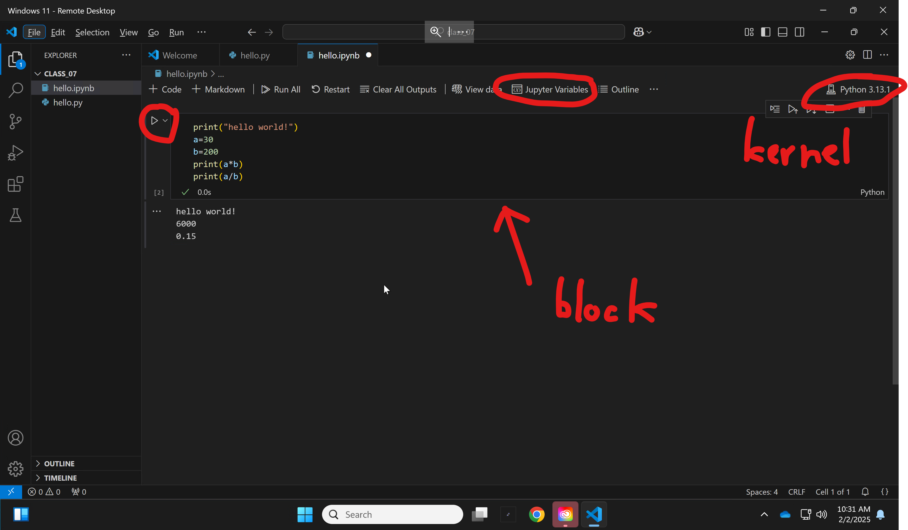
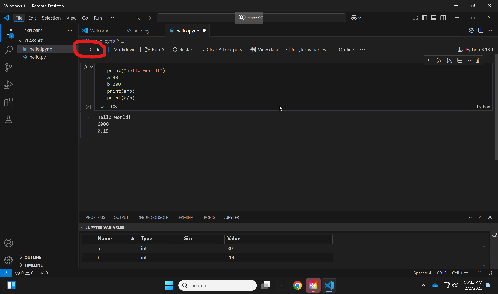

# Chem 260 Class 7 – Python intro!

Today we start working with Python - which will be the language of choice for the rest of the semester. 
Topics include:	
1. [Python Overview](#python-overview)
2. [Running python](#running-python)
    * [The python shell](#i-the-python-terminal)
    * [the VSCode integrated working environment](#ii-vscode)
    * [Jupyter notebooks](#iii-jupyter-notebooks)
5. [Variables](#python-variables)
6. [Loops and conditionals](#script-flow-control)
7. [Libraries](#python-libraries)
8. [First coding exercise: random walk]

# Python Overview

## I. History ##

1. Python was developed in the 80's as a hobby. It emphasized code readability (ie the ability of someone who didn't write the code to understand what it does). Modern python can be run:
    * In a structured (procedural) way - line by line
    * By calling specific defined functions (we will see this today)
    * Using Object-Oriented architecture (we will see this towards the end of the semester)

2. Python is designed to be a highly readable language with a clean and uncluttered syntax. Unlike languages that rely on curly brackets and semicolumns to define code blocks, Python uses indentation for structure. Additionally, Python has fewer syntactic exceptions and special cases compared to languages like C.

3. Python is routinely one of the most sought after programming language in any data science/research job. It is also the _lingua franca_ of machine learning.

3. For further reading on history and philosophy of the language, see [here](https://www.geeksforgeeks.org/history-of-python/)

## II. Libraries ##

1. One of the best aspects of python is the availability of libraries. These are code written by others that one can import into your own python script/program

2. The library introduces new functions and data structures that dramatically expand the options provided by the standard (aka _vanilla_) python interpreter.

3. All one has to do is install the library locally (we will see how to do this), then _import_ the library into the code. All functions from the library become immediately accessible

## II. Version ##

1. We will be using Python 3.13 - this is the latest "stable" - fully supported - version of the code. The versions are meaningful. Trying to run python 2.X code in a python 3 environment will result in an error, and vice versa. 

2. Another major tenet of Python is backwards compatbility - meaning every subsequent version should support all syntax and function of previous versions. Though this is obviously best, some libraries (more about this later) require a specific python version to work (though this is rare, especially in popular and well-maintained libraries).

# Running python
## I. The python terminal

1. Last week we've installed the python interpreter and VSCode on our computers. Let's start by running the python interpreter. Open your start menu, search for python - make sure you select Python 3.13, and run it. 


2. The shell should look like this:



3. In the shell, try the following:

```python
print("Hello world!")
```

```python
a=20
```

```python
b=300
```

```python
print(a*b)
print(a/b)
```
4. While this code works, you can see this will not be a very good way to write complicated scripts. In general, we will want to edit our script in a text editor (like nano in our shell) and have a rapid way of seeing output to help debug it.

## II. VSCode

1. We will be working in VSCode. VSCode is an "integrated development environment" (IDE) - basically a fancy text integrated with a python interpreter that will allow us to rapidly write and debug our code. VSCode is free, has many plugins, and tons of online tutorials on how to do things.

2. Last week we installed VSCode on our machines. Let's run it now, and start a new folder. Make sure it is placed in your syracuse onedrive folder, so it's available anywhere. I recommend putting all class code in /CHE600/class_XX, like we did on the server.





3. Next, let's start a new python script file. 


4. We now see the text file, ready to edit. Save it in your class_07 directory as ```hello.py``` (from the file menu or with ctrl+s), and make sure the python interpreter (aka "kernel") is integrated into the script, as shown on the bottom right.



5. Place the same code in the text, and run it using the "play" button on the top right. A new panel should open up on the bottom, showing the result of running your code. 

6. Congrats! You can now write and run code in VSCode. But things will get a bit messier when we want to visualize data or share our code with others. For this, we will use Jupyter notebooks

## III. Jupyter notebooks

1. Another option to write python is using Jupyter notebooks. This is similar to a text file, but lines of code can be written in block, executed, and the result displayed in line before the next block. See some examples [here](https://jupyter.org/try-jupyter/notebooks/?path=notebooks/Intro.ipynb).

2. Let's start a new jupyter notebook.  Go to _file_ and select _New File..._, then choose the _Jupyter Notebook_ option.



3. Save the notebook in the same directory as _hello.ipynb_ - ipynb is the suffix for jupyter notebooks. Check that you have a connection to a python kernel on the top right of the notebook.



4. Your window should contain a single cell. Place the same code from the last two exercises in the cell. Run the code using the "play" button on the upper left side of the block. You should see output! Notice that you can also have a look at your variables by hitting the _Jupyter Variables_ button on the top.



5. We can now add another block by pressing the _+ Code_ button on the left of the top toolbar, and then write more code in the next block!



6. Jupyter notebooks are saved automatically, and can hold any number of cells and variables. Anything defined in previous cells will be carried over to the next cell within the same notebook.

7. In this class we will primarily work with Jupyter notebooks. These are also the best for scientific research because any reader can see the entire script, as well as any figures, and the notebook can be saved as an HTML file to be shared over github or as a webpage. See for example a recent notebook from our lab [here](https://github.com/sukeniklab/ClinVar_Re_predictions/blob/main/analysis/plotClinvarAll.ipynb)

# Python Variables

Now that we have a way to comfortably write and test code in python, let's start getting our hands dirty. Like bash, we will first learn how to define variables in python.

1. To define a variable, we just use a simple equal sign. Python does not care about spaces between the ```=``` and the variable name or value, but the name cannot have spaces in it, and must start with an alphabet character.

```python
variable = value
```

2. Unlike bash, python has many different _types_ of variables. Variables are given a _type_ when they are created, and the type is updated as needed, often automatically.

3. We’ll learn about 6 variable types for “vanilla” Python
    a. Numbers (integer and floating point types)
    b. Strings (any combination of text, symbols or numbers)
    c. Lists (an indexed collection of variables, objects, strings, or numbers)
    d. Dictionaries (matching names to a pattern)
    e. Objects (custom data types that are created in programs or that you write yourself)

## I. Number variables

1. Floating point (anything with a decimal). Also called _float_. Try putting the following in your notebook block and running it. We define a variable called _myVar_ and assign a non-integer number to that variable. We then _pass_ the variable into the function ```type```, which should tell us what its variable type is. Note that comments in python start with ```#```, and can be placed anywhere in the block

```python
myVar=3.14  # defines var “value” as a float
# the type function shows the type of variable “passed to it” inside the parentheses
type(myVar) 
```

2. Integer (exact, non-decimal number). These numbers cannot have decimals. As a result they take up much less space in the computer's memory. Place this code in a new block. Notice that the old value of the variable _myVar_ will be overwritten.

```python
myVar=3*10+4
type(myVar)
```

3. In many programming languages, if we try to perform an operation on a integer that will return a float, an error will occur. Python automatically "upgrades" integers to floats when needed. Try the following in a new block:

```python
type(myVar)
myVar=myVar/4.2
type(myVar)
```

## II. String variables

Strings - any combination of characters, symbols, and numbers. Notice that if we want to assign characters to a variable, we will need to use either single or double quotation marks - otherwise python will intepret our string as a variable name. Try the following in a new block:

```python
myString='this is a string with 2 numbers: 4 and 6'
type(myString)
```

## III. List variables

Lists can hold any mix of data types (including other lists) in an indexed way - in other words it is a variable that can contain multiple, indexed values. 

1. We can create lists in several ways. Start a new block and try the following:

```python
# We first define a list by assigning variables seperated by commas and contained within square brackers ([]):
myList=[1, 9, 3, 7, "a"]
type(myList)
print(myList)
# The len() function works only on list variables returns the length of the list.
len(myList)
```

2. We can create empty lists using an empty square bracket or with the list() function:

```python
blist=list()
type(blist)
blist=[]
type(blist)
```

3. List variables contains some functions themselves. For example, the ```append``` function is _called_ through the ```blist``` variable. Try it out in the same block:

```python
blist.append(10)
blist.append("b")
print(blist)
```

4. You can create a list variable with all the same values using ```*```:

```python
clist=[0]*20
print(clist)
# we can combine two lists together with append. For example, to add your clist to blist, use:
blist.append(clist)
print(blist)
```

5. We can pull specific indices from a list using ```[]```. Note that first entry in the list has an index of [0]

```python
# pulling the first entry in the list
blist[0]
# pulling the second entry in the list
blist[1]
# pulling the 2nd and 3rd entires in the list
blist[1:3]
# pulling all entries byt the first
blist[1:]
#pulling all entries up to the 4th
blist[:5]
# pulling the last entry in the list
blist[-1]
# We can also set the value of an index in a list using this indexer:
alist[4]
alist[4]=5
alist[4]
```

6. We saw the ```append``` function can be called from a list - this is because a list is a python objects. Objects in python often contain internal functions that can be invoked directly from the variable. To see the complete set of ```list``` functions, hit the tab after type ```blist.```

```python
# Count the  number of times an element appears in a list
blist.count(3)
# Take off the last element:
blist.pop()
# Sort the list:
blist.sort()
# Reverse the list:
blist.reverse()
```

# Script flow control

## I. "for" loops

1. for loops are similar to bash, but use indentation instead of do/done to denote the commands to be included in the loop. 

2. Note that indentation matters! – python doesn’t care if you indent with tab or with spaces (or how many spaces) but you must be consistent! You can’t use tab once then spaces, or different number of spaces.

3. To set the value of the iterable variable we will use the range command. range is a python command that creates a “range” object that contains sequential integers separated by a step. The format is ```range(start,stop,[step])```, where start is the first integer, stop is the first integer that will **NOT** be included), and step is the step size. (step is optional so it is written in []– if non is provided the default is 1). Start a new block in your notebook and enter the following:

```python
for i in range(0,100): 
    j=i*i # this line is indented
    print(i,j) #so is this one!
```

## II. "If" conditionals

If statements are similar to bash but use indentation instead of then/fi to denote the commands to be included in the loop and do not require parentheses around condition. In a new block, insert the following. Pay attention to indentation!

```python
q=[1,2,2,3,3,4,7]
if q.count(3)==1:
	print("q has one 3")
elif q.count(3)==0:
	print("q has no 3s")
else:
	print("q has two 3s or more!")
```

# Python Libraries

Libraries of useful functions are organized into modules that are imported into Python programs using the import or from commands. This is one of the best features of python. Most libraries, especially the most popular and extensive ones, are easy to install and work right out of the box.

1. Some libraries come built in with vanilla python. However, they still must be imported. This is because storing a library's functions takes up memory while running your script. Using only required libraries (or even only specific functions of required libraries) will reduce memory usage, making your script faster and more efficient.

2. The ```import``` command loads in an entire library. To use a function from that library you will need to call the library after this import. In a new block write:

```python
import math
math.sqrt(10)
```

2. The ```from``` command loads just the specified functions. If you call functions in this way, you can use them directly from the main variable space. In a new block, write:

```python
from math import sqrt
sqrt(10)
```

3. A useful function is ```choice()``` from the ```random``` library. ```choice()``` returns one value from a list selected randomly. In a new block, write:

```python
from random import choice
ndice=5
for i in range(ndice):
    dice.append(choice(range(1,7)))
dice.sort()
print(dice)
```


