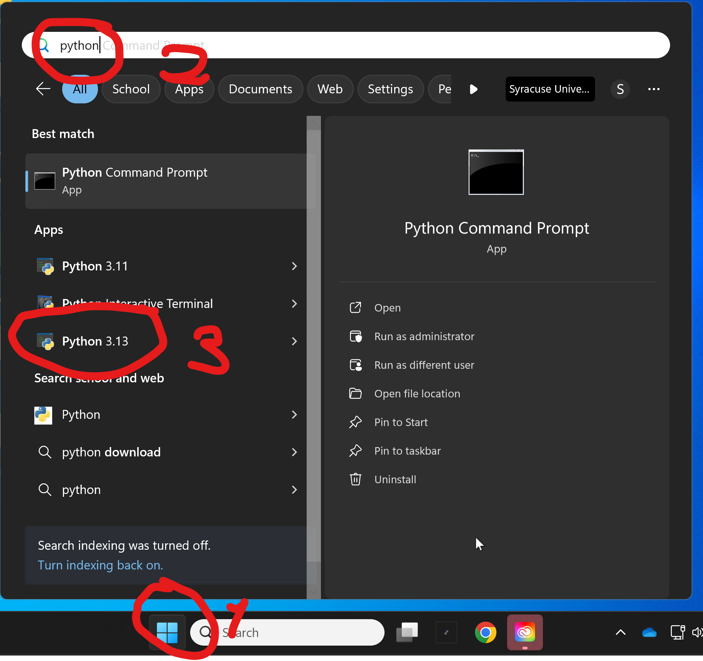
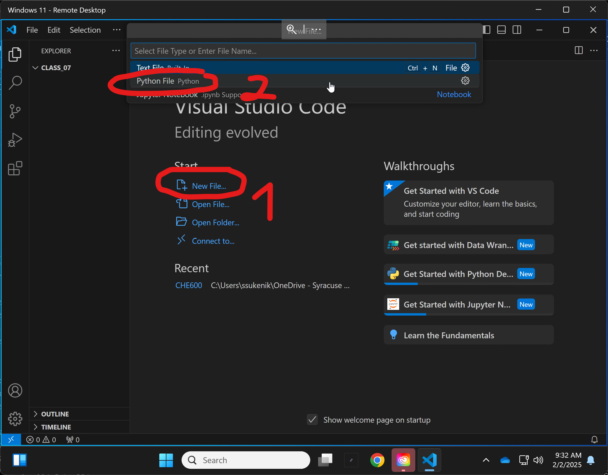
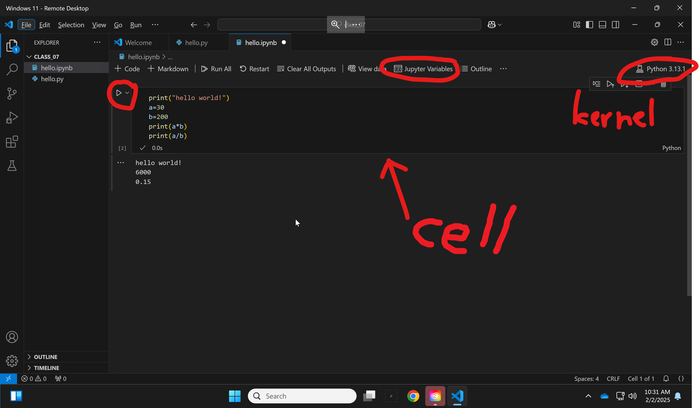

# Chem 260 Class 7 – Python intro!

Today we start working with Python - which will be the language of choice for the rest of the semester. 
Topics include:	
1. [Python Overview](#python-overview)
2. [Running python](#running-python)
    * [The python shell](#i-the-python-terminal)
    * [the VSCode integrated working environment](#ii-vscode)
    * [Jupyter notebooks](#iii-jupyter-notebooks)
5. [Variables]
6. [Loops and conditionals]
7. [First coding exercise: random walk]

# Python Overview

## I. History ##

1. Python was developed in the 80's as a hobby. It emphasized code readability (ie the ability of someone who didn't write the code to understand what it does). Modern python can be run:
    * In a structured (procedural) way - line by line
    * By calling specific defined functions (we will see this today)
    * Using Object-Oriented architecture (we will see this towards the end of the semester)

2. Python is designed to be a highly readable language with a clean and uncluttered syntax. Unlike languages that rely on curly brackets and semicolumns to define code blocks, Python uses indentation for structure. Additionally, Python has fewer syntactic exceptions and special cases compared to languages like C.

3. Python is routinely one of the most sought after programming language in any data science/research job. It is also the _lingua franca_ of machine learning.

3. For further reading on history and philosophy of the language, see [here](https://www.geeksforgeeks.org/history-of-python/)

## II. Libraries ##

1. One of the best aspects of python is the availability of libraries. These are code written by others that one can import into your own python script/program

2. The library introduces new functions and data structures that dramatically expand the options provided by the standard (aka _vanilla_) python interpreter.

3. All one has to do is install the library locally (we will see how to do this), then _import_ the library into the code. All functions from the library become immediately accessible

## II. Version ##

1. We will be using Python 3.13 - this is the latest "stable" - fully supported - version of the code. The versions are meaningful. Trying to run python 2.X code in a python 3 environment will result in an error, and vice versa. 

2. Another major tenet of Python is backwards compatbility - meaning every subsequent version should support all syntax and function of previous versions. Though this is obviously best, some libraries (more about this later) require a specific python version to work (though this is rare, especially in popular and well-maintained libraries).

# Running python
## I. The python terminal

1. Last week we've installed the python interpreter and VSCode on our computers. Let's start by running the python interpreter. Open your start menu, search for python - make sure you select Python 3.13, and run it. 



2. The shell should look like this:


3. In the shell, try the following:

```python
print("Hello world!")
```

```python
a=20
```

```python
b=300
```

```python
print(a*b)
print(a/b)
```
4. While this code works, you can see this will not be a very good way to write complicated scripts. In general, we will want to edit our script in a text editor (like nano in our shell) and have a rapid way of seeing output to help debug it.

## II. VSCode

1. We will be working in VSCode. VSCode is an "integrated development environment" (IDE) - basically a fancy text integrated with a python interpreter that will allow us to rapidly write and debug our code. VSCode is free, has many plugins, and tons of online tutorials on how to do things.

2. Last week we installed VSCode on our machines. Let's run it now, and start a new folder. Make sure it is placed in your syracuse onedrive folder, so it's available anywhere. I recommend putting all class code in /CHE600/class_XX, like we did on the server.


3. Next, let's start a new python script file. 



4. We now see the text file, ready to edit. Save it in your class_07 directory as ```hello.py``` (from the file menu or with ctrl+s), and make sure the python interpreter (aka "kernel") is integrated into the script, as shown on the bottom right.


5. Place the same code in the text, and run it using the "play" button on the top right. A new panel should open up on the bottom, showing the result of running your code. 

6. Congrats! You can now write and run code in VSCode. But things will get a bit messier when we want to visualize data or share our code with others. For this, we will use Jupyter notebooks

## III. Jupyter notebooks

1. Another option to write python is using Jupyter notebooks. This is similar to a text file, but lines of code can be written in block, executed, and the result displayed in line before the next block. See some examples [here](https://jupyter.org/try-jupyter/notebooks/?path=notebooks/Intro.ipynb).

2. Let's start a new jupyter notebook.  Go to _file_ and select _New File..._, then choose the _Jupyter Notebook_ option.


3. Save the notebook in the same directory as _hello.ipynb_ - ipynb is the suffix for jupyter notebooks. Check that you have a connection to a python kernel on the top right of the notebook.


4. Your window should contain a single cell. Place the same code from the last two exercises in the cell. Run the code using the "play" button on the upper left side of the block. You should see output! Notice that you can also have a look at your variables by hitting the _Jupyter Variables_ button on the top.



5. We can now add another block by pressing the _+ Code_ button on the left of the top toolbar, and then write more code in the next block!


6. Jupyter notebooks are saved automatically, and can hold any number of cells and variables. Anything defined in previous cells will be carried over to the next cell within the same notebook.

7. In this class we will primarily work with Jupyter notebooks. These are also the best for scientific research because any reader can see the entire script, as well as any figures, and the notebook can be saved as an HTML file to be shared over github or as a webpage. See for example a recent notebook from our lab [here](https://github.com/sukeniklab/ClinVar_Re_predictions/blob/main/analysis/plotClinvarAll.ipynb)

# Python Variables

Now that we have a way to comfortably write and test code in python, let's start getting our hands dirty. Like bash, we will first learn how to define variables in python.

1. To define a variable, we just use a simple equal sign. Python does not care about spaces between the ```=``` and the variable name or value, but the name cannot have spaces in it, and must start with an alphabet character.

```python
variable = value
```

2. Unlike bash, python has many different _types_ of variables. Variables are given a _type_ when they are created, and the type is updated as needed, often automatically.

3. We’ll learn about 6 variable types for “vanilla” Python
    a. Numbers (integer and floating point types)
    b. Strings (any combination of text, symbols or numbers)
    c. Lists (an indexed collection of variables, objects, strings, or numbers)
    d. Dictionaries (matching names to a pattern)
    e. Objects (custom data types that are created in programs or that you write yourself)

## I. Number variables

1. Floating point (anything with a decimal). Also called _float_. Try putting the following in your notebook block and running it. We define a variable called _myVar_ and assign a non-integer number to that variable. We then _pass_ the variable into the function ```type```, which should tell us what its variable type is. Note that comments in python start with ```#```, and can be placed anywhere in the block

```python
myVar=3.14  # defines var “value” as a float
# the type function shows the type of variable “passed to it” inside the parentheses
type(myVar) 
```

2. Integer (exact, non-decimal number). These numbers cannot have decimals. As a result they take up much less space in the computer's memory. Place this code in a new block. Notice that the old value of the variable _myVar_ will be overwritten.

```python
myVar=3*10+4
type(myVar)
```

3. In many programming languages, if we try to perform an operation on a integer that will return a float, an error will occur. Python automatically "upgrades" integers to floats when needed. Try the following in a new block:

```python
type(myVar)
myVar=myVar/4.2
type(myVar)
```

4. Strings - any combination of characters, symbols, and numbers. Notice that if we want to assign characters to a variable, we will need to use either single or double quotation marks - otherwise python will intepret our string as a variable name. Try the following in a new block:

```python
myString='this is a string with 2 numbers: 4 and 6'
type(myString)
```

5. Lists (open a new window in spyder and put all of the commands in this section into lists.py)
a.	Lists can hold any mix of data types (including other lists)
b.	Several ways to create a new list:
1.	Create with values
alist=[1, 9, 3, 7, "a"]  (Note square brackets)
type(alist)
print(alist)
len(alist)

2.	There are many ways to create empty list:
blist=list()
blist=[]

3.	There are ways to fill lists with values:
blist.append(10)
blist.append("b")

4.	You can initialize a list with all the same values using “*”:
clist=[0]*20

c.	You access values in arrays lists with [], note that first entry is element zero [0]

alist[0]
alist[1]
alist[1:2]
alist[1:]
alist[:2]
alist[-1]

Setting a value in alist:
alist[4]=5

d.	Lists are objects. Objects often contain internal functions that can be invoked directly from the variable:
1.	Count the  number of times an element appears in a list
alist.count(3)
2.	Take off the last element:
alist.pop()
3.	Sort the list:
alist.sort()
4.	Reverse the list:
alist.reverse()
5.	To see the complete set of function for list in spyder, pause after typing the “.” And hit tab.


