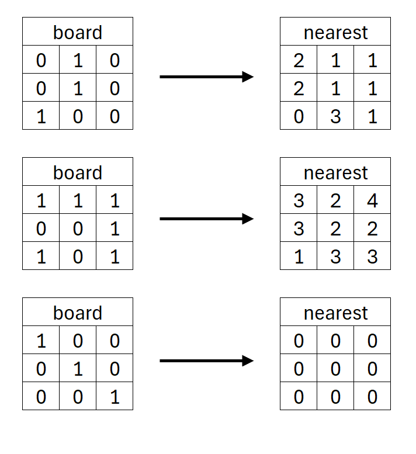

# CHE600 - Class 10 - defining functions

Today we'll learn how to define functions in scripts. We've mentioned in the beginning that python can be run "sequentially" (i.e. line-by-line) which is what we've done so far. Today we'll learn how to create our own functions that will accept parameters and return specific results.

# defining functions

## I. The def keyword

Python allows you to define functions in scripts. In this way, you can call the function from anywhere in your script, any number of times. The function, like others we’ve used can accept any inputs you define, and return anything that has been created during its executation as output.

1. Let’s start by writing a function called genBoard that accepts two variables, N and M, and generates an NxN 2D matrix with zeros and M ones. Start a new jupyter notebook in class10 directory called make_board.ipynb. 

2. Import numpy and matplotlib.pyplot into it in the first cell. 

3. In a new cell, define a new function using the ```def``` keyword. Note that when you run this cell nothing will happen. This is because we only DEFINE the function, but do not actuall call it!

```python
def myFunc(x):
	# print a line every time the function runs
	print('myFunc is now running!')
	# return two variables: N-2 and M+2
	y=x*x
	return(x+2,y)
```

4. This function is called by calling myFunc(), and accepts a single input variable. It returns two variables: the input variable x incremented by 2, and y which is the square of x. Notice the format here is like a for loop or conditional – everything following ```def``` with an indent will be a part of this function! Let's now call the function and observe the output. In a new cell, type:

```python
[out1,out2]=myFunc(4)
print(out1)
print(out2)
```

5. We have placed the values RETURNED by ```genBoard()``` into two variables, ```out1``` and ```out2```. Notice that even though these variables are named ```x``` and ```y``` in genBoard, they are not included in our namespace (see the jupyter variables list to be convinced!). We can call this function as many times as we want:

```python
for i in range(10):
	[out1,out2]=myFunc(i+30)
	print(out1)
	print(out2)
```

## II. Turning a script to a function

1. We will now adapt the ```board.ipynb``` script we wrote last class to a function that accepts two variables and generate a board. Start a new file called ```game.ipynb``` in your ```class10``` directory. 

2. In the first cell, import numpy and matplotlib.pyplot. 

3. In the next cell, define a new function, ```genBoard(M,N)```. M and N are the number of 1's and the side-length of the board, respectively. The function should ```return``` the board itself: a NxN numpy array with M ones and (NxN - M) zeros.

2. You should copy and paste your ```board.ipynb``` code from class09 into this funciton, arrange variable names as needed, and make sure you are using the user provided ```M``` and ```N``` variables to create your ```board``` array. End the function with the ```return(board)``` command. This will exit the function and pass the returning variable either into your standard out, or into a variable. 

3. Once you think it's working try it out. The following function should create a 8x8 numpy array as a variable called ```aBoard``` filled with 0’s and 10 1’s in random positions. Remember that the function definition must come before the script that calls it!

```python
aBoard = genBoard(10,8)
print(aBoard)
print(np.sum(aBoard))
```

# Independent work

We will next write some additional functions in our ```game.ipynb``` notebook. Each function will go in a new cell, but called together they will form  an actual python program:

## I. drawBoard() - a function to visualize our board

1. The first function should be called ```drawBoard()``` This function accepts an NxN matrix of 0’s and 1’s (we refer to this as a board) and then plots it using matplotlib. See [last week's class](../Class_09/README.md#ii-visualizing-boards) for details on how to do that. 

2. Notice that for this function, nothing should actuall be returned - the function itself will generate the figure. In this case, you can just end with an empty ```return()``` statement

3. Run the function in a new cell by providing a board variable as an input argument:

```python
board = genBoard(5,3)
drawBoard(board)
```

## II. countNear() - a function to count nearest neighbors for each cell

1. The second function should be called ```countNear()``` This function accepts a board as input and returns an 2D numpy array with the same dimensions as the board. Unlike the board though, each element in the returned array contains the number of neighboring 1’s in the board. 
	
2. A neighbor is defined by a square with a 1 that is immediately adjacent to another square with a 1. Do not count diagonals. 
	* What is the smallest number in this array? 
	* What is the largest number in this array?

3. We assume the board is “infinite” – which means the top row is in contact with the bottom row and the left-most column is in contact with the right-most column. This is sometimes called “periodic boundary conditions” and lets us simulate an infinite system.

3. See examples below:
<center>

</center>

4. This is the most challenging script you've had to write so far, but there are many way to do it and no wrong way. **I strongly recommend you try this yourself before just handing this task off to an LLM.** Some hints provided below:

<li> Start with SMALL boards (like the ones shown in the example above) where you can easily visualize and count neighbors yourself. 
<li> You can create a 3x3 zeros matrix and place 1's in exact position to test your script!
<li> Implement periodic boundaries only AFTER your code is working without them.
<li> Remember what the input and output should be as you write your code.
<li> Only put the code in a function when it's ready - don't debug within a function!
<li> Matrix arrays can be "moved" up/down/left/right by one cell using the np.roll() function (see the help file)

4. Once done, your jupyter notebook should start with the three functions, ```genBoard()```, ```drawBoard()```, and ```countNear()```. Then, in a new cell below these functions, write a script that will create a board, visualize it, and return a neighbor matrix by calling the three functions. 

5. This is a step up in difficulty – please feel free to discuss with me/each other on how to approach this challenge! Again, **I recommend trying these yourself before outsourcing to LLM's**. If you do end up using LLMs, please make sure you understand what the code does and that it actually works! Some tips below.

6. Upload your full ```game.ipynb``` script to the blackboard submission link in class 10. The script should include the three functions: genBoard(), drawBoard(),  and countNeighbors(), and the calls to these functions. You should also upload a screenshot of the visualized board and the neighbor matrix (either visualized or in text form from the iPython console is fine) of a 20x20 matrix with 70 ones.


