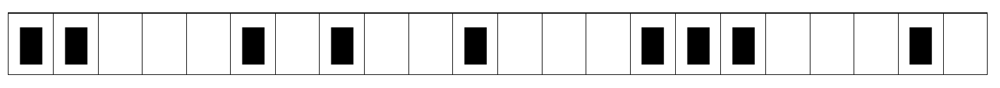
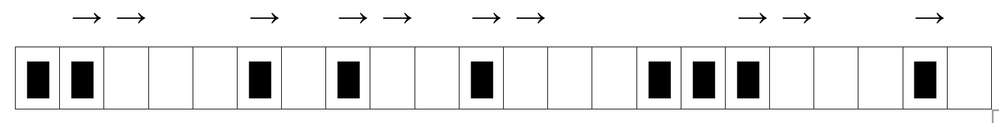
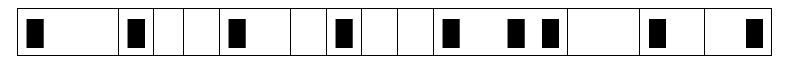

CHE600 - Class 11 - Cellular automata

Topics today:
1. [Cellular automaton](#cellular-automaton)
2. ["game of life”](#game-of-life)
3. [Homework: Traffic simulation](#homework-traffic-cellular-automata-simulation-due-tue-1022)

# Cellular Automaton

Today we will bring together everything we’ve learned with python to create an agent-based simulation (aka [cellular automaton](https://en.wikipedia.org/wiki/Cellular_automaton) or CA). 

1. CA are DETERMINISTIC simulations, where the end result can be known exactly given the rules of the simulation and the initial state. However, small changes in initial state can give VERY DIFFERENT outcomes because the system is complex.

2. In relation to what we’ve done – we can think of the board we’ve generated as a series of “agents” – where an agent is a board position with a value of 1. These agents have specific, uniform, and set rules that define their behavior, and the system evolves from the initial condition based on these rules.

3. To complete today’s classwork, you will use the functions you’ve written together with a new function we'll write together that evaluates the CA rules and prints out a new board. This function will be called iteratively to run the agent-based simulation. You will also be visualizing your results with matplotlib.

# Game of life

We’ll start by adding a couple of new routines to your “board” functions, adapting them to create and visualize a CA called “Game of Life” developed by British mathematician [John Conway](https://en.wikipedia.org/wiki/John_Horton_Conway). This is essentially a simulation of population evolution, but unlike evolution, which is stochastic, the simulation is deterministic, and is a result only of the initial state of the board and the rules that propagate it. There is a [game of life wiki](https://conwaylife.com/wiki/) that is full of different boards and information and web-based simulations.

1. The rules are simple: We have a board of ones and zeros – with ones being occupied sites and 0 unoccupied sites. From an initial random state, the board then develops according to the following rules:
	1. Any occupied cell with less than two occupied neighboring cells dies (becomes 0)
	2. Any occupied cell with two or three occupied neighboring lives (remains 1)
	3. Any occupied cell with more than three occupied neighbors dies (becomes 0)
	4. Any unoccupied cell with exactly three neighbors becomes alive (becomes 1)

2. We'll start from the old board generator genBoard() and the neighbor counting script countNear() we have used. Copy the script game.ipynb from class10 to your class_11 directory.In case you haven't completed them, here’s how I tackled this problem (note that I am being fancy and including diagonal neighbors as well):

```python
def countNear(board):
    nears=np.zeros_like(board)
    for rollx in [-1,0,1]:
        for rolly in [-1,0,1]:
            board_roll=np.roll(board,[rollx,rolly],axis=[0,1])
            nears+=board_roll
    nears[np.where(board==1)] += -1
    return(nears)
```

3. Now create a new function called golStep(). This function accepts a board with 1's and 0's, and returns a NEW board from the old one, based on the Game of Life rules. To create the new board, the function should call countNear(), and use the output neighbor matrix according to the following rules:
	1. A cell on the board where board=1 AND neighs>3 turns to 0
	2. A cell on the board where board=0 AND neighs=3 turns to 1
	3. A cell on the board where board=1 AND neighs<2 turns to 0.
	4. All other cells remain as-is.

4. Finally, let’s write a function that plots the board. In order to ensure that our plot updates regularly, have the iPython console on qt mode by typing %matplotlib qt in the console itself!

```python
def drawBoard(board,i):
    plt.cla() # clears the current plot
    plt.imshow(board)
    plt.title("iteration %i" % i)
    plt.pause(0.1) #waits for 0.1 seconds before returning
```

4. All four functions should be placed together in a file called GoL.ipynb in your class 11 directory whole thing together. The file should have 4 defined functions: genBoard(M,N) to generate the board, countNear() to count the nearest neighbors, golStep() to progress the board one step according to the “rules of life,” and drawBoard(board,i) to visualize the board. 

5. In the same directory, start a new jupyter notebook called ```playGoL.ipynb```. Now we're going to import all the functions you wrote. In the first cell, write:

```python
import GoL
```

6. Now we just need to iteratively call these functions in the right order to progress the board according to the rules, and visualize the board after every update!

7. Congrats! You just coded Conway’s “Game of Life”. This little deterministic simulation is determined ONLY by its initial configuration, but fascinating dynamics evolve all the same. Please upload five of your favorite screenshots from your simulation to this week’s classword assignment.


# Homework: Traffic cellular automata simulation. DUE: Tue. 10/22

You are tasked with simulating traffic motion on roads. 

1. The model consists of a 1-lane "road" with cars (symbolized below by █). The lane has a periodic boundary connecting the left end with the right end (so that this simulation is akin to cars going around in a traffic circle):

<center>

</center>

2. To progress the road, the cars move to the right, according to the following rule:
	1. If the space to the right is occupied by a car at time t, the car does not move.
	2. If 2 or more spaces to the right are empty, the car moves by 2 spaces.
	3. If only the next space to the right is empty, the car moves by 1 space.

3. To illustrate these rules, below you can see the “rules of the road” being evaluated to generate the road at time t+δt

At time t:
<center>

</center>
At time t+δt:
<center>

</center>


4. The road will be a vector with 0's (empty road) and 1's (car-occupied road). The conditions on the road are defined by several “observables”:
    * $$N$$ - number of cars (1's) on the road
    * $$L$$ - the length of the road vector
    * $$v_i$$ - the current "velocity" of the _i_ th car  
    * $$\rho = N/L$$ - density 
    * $$\langle v \rangle = \frac{1}{N} \sum\limits_{i=1}^N v_i$$ - average road velocity
    * $$F = \rho \times \langle v \rangle$$ - traffic flow

5. Complete the following assignments, **due 2/8/25 by 11:59 PM**:
	1. Write a program that simulates a road that can hold 1000 cars. To do this: 
	    * Write a ```genRoad()``` function that generates the road: accepts road length L and density ρ as parameters, and returns a vector of length L that is all zeros except for L×ρ ones at random positions)
	    * Write an ```updateRoad()``` function that will accept the road vector and advance the road by a single step (as specified in the rules above), and return the “road” vector in its new state. This function should also return the average speed for the given step. 
	    * Finally, write a script to propagate the system using a for loop. Within the for loop you will feed in the road vector from the previous iteration into your ```updateRoad()``` function to propagate a new road state, and store the velocity generated by the ```updateRoad()``` function into an array.
	2. Check how many steps you need to propagate your system in order to reach a steady average velocity. 
    3. Plot a graph of avg. velocity vs. timestep at ρ = 0.25, 0.5, and 0.75.
	4. Plot a graph of the average velocity as function of road density ρ, where ρ ranges from 0.05 to 1 in steps of 0.05. Make sure you are sampling the velocity at a point where your road has reached its steady-state.
	5. Plot the flow of traffic vs road density
	6. Upload your script, graphs (in png or jpg format), and any other material to Blackboard at the appropriate homework link.
	
6. Bonus tasks:
    1. Simulate a police car on the side of the road: When a car is within 2 positions next to the police car, its speed will drop to 1, even if it can move faster. Plot the traffic flow vs. Road density with this obstruction.
	2. Simulate a two-lane road. In this scenario, if there is a car directly ahead, the car behind can move to an empty lane in a single step (think about how you would formulate that as a rule). Plot flow vs. road density on this road. Does it behave differently?
