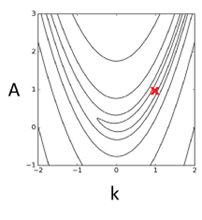
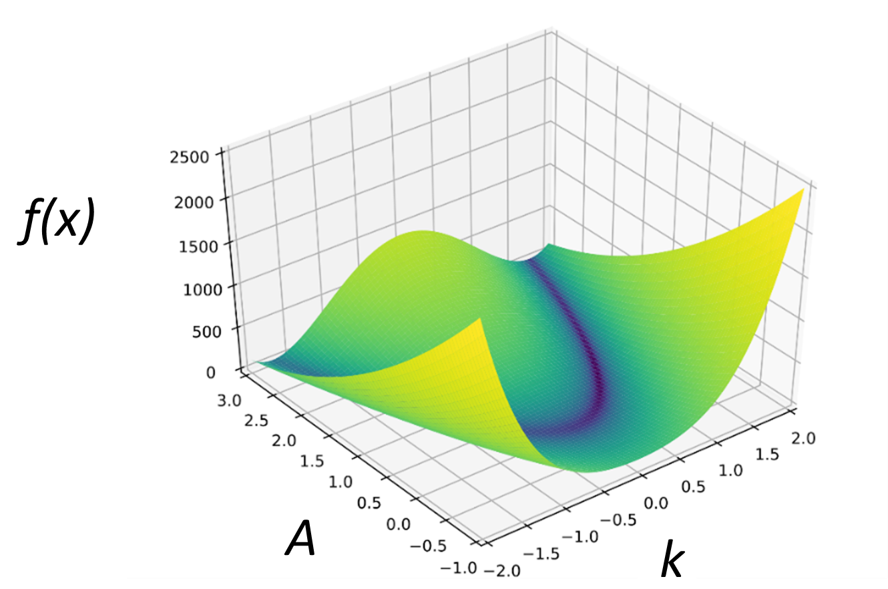
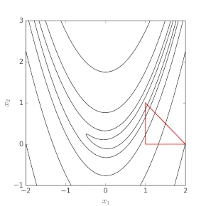
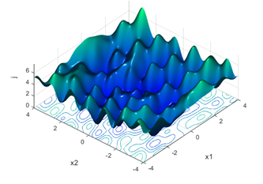

# CHE600 - class 13

Topics today:

1. [Intro to optimization problems](#intro-to-optimization-problems)
2. [Generating and fitting "test data"](#generating-and-fitting-test-data)
3. [Class exercise on fitting data](#independent-work--fitting-experimental-data)

# Intro to optimization problems

One of the most common things we use a computer for in data science is to "fit our data". But what does that mean? Fitting is essentially a private case of a very broad set of problems called [optimization problems]. These problems involve finding the _optimum_ (minimum or maximum) of an arbitrary function - hence the term optimization. This may seem confusing – we usually are not interested in the minimum of a function! But we can turn any curve fitting to an optimization problem quite easily. 

## I. Defining the optimization problem

1.  Let’s consider we have some experimental data that we want to fit with an experimental curve. Looking at the data (below), seems like an exponential decay would be a good fit:

$$y_{fit} = Ae^{\frac{-x}{k}}$$

2. Our task is to find the values of $A$ and $k$ that would be the best fit for our experimental data. Now let's turn this into a function with a clear minimum - also called the _objective function_ or the function it is our objective to solve (minimize!). We can do this with the following equation:

$$f(x,y_{exp},A,k) = (y_{exp}-y_{fit})^2=(y_{exp}-Ae^{\frac{-x}{k}})^2$$

3. Now, $f(x,y_{exp},A,k) is our _objective function_, $y_{exp}$ is a vector containing our experimental data, $y_{fit}$ is a vector of the same shape as $y_{exp} but which contains the result of the fitting function, $x$ is a vector of the same shape as $y_{exp}$ that contains the independent variable (our x-axis), and $A$ and $k$ are the free or _fitting_ paramteres. These are the values we will vary to find the minimum value of our objective function $f$. 

3. Look closely: with this transformation, we have turned our problem to an optimization problem. That's because when this function is at its minimum, we have managed to "fit" our experimental data! This is sometimes called a "least square" optimization, because we’re looking for the smallest square difference. 

4. How does this minimization function look? You can see that in this case it is a two-dimensional function (a function of $A$ and $k$). The shape of this two dimensional surface is very difficult to visualize, but in this case it will have one minimum. But if we use _N_ fitting parameters, this space becomes N-dimensional and extremely complicated. Luckily, we usually don’t have to concern ourselves with this! SciPy’s optimization toolkit will do the dirty job for us. 

## II. Solving optimization problems

1. How does it work? Usually, optimization algorithms for non-linear functions rely on the gradients of our function. Let’s consider the following surface:

    
 
2. The minimum of our optimization function is at the red x. We will need to vary A and k to reach this position, but our initial guess can start at any of (infinite) values, and we have no knowledge of what the surface actually looks like. How can we get to the X? If we start from an initial guess of k=2, A=-1, we want to walk in the direction where the function drop is the steepest. It may be easier to understand with a 3D representation of the function:


 
3. We want to change our variables $A$ and $k$ so that we move towards the minimum. There are many algorithms to do this. One famous algorithm named after its developers [Nelder-Mead](https://en.wikipedia.org/wiki/Nelder%E2%80%93Mead_method) introduces an “amoeba” with N vertices starting at a random position and traverses the surface by moving one vertice at a time:



## III. Issues with optimization

Often, our optimization does not reach the required minimum. This can happen from several reasons:

1. Some optimization algorithms "walk down the path" in what is hopefully the steepest descent possible (that’s the most efficient walk assuming only one global minima!). You can see, however, that as we reach the valley, the gradient becomes almost flat, and these steepest descent algorithms can converge slowly, or never converge at all. To overcome this, we usually put a _tolerance_ on our solution - if the difference in the value of the objective function $f$ between this and the last step is smaller than that tolerance, we call our problem solved.

2. We might be starting from a direction that is so far off from our solution that it will take a huge number of steps for our optimization to reach a minimum. To solve this, we can provide an initial guess that already brings our solver to a region close to the solution. Our physical intuition (e.g. understanding what the variables in our function mean) can be very helpful here.

3. Similar to the previous issue, the space we're searching is effectively infinite. If the landscape is complex, our solver might quickly walk in the wrong way and get very far away from our solution. To help with this issue, we can provide _bounds_ to the solver - basically limiting the range of values our fitting variables can have.

4. A more fundamental problem we can have with optimization algorithms occurs when we have many local minima. The steepest descent approach fails to find the global minima on a landscape. In fact, there is no algorithm that can always find the global minimum of an arbitrary function! (but we have ways of guessing if we have found it or not)


 
# Generating and fitting test data

We’re going to try and fit some experimental data using python – but before we do this, we’re going to generate a test dataset to practice our skills. Generating "test data" is an excellent way to check if your analysis/algorithm is working properly!

## I. First taste of fitting

Let's start by creating a test dataset. This is a dataset that is generated by rules you provide (_i.e._ using a function you define), so if you fit it you can know if the fit succeeded. It’s kind of like a “positive control” for your analysis! In our case, we’ll generate a function based on a real system, add some noise to it to account for experimental noise, and attempt to fit it using ```scipy.optimize.curve_fit()``` function.

1. In your class_13 folder, create a notebook called fitPlot.ipynb

2. Let's install scipy. While numpy adds functionality to python and lets us work with matrices, scipy is more of a collection of tools. It contains algorithms for optimizing (fitting), linear algebra, integration, interpolation, and statistical analysis. Let's first make sure we have scipy installed. Put the following in your first cell, run it, and then delete the cell.

```python
pip install scipy
```

3. In the first cell, import the optimize function from the SciPy library. Also import numpy and matplotlib.pyplot

```python
from scipy import optimize
import numpy as np
import matplotlib.pyplot as plt
```

4. Let’s start by defining our function. You have free range: define any kind of function you want. Note that for ```optimize.curve_fit()``` to work, the first variable must be our x vector, and all other variables are fitting parameters. Here is one example of a function:

```python
def func(x,a,b,c,d):
   y = a * np.exp(-x/b) + c * np.exp(-x/d)
   return y
```

5. Use this function to generate y values from x values generated with np.linspace 

```python
x=np.linspace(0,100,1000) # 1000 numbers between 0 and 100
y=func(x,0.2,2,0.8,20) #asterisk feeds the list step-wise as individual values.
```

6. Now let’s add noise to generate "experimental data". You can do this as its own function, or just a line:

```python
def noisify(y,s=0.1):
noise = np.random.normal(0,s,y.shape) # 0 is mean, s is stdev
y += noise
return(y)
```

7. Use ```plt.scatter()``` to plot x,y and  see what your "noisy" function looks like. You can adjust the level of noise by changing s.

8. Now it’s time to fit. We’ll use scipy’s optimize function to fit our experimental data “x,y” to the function “func”. In this case, we used the same function to generate our experimental data, but don’t be confused: We normally get our experimental data by importing it from our actual instrument/experiment!

```python
popt, pcov = optimize.curve_fit(func,x,y_exp)
```

9. The resulting variables are:

* ```popt```: (1d array) Optimal values for the parameters so that the sum of ```(func(x, *popt) - y)^2```  is minimized

* ```pcov```: (2d array) The estimated covariance of popt. The diagonals provide the variance of the parameter estimate. To compute standard deviation errors on the parameters (this is what you use to get the error bars on your fit) you would need the square root of the variance. The resulting vector contains the error for each one of the parameters in ```popt```

```python
popt_err = np.sqrt(np.diag(pcov))
```

11. To plot the fitted function, simply feed the ```popt``` variable into ```func```. Note that the asterisk (```*```) tells python to pass a list as individual values, so effectively ```func(x,*popt)``` is the same as writing ```func(x,popt[0],popt[1],popt[2],popt[3],...,popt[n])``` for an n-dimensional vector of fitting parameters.

```python
plt.plot(x,func(x,*popt)
```

## II. Dealing with hard-to-fit functions

Often, functions will not be able to fit properly without some help (see the section [above](#iii-issues-with-optimization)). Two common ways to help are:

1. Provide an initial guess. This can be from some knowledge of what the data looks like (ie, setting a minimum and a maximum, etc.). In the example below, the initial guess is called p0:

```python
p0 = [0.1,10,0.5,50] # initial guess for the fit
popt,pcov=optimize.curve_fit(func,x,y_exp,p0=p0)
```

2. You can fit the function within certain bounds on the parameters. For example, sometimes you know the variables need to be positive, negative, or capped at a certain value. Lower and upper bounds are given as tuples with the same number of values as the number of variables in func. In our case: 

```python
bounds = [(0,-np.inf,0,0),(1,np.inf,10,np.inf)] 
popt, pcov = optimize.curve_fit(func,x,y,bounds=bounds)
```

3. You can change the settings of the optimization algorithm by adjusting the tolerances that tell the function when it has reached a minimum. Here we use default values. 

4. Lots more information and options in the ```curve_fit()``` [API reference of scipy](https://docs.scipy.org/doc/scipy/reference/generated/scipy.optimize.curve_fit.html)

# Independent work – fitting experimental data

1. Download the dataset data.csv and place it in your class_13 directory. 

2. Start a new notebook called fitData.ipynb. In this notebook, import the dataset into a variable using ```pd.read_csv()``` function (don't forget your imports!). Notice this array contains both the x and y for the experimental data.

3. Plot the data using ```plt.scatter()```. Think of a _functional form_ you want to fit this data to. What might that be? Write a new function called ```fitfunc(x, params)``` for the fit. Make sure you replace ```params``` with all the free parameters you need for your function.

4. Try out your function by feeding the experimental x-axis and some parameters. Explore your variable space and what the function might look mlike.

5. Fit using ```popt, pcov = scipy.curvefit(fitfunc, x, y)``` where ```fitfunc()``` is your functional form, x is the x axis of the imported data and y is the y axis of the imported data.

6. Make sure your fit returned reasonable results by plotting the imported data as a scatter, and the fitting result as a red line (see example above for how we generated y_fit using the function and the popt variable). 

7. If the fit didn’t work, it is recommended you put in an initial guess (passed through the p0 paramter) and/or bounds (using the bounds parameter)

8. Upload your fitData.ipynb script and the screenshot of the experimental and fitted curves to Blackboard.


