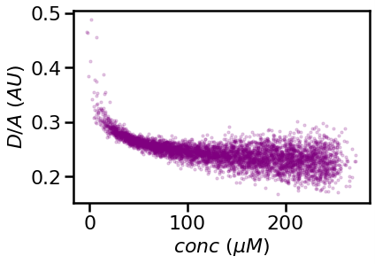

# CHE600 - Class 14

Topics today:
* [Fitting a physical model – overview](#fitting-a-physical-model)
* [Designing a model](#designing-a-model)
* [Using the model as a fitting function](#fitting-our-model-to-our-data--homework-2)

# Fitting a physical model

Last class we've seen how to an arbitrary function and fit it to experimental data. While the function can be informative (e.g. provide a decay constant, find the peak or the midpoint of a curve, etc.), it reveals very little about the underlying behavior of the system that ultimately generates the data. 

1. To gain true mechanistic insight about our system requires us to think of a mathematical model that determines the behavior of the system given some initial conditions. Inmportantly in our case, we want the model to produce the same observable our experiment measures. This could be the concentration of a specific chromophore, the pH of the system, the change in temperature, or any other expeirmentally accessible variable. 

2. Our approach is as follows: 
    1. Create a model (in practice: define a function) that accepts initial conditions as input and the experimental observable as output
    2. The model will include constants that define the behavior of the system
    3. Test your model with the initial conditions of your experiment and a reasonable range of values for the constant to see if it works as expected
    4. Finally, use the initial conditions of your experiment and FIT the constants to reproduce your experimental data
    5. The fitting results now reveal the value of the real physical constants underlying your system (as opposed to details about the shape of your data)

3. Modelling a system in this way is the ultimate way to leverage experimental results: If your fit doesn't work, or produces unrealistic constants, it means your experiment behaves by a different set of rules than what you expect. 

4. Importantly, even if your model **does** work, it does not mean you've captured all the nuance that might be present in the experiment! It only means you've found one way to explain the behavior of your system. 

# Designing a model

We write models based on our physical/chemical/biological knowledge. Models are extremely powerful to connect macroscopic observables with microscopic behavior. Models can be used to rule out specific mechanisms, verify others, and back out constants that would otherwise not be accessible.

## I. Setting the ground for the model

1. In today’s class, we will take experimental data from my lab, and try to fit it to a physical model. The data is the FRET signal from cells expressing a specific FRET-labeled protein. The donor-to-acceptor ratio (D/A) is the ratio of the donor and acceptor fluorophore emissions, and is measured using live cell microscopy. The concentration on the x-axis is measured by the intensity of the acceptor flurophore. Each point on the scatter plot below is a single cell.

    

2. Here’s where our expertise as scientists come into play. We need to integrate what we know about the system we’re studying, about the method used to obtain the data, and our intuition about what is going on to propose a model. 

3. In this case, my student was surprised to see a concentration dependence of the D/A signal – because naively we would assume the signal is coming from an individual molecule. My student suggested that this may be due to interaction between proteins – meaning labeled proteins would interact with each other in the cell to form DIMERS with a different D/A signal than monomers. 

4. We now have a hypothesis based on a physical intuition: As concentration increases in the cell, more of the labeled protein population would exist as a dimer with a lower D/A. We want to fit this model to our experimental data above. If it doesn’t work – meaning the fit is poor – the hypothesis is ruled out. If it works, it indicates the hypothesis might be correct – it does not prove it outright!

5. We would need to:
    1. Write the model as a function
    2. Test the function with some reasoable values
    3. Use this function, together with ```scipy.optimize.curve_fit()```, to fit our experimental data

## II. Turning our model into equations

Equations are what let us turn an idea into a quantitative prediction. In any model you must turn your intuition/thoughts/concepts that you believe are key to explaining your system into a set of equations. In this case, the ideas revolve around a monomer dimer equilibrium in our system. Remember also that ultimately you will need to model the observable - in this case the D/A ratio.

1. The first thing we need to think about is how we turn the composition of our system into our observable – in this case a D/A fluorescence ratio. For that, we will assume that the entire protein population is divided into two states, and that each state has an average D/A value that is associated with it. The final equation would be:

$$\begin{equation}\tag{1}{D/A=\frac{[monomer]}{[total]} \times D/A_{monomer} + \frac{[dimer]}{[total]} \times D/A_{dimer}}\end{equation}$$

* Note that this assumption need not be true – it’s possible there are higher order oligomers, or that the initial state is a dimer, or that there are stable oligomeric states.. but all these can be tested down the line. 

2. What parameters here can we obtain from our experimental data (assuming the model is correct?) Clearly there is some relationship between [monomer], [dimer], and [total]. Let’s build a model to account for this. The model will assume that the FRET reporter population in each cell is at equilibrium (another assumption!) according to the equilibrium equation:

$$\begin{equation}\tag{2}{[dimer] \rightleftharpoons 2[monomer]}\end{equation}$$

3. This chemical equilibrium obeys the following equilibrium constant:

$$\begin{equation}\tag{3}{K_d=\frac{[monomer]^2}{[dimer]}}\end{equation}$$

4. We do NOT know the dimer and monomer concentrations. HOWEVER – we know the TOTAL concentration of protein in each cell (that’s out x-axis!). We can back out individual concentrations if we know the Kd by using a simply quadratic:

$$\begin{equation}[total]=2×[dimer]+[monomer]\end{equation}$$

5. From here follows that:

$$\begin{equation}[dimer]=([total]-[monomer])/2\end{equation}$$

* And:

$$\begin{equation}K_d=\frac{[monomer]^2}{([total]-[monomer])/2}\end{equation}$$

* This rearranges to a second degree polynomial:

$$\begin{equation}-2[monomer]^2-K_d [monomer]+K_d [total]=0\end{equation}$$

* Which is solvable using a quadratic formula, where $a=-2$, $b=-K_d$, $c=K_d[total]$, and $x=[monomer]$. Reminder that the quadratic formula is 

$$\begin{equation}x_{1,2}=\frac{-b±\sqrt{(b^2-4ac)}}{2a}\end{equation}$$

6. In other words, we can now supply our function with $K_d$ and $[total]$ (our x axis – the vector containing the total concentration of protein in uM), and we will get the monomer and dimer concentration from:

    1. solving the quadratic in Eq. (7) to obtain $[monomer]$
    2. plugging in $[monomer]$ into Eq. (5) to get $[dimer]$
    3. plugging in $[monomer]$ and $[dimer]$ to Eq. (1) to get the observable D/A.


## III. Turning the equations into code:

1. Code this entire segment according to the following instructions:
    1. Generate $[total]$ values (in the same $\mu$M range you see in the experimental data) using ```np.linspace()```
    2. Assign values to scalar variables $K_d$, $D/A_{monomer}$, and $D/A_{dimer}$
    3. Code the quadratic equation shown in eq (7) to obtain $[monomer]$ 
    4. Use $[monomer]$ and $[total]$ to calculate $[dimer]$ according to eq. (5)
    5. Use eq (1) to calculate the observed D/A.
    
2. You can now plot the D/A signal vs $[total]$, which is the experimental observable. However, you can now also plot the **monomer and dimer concentrations** as function of total concentration. Plot all of these - do they make sense?

3. Think also about how you would do some sanity checks: For example, we know that $K_d$ should remain constant throughout. You can calculate it explicitly using Eq. 3 above, and see if it remains constant for every $[total]$ concentration. 

4. We also want [total] to stay constant – you can check that by summing the monomer and dimer concentrations (Eq. 4) to see if they are not changing.


## IV. Turning the code to a function

Now that the model works – we need to turn it into a function so that we can use it with ```scipy.optimize.curve_fit()``` to fit our experimental data. How do you do this? 

1. Looking back, the parameters we need to use as input for our model are:
    * $[total]$ – this is the x axis, and a known quantity for the experiment 
    * $D/A_{monomer}$ and $D/A_{dimer}$ – the FRET value of the monomer and dimer conformations. 
    * $K_d$ – the equilibrium constant for the dissociation reaction

2. The output we'll want to receive:
    * the total, observable D/A - as described by eq. (1)

3. Code it up and try running it and plotting the results. It’s a good idea to not have this function plot anything, because that would be problematic when you call it iteratively through curve_fit. 

# Using our model to fit experimental data

1. Import the experimental data [here](./files/DA_vs_conc.csv) and import it into your python using pandas or numpy.

2. Plot the experimental data, see if it makes sense.

3. Call your dimer model function through curve_fit (remember your imports!):

```python
popt,pcov = scipy.optimize.curve_fit(func, x, y_exp, **args)
```

4. Try fitting it without any arguments. If this doesn’t work, pass some initial starting point using p0, or add some bounds. We can use our knowledge of chemistry to help set these: For example, we know for a fact Kd and D/A can’t be negative.

5. Plot your fit on top of the experimental data. Is the fit good?

6. If you managed to fit your data: congrats! Not only have you shown that the concentration dependence we see could be explained by our FRET construct dimerizing, you also managed to quantify the Kd for this reaction.This analytical dimerization model is a major upgrade for this paper, and gives strong mechanistic insight to an otherwise purely phenomenological observation

7. To the blackboard submission link, please upload:
    1. The final notebook (call it dimerModel.ipynb), including the model function and the fitting script.
    2. A plot of the experimental data overlayed with your model fit
    3. A plot of the monomer and dimer concentrations vs. total concentration.

