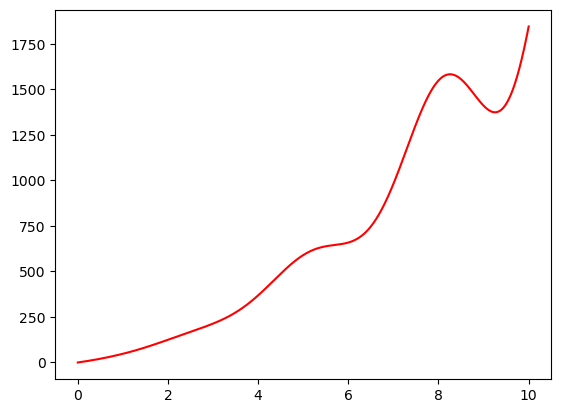

# CHE600 - Class 15

Topics today:

* [Integration of arbitrary functions](#numerical-integration)
* [Integration of ordinary differential equations (ODEs)](#integrating-odes)
* [Class work: predatory-prey model](#class-work---predator-prey-equations)

# Numerical Integration

Many tasks require integration of datasets. You've probably seen many functions that can be integrated analytically. However, This is an exception to the rule - integration is often not solvable analytically since we usually have an arbitrary form to our data and are also limited by sampling/spacing of our data points. 

1. On the computer, we cannot do infinitesimal calculation – the computer doesn’t understand the concept of "limits". We therefore need to "discretize" our integration – go from an integral to a sum.

2. In other words, we need to break down the data we want to integrate into discrete blocks, and the sum of these blocks will be the integrand. The simplest way we can do this is to sum the area of “bars” that run through our data points.

3. Let’s define a function that we will integrate over. Start a file called integrate1.py. Import numpy and matplotlib.pyplot, and define an arbitrary function (this can be any other function you want! But let's make sure it’s not a simple polynomial since those can just be solved analytically!):

```python
def f(x):
    y=np.sin(x)**2*x**3+12*x**2+35*x
    return(y)
```

4. We’re interested in the integral under this curve, between 0 and 10. Let's first draw the function

```python
x1 = np.linspace(0,10,1000) # to visualize the curve
plt.plot(x1,f(x1),c='r')
```



5. Let’s start by integrating with bars. How many bars do we need? We’ll start with 4 points on it:

```python
x2 = np.linspace(0,10,4)    # to visualize bar integration
plt.plot(x1,f(x1),c='r')
plt.bar(x2,f(x2),width=x2[1],edgecolor='k')
```

6. The "integral" will basically involve summing the area of the four bars. What do you think? Will we get the right value for our integration? 


7. Now lets try the same thing with more bars, say 50. Plot the same graphs again after adjusting your ```np.linspace()``` spacing. What does the graph looks like now? Will the integration improve?

8. As spacing between points becomes smaller and smaller, our estimate of the area under the graph becomes better. Let’s try this. Define an array with increasing numbers to use as a spacing parameter for our linspace range of (0,10).

```python

```

9. Now iterate over this array to plot the function and sum over each of the rectangles to get the final integrand. Since spacing between adjacent x-values is not 1, we will need to calculate this and multiple it by the y-value. Since our x-axis is linearly spaced, we can do this by simple taking two adjacent x values, say x[1]-x[0]

```python
# dx is number of "bars"
dx = np.array([4,6,8,10,50,100,500,1000])
# make subplots
fig,ax=plt.subplots(1,len(dx),figsize=[12,3])
# make an array to hold the value of the integrand
integrand=np.zeros_like(dx)
# loop over dx
for i in range(len(dx)):
    x = np.linspace(0,10,dx[i])
    y = f(x)
    # calculate integrand 
    integrand[i] = sum(y*(x[1]))
    ax[i].bar(x,y,label=str(1/(dx[i])),width=x[1])
    ax[i].plot(x1,f(x1),c='r')
    ax[i].set_xlabel('x')
    ax[i].text(0,1750,'dx: %i \nint: %i'%(dx[i],integrand[i]),fontsize=6)
ax[0].set_ylabel('y')
#ax[1].set_xlabel("dx")
#ax[1].set_ylabel(r'$\int f(x)\ dx$')
plt.tight_layout()
```

10. See how the integrand converges as we decrease the x-axis spacing! However, with these summation methods we are always limited to using rectangles, and so will never be able to accurately fit smooth functions!

11. This may seem redundant – we manage to get a very good estimate of our integral even with this simple method! BUT some computations require millions and millions of integration steps. Making the step size very small will increase computational costs; accruing even small errors in each of our million steps ensures that total integration error will increase with every iteration. As a result, the rectangle summation method is woefully inadequate for pretty much any function.

12. Enter the trapeze method. Instead of summing over rectangles, we summer over trapezes. This will give an accurate integration of linear slopes (but not of higher polynomials!). This can be done with a scipy function, scipy.integrate.trapz, but we will code it ourselves so we understand how it works:

13. Define a new function trapez(x,y):

```python
def trapeze(x,y):
    w = x[1]-x[0] #width
    int_y = w*y[:-1]+w*(y[1:]-y[:-1])/2 #trapeze area
    return(sum(int_y))
```

14. The equation for int_y is derived from the area of the trapeze defined by (x1,y1) and (x2,y2). We return the sum of this entire array of trapeze areas at the end (a scalar). Now let’s use this to calculate the integrand and see how it converges compared to the rectangle method:

```python
fig,ax=plt.subplots(1,len(dx),figsize=[12,3])
integrand_trapeze=np.zeros_like(dx)
for i in range(len(dx)):
    x = np.linspace(0,10,dx[i])
    y = f(x) 
    integrand_trapeze[i] = trapez(x,y)
    ax[i].plot(x,y,label=str(1/(dx[i])))
    ax[i].scatter(x,y,s=5)
    ax[i].plot(x1,f(x1),c='r')
    ax[i].set_xlabel('x')
    ax[i].text(0,1750,'dx: %i \nint: %i'%(dx[i],integrand_trapeze[i]),fontsize=6)
ax[0].set_ylabel('y')
#ax[1].set_xlabel("dx")
#ax[1].set_ylabel(r'$\int f(x)\ dx$')
plt.tight_layout()
```

15. We can see that the trapeze method converges much better than the rectangle method. The trapeze method is actually an exact solution for linear relationships at any dx!

16. Fancier integration methods have higher-order polynomials between points, and can be more efficient, but also slower to calculate. These can involve both interpolation and extrapolation from known points for increased accuracy.

# Integrating ODEs

Generally – we don’t need the computer to integrate simple functions like polynomials since we can do this analytically. Instead, we will often need to integrate to solve differential equations. These equations combine functions and their (n-th order) derivatives to describe natural laws. For example:

$$\frac{dy}{dx}+y=x$$

1. This is a first order, ordinary differential equation (ODE). The solution to this equation will give us an integrated equation equating y to x. 

2. Solving ODEs requires that we integrate over both sides of the equation (in a simple case). There are several ways to do this analytically (integration by parts, by substitution, etc.). Luckily – we won’t have to do any of this.

3. Regardless of how we solve them, we will always need to know some initial value since the differential form does not include any constants that may be present in the integrated equation. 

4. Spoiler: the solution for this ODE, assuming y(x=0)=1, is:

$$y=x-1+2e^{-x}$$

5. How do we solve ODEs with python? First, let’s separate the derivative from the non-derivative parts of our equation. In this case we isolate the derivative on the left hand side, and the function over which to integrate will be on the right hand side:

$$\int \frac{dy}{dx}=\int(x-y)$$

6. Scipy has a range of different ODE solvers. We will use the ```solve_ivp()``` [function](https://docs.scipy.org/doc/scipy/reference/generated/scipy.integrate.solve_ivp.html) (solve initial value problem), which is a wrapper for a range of different ODE solving algorithms. Open a new notebook called ODE.ipynb. 

7. After adding your imports, let's write down our ODE as a function:

```python
def dy_dx(x, y):
    return(x-y)
```

8. Calling this solver requires need the following input: ```x_eval``` is the x-values we want to evaluate the function at, ```y0``` is the boundary condition (the value of y at x=0), ```x_span``` is the bounds of integration (given as a two-member list or tuple), and ```func``` is callable function that is the right-hand side of the derivative and accepts the x-axis and y values as input (in that order!). Let’s see it all work together:

```python
#import
from scipy.integrate import solve_ivp

x = np.linspace(0,5,100) # integration range
y_exact = x - 1 + 2*np.exp(-x) # exact solution
y0 = 1.0  # the initial condition

# solve!
sol = solve_ivp(dy_dx, (x.min(),x.max()), [y0], t_eval=x)
ys = sol.y.flatten() # extract solution y-values
y_diff = np.abs(y_exact - ys) #calculate errors

# plot!
fig,ax=plt.subplots(1,2,figsize=[12,6])
ax[0].set_xlabel("x")
ax[0].set_ylabel("y")
ax[0].plot(x, ys,linewidth=3,c='black',label='solver')
ax[0].scatter(x, y_exact,s=50,c='red',label='analytical')
ax[0].legend()
ax[1].semilogy(x, y_diff)
ax[1].set_ylabel("Error")
ax[1].set_xlabel("x")
plt.tight_layout()
```

# Class work - predator-prey equations

We’ll next use ODE solvers for a famous example that’s a bit out of the chemistry field: Predator-prey equations. This is famous set of differential equations in ecology, sometimes called the [Lotka-Volterra equations](https://en.wikipedia.org/wiki/Lotka%E2%80%93Volterra_equations), that describe the population dynamics in a system with predator and prey. 

1. Predators cannot survive without prey, but eat too much and prey will become scarce, causing predators to die off. This leads to interesting dynamics. These are described by two first-order differential equations:

$$
\frac{dx}{dt}=x(a-by)
\frac{dy}{dt}=-y(c-dx)
$$

2. In these, x is the population of prey (eg rabbits) and y is the population of predators (eg foxes). The parameters a, b, c, and d are positive parameters which describe the interactions between the species (how effective are the predators, how many offspring do the prey have, etc.). Start a new python notebook called LVeq.ipynb, and in the first cell do all your imports (```numpy```, ```matplotlib.pyplot```, and ``solve_ivp`` from ```scipy.integrate```)

3. We will use the r.h.s of the derivatives to define the integration function. Note that if we compare to the previous example, x is called "t" (time) and "y" is called "P". Importantly, the returned variable P is now an array that contains two elements – populations of prey (P[0,:]) and predator (P[1,:]):

```python
def dP_dt(t, P, a, b, c, d):
    prey = P[0]*(a - b*P[1])
    predator = -P[1]*(c - d*P[0])
    P=[prey, predator]
    return(P)
```

4. We now use ```solve_ivp()``` to integrate over these ODEs:

```python
# define constants/ranges
ts = np.linspace(0, 12, 100) # define time range
P0 = [1.5, 1.0] # define initial value of prey and predator
a,b,c,d = 1,1,1,1 # model constants

# solve
sol = solve_ivp(dP_dt, (ts.min(),ts.max()), P0, t_eval=ts, args=(a,b,c,d)) 
```

5. Note that the returned object from sol_ivp contains multiple attributes. We're interested in the y-values, which are stored in ```sol.y```:

```python
# extract values from solution
prey = sol.y[0,:] # extract prey from solution
predators = sol.y[1,:] # extract predator from solution
```

5. Plot predator and prey vs time on the same graph using matplotlib. Upload the notebook to class 15 submission, and explain the behavior of the system. In addition, answer the following questions in the submission textbox:
    1. What happens if you play with the constants a,b,c,d? Guess, based on how the plot changes, what each of these parameters mean?
    2. What happens if you change the density of points your x-axis (by changing the number of points in the ts array)? Pay special attention to the number of points in your x-axis, and what happens if you set this to too few…


