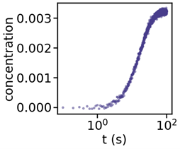
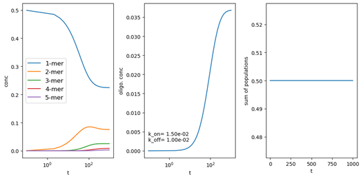

# CHE600 - Class 16

Topics today:
* Kinetic master equation
* Integrating the master equation with solve_ivp
* Homework II: fitting the master equation to experimental data

# Kinetic master equations

In our work we often encounter a system with multiple populations that interact with each other. Kinetic theory dictates that the rates at which these interactions occur is set by their concentrations and a set of constants the describe the frequency of interactions. This can be applied to chemical species, organisms in a test tube, proteins in a cell, or anything else. Today we will learn how to model the evolution of such a system over time. 

## I. Oligomerization

We conducted a light scattering experiment on a protein that can oligomerize over time. The experimental data we collected (download the raw data [here]) looks like this:



1. We know some things about this system from the literature:
    * In this system, monomers attach to other species in a step-wise fashion. That means that we only need to consider monomer addition or detachment from oligomers.
    * Our method cannot detect species smaller than trimers.
    * Above the detection threshold, our method cannot detect differences in oligomer size.
    * The size of oligomers for this system is capped at tetramers.

2. Because this is a kinetic experiment, we will use kinetic theory to integrate our information into a time dependent model. Kinetic theory states that for an equilibrium process $A + B \\rightleftharpoons C$ the rate at which the concentration of A changes depends on the rate constants $k_{on}$ and $k_{off}$ and the concentration of the different species in the solution.

$$
\frac{d[A]}{dt}=k_{off}[C] - k_{on}[A][B]
$$

3. Notice that this forms a first order ordinary differential equations. We know how to solve these with solve_ivp!

4. With this strategy in hand, let’s think about the different species in our system: monomers, dimers, trimers, and tetramers. These interchange between each other by losing or gaining monomers. We can generate our observable by summing the concentration of trimers, and tetramers in our solution at any given time point!

5. We’re going to take a two-step approach: 
    1. We will write a function with our ODEs that will accept $k_{on}$ and $k_{off}$ as parameters and be solved by integration using ```solve_ivp()```. 
    2. We will write a function that accepts guesses for $k_{on}$ and $k_{off}$, and returns our experimental observable. This will be used as the _fitting function_ for ```curve_fit()``` to fit our experimental data.

## II. A simple dimer kinetic model.

We’ll start by coding up a function that describes a simple monomer-dimer master equation, where two monomers can come together to form a dimer, and a dimer can dissociate to two monomers. 

1. The differential equations are as follows:

$$
\frac{d[monomer]}{dt}= -2k_{on}[monomer]^2 + 2k_{off}[dimer]
$$
$$
\frac{d[dimer]}{dt}=k_{on}[monomer]^2 - k_{off}[dimer]
$$

2. The function should be called ```ME(t, C, k_on, k_off)```. ```t``` is the integration parameter (time), ```C``` is a two-element list containing the concentrations of monomer and dimer, and the on and off rates are ```k_on``` and ```k_off```. Write the two differential equations in the same way we’ve seen for the predator-prey equations. Remember that the concentrations of monomer and dimer are ```C[0]``` and ```C[1]```, respectively.

```python
def ME(t,C,k_on,l_off):
    # your code here
```

3. These coupled differential equations are sometimes refered to as a ["master equation"](https://en.wikipedia.org/wiki/Master_equation). The describe the accounting of all species in the system, given an initial concentration and rate constants. Notice that the overall number of monomers MUST be conserved (otherwise we refer to the system as "leaky"). 

4. The call to ```solve_ivp()``` to intgrate ME should be as follows: ME is the master equation ODE function, t is the time vector (a numpy array) that provides the integration range, C0 is your initial concentrations (remember this should be a 2-member list!), ks is a two-member list with the values for $k_{on}$ and $k_{off}$ (the order is determined by the order in your function!).

```python
sol=solve_ivp(ME,(t.min(),t.max()),C0,args=ks,t_eval=t)
```

5. Solve this with an initial concentration of 0.7 for monomers only (no dimers) and kon and koff of 0.06 and 0.01, respectively, for time ranging from 0 to 100, and output the concentration of monomers and dimers vs time. To do this we’ll store our concentrations in a 2-member list we’ll call C. C[0] is the concentration of monomers, C[1] of dimers. You will want to write a few lines to plot the solution variable sol.y. Remember this will be a 2 x len(t) matrix!

```python
# time vector
t = np.linspace(0,100,100)
# initial concentrations (monomer, dimer)
C0 = [0.7,0]
# rate constants (k_on, k_off)
ks=[0.06,0.01]
# use solve_ivp to integrate the ME() function
sol=solve_ivp(ME,(0,100),C0,args=ks,t_eval=t)

fig,ax = plt.subplots(figsize=[10,10])
ax.plot(t,sol.y[0],label='monomer')
ax.plot(t,sol.y[1],label='dimer')
ax.legend(fontsize=12)
ax.set_ylabel('conc')
ax.set_xlabel('t')
```

7. We’ve now built a master equation for a monomer-dimer equilibrium system. What do the results look like? Does it make sense? How would you debug this?

# Extending to tetramers

Next we’ll expand our model to all oligomer structures inherent in our full model. It’s recommended to start a new cell so you keep your simple dimer model unchanged as reference. 

1. Write a set of equilibria all the way to tetramers on a piece of paper - this will help you figure out the differential equations. 

2. Write the differential equations all the way to tetramers. Remember that the system is built step-wise using monomers, so two monomers turn into a dimer, a dimer and a monomer turn into a trimer, etc. Remember also that the monomer addition is reversible, so a dimer can turn into two monomers, a trimer into a dimer and a monomer, etc. For example, the ODE that describes dimer change with time can look like:

```python
dC2 = k_off*(-C[1] + C[2]) + k_on*C[0]*(C[0] - C[1])
```

3. As before, the function should accept a time vector t, a list with all 4 concentrations C, k_on, and k_off. There is an inherent assumption that rates are constant and do not change for different oligomers. The function should return a list of all concentrations. 

4. Once the function is done, let’s try running it with some parameters. You will want to write a few lines to plot the solution variable sol.y. This is the same as before but remember C will now be a 5 x len(t) matrix!

```python
t = np.linspace(0,100,100)
C0 = [0.5,0,0,0,0]
p0=[0.15,0.007]
sol=solve_ivp(ME,(0,100),C0,args=p0,t_eval=t)

fig,ax = plt.subplots(figsize=[10,10])

for i in range(sol.y.shape[0]):
    ax.plot(t,sol.y[i],label=str(i+1)+'-mer')
ax.legend(fontsize=12)
ax.set_ylabel('conc')
ax.set_xlabel('t')
```

5. You’ll quickly find out that constants need to be smaller than 1 or our simulation “explodes”. Try generating some solutions that would make sense, and plotting these as function of time. Note that the graph below is only one example with some arbitrary parameters – yours can look very different!

6. How can we test if our model is working right? One way to do this is to check that matter is conserved, and no monomers are destroyed our simulation. In other words, our simulation isn’t “leaky”. One way to do this is to use the ```np.sum()``` function to go over each line in the concentration matrix (```sol.y```), and sum the monomers. Remember to multiply each column by the number of monomers in the species! Write a function called ```checkModel()``` that accepts the sol.y matrix returned from the ODE solution and checks this for you easily.

7. Using your checkModel() function, make sure the number of monomers stays constant in your system through the integration. If it is not, find the error(s) in your differential equations! It is neccessary to make sure that there are no leaks in your equations before proceeding to the next step!

# Recreating our observable

1. Our first goal is to create an objective function that will return the observable. Recall that our observable concentration (our y-axis) cannot see small species and cannot differentiate between the larger species. Write a function calcObs that accepts the sol.y matrix returned from the ODE, sums the total concentration of trimers and tetramers, and returns this summed concentration for each timepoint. 

2. Write a script that will define initial concentrations and on and off rates, and use that to:
    1. Plot the change in monomer, 2-mer, 3-mer, etc species vs. time
    2. Plot the observable signal (sum of concentrations of trimers and higher) vs. time
    3. Shows the conservation of monomers vs time.
    4. See example below



3. Play around with rate constants, timepoints, and initial concentrations and see the limits of the model. when does it fail? When does nothing happen? When do you get interesting dynamics? When does the simulated observable start to look like the [experimental results](#kinetic-master-equations)?

4. A note about units – the computer doesn’t care about units, but this can often be a major problem comparing experiments to simulations. Here I’ve used experimental data that is amenable to using reasonable numbers for the simulation. This is rarely the case, and you will need to be very diligent in keeping track of the units in the computer and the units in your experiment!

# Homework II: Using an ODE model to fit the data

Now we are ready to fit the observable we obtain from calcObs to the experimental data. Doing this will allow curve_fit() to iterate through different k_on and k_off values to find the monomer on and off rate in this system that match our experimental data. 

1. Download the [experimental data](./files/Aggregation.csv) and place it in your working directory. 

2. Start a new notebook called ```ODEFitting.ipynb```, and do the required imports. Don't forget to import both ```scipy.integrate.solve_ivp()``` AND ```scipy.optimize.curve_fit()```

2. The notebook should contain the following functions:

```python
# Master equation up to tetramers
def ME(t, C, k_on, k_off):
    # your code here, copied from the class exercise
    # return monomer, dimer, trimer, and teramer concentrations
```
```python
# function to calculate observable
def calcObs(sol):
    # your code here, copied from the class exercise
    # return observable trimer + tetramer concentrations
```
```python
# solve the ODE and return the observable - for use with curve_fit()
def fitODE(t,k_on,k_off):
    # the keywork global here tells the function to access the value of C0 from the main namespace, so we don't need to redfine it.
    global C0
    sol = solve_ivp(ME, (t.min(),t.max()), C0, args=(k_on,k_off), t_eval=t) 
    return(calcObs(sol))
```

4. Once you've completed these functions and tested that they work with some reasonable k_on and k_off parameters, we can use ```fitODE()``` as the function to feed into ```curve_fit()```. For this, ```t_exp``` is the experimental data x axis, ```y_exp``` is the experimental data y axis (remember you can also provide an initial guess and bounds for the fit!):

```python
popt,pcov = curve_fit(fitODE,t_exp,y_exp,p0=p0)
```

5. The actual script would look like this:

```python
# import experimental data
data = pd.read_csv('Aggregation.csv')
# define initial concentrations
C0 = [0.12,0,0,0,0]
# define initial guess for k_on, k_off (optional)
p0 = [0.15,0.07]
# define initial bounds for k_on, k_off (optional)
bounds = [(0,0), (1,1)]
# fit ODEs to experimental data
popt, pcov = curve_fit(fitODE,data['t'],data['F'],p0=p0, bounds=bounds)
# solve ODEs with results of the fit to comapre against experimental data
y_model = solve_ivp(ME, (0,100), C0, args=popt, t_eval=data['t'])

# In one plot, show the experimental data overlayed with the fitted model
# In a seperate plot, show the concentrations vs. time of all species in the system, from monomer to tetramer
# In the last plot, show that your system isn't leaky
```

6. Upload the entire notebook to the submission link on Blackboard. In the textbox, answer the following questions:
    1. What rates did you get from the fit? 
    2. Use your model to make a prediction that can be observed using experiments. For example, you can propose to increase rates by heating the system, and using the model to predict the effect given the same initial concentrations.

7. This full program needs to be completed by 3/27. 
