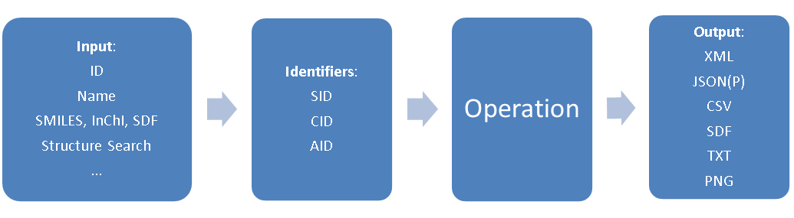

# CHE600 - Class 19

Topics:

1. [Online databases](#online-databases)
2. [The REST interface](#the-rest-interface)
3. [Programmatic access via python libraries](#programmatic-access-via-python-libraries)

# Online databases

As scientific knowledge grows, there is an ever-growin need to organize data in databases. These are built with clear logic (at least to the developers), standardized formats, and can be used to search quickly and efficiently. Often, information from these database can be incorporated into your research, or paired with other databases as a powerful tool to develop or tests hypotheses. 

1. Sometimes, we will need to look for a single entry in a database. For this, an easy option is simply to use the database's search function and pull up the relevant entry. 

2. Other times we need to pull up dozens, hundreds, or even thousands of entries from a database. In cases where multiple entries must be pulled, it is often impossible to do so manually. Some databases have advanced search modes, but even those can be problematic.

3. In addition, displaying the results in a webpage is often not efficient - we might need to click some links manually, or scroll to the bottom of the page to find the information we need, or perform operations on the values in the database. Other times we will want to cross-reference data from one database with data from another database

4. For these cases, some databases offer a download of the entire database. This is not always available, and can create challanges, both in terms of the download size and the requirement to search through a massive database on your local computer.

5. In many cases, the best way to interface with online databases is through programmatic access. That means we will write code to look up entries in the database.

6. Programmatic lookup allows us both to look up multiple entries, and also to format the output in a way that will be useful to us.

7. Today we will demonstrate how to do this using the [PubChem](https://pubchem.ncbi.nlm.nih.gov/) database. PubChem is an NIH-run database that is the world's largest collection of freely accessible chemical information. You can search chemicals by name, molecular formula, structure, and other identifiers, and find chemical and physical properties, biological activities, safety and toxicity information, patents, literature citations and more.

# The REST interface

For many databases, information is directly accessible from URL (e.g. a web address beginning with _https://_). We will now see how to access pubchem through this REST interface

## I. Getting to know PubChem

1. This [video](https://www.youtube.com/watch?v=jZw7w9jithI) gives a brief overview of SOME of the information available in this huge database.

2. Play around with the database a bit. Search for a gene (e.g. BRCA1), a protein (e.g. GPCR), or a compound (e.g. aspirin)

3. Let's search for GLP-1 - this is the Glucagon-like peptide 1 receptor, the target for semaglutide (Ozempic). 

4. Note this _protein_ entry an _accession code_ - P43220. This is an accession code for proteins that originates from another database called [UniProt](https://www.uniprot.org/) (more about UniProt later.)

5. Try to find the list of compounds that bind GLP-1 in the protein entry. Can you find semaglutide in the list? Even if you manage to find it, the information provided is somewhat limited. Programmatic access can help with that!

## II. The PubChem REST interface

We'll now try to pull the information of GLP-1 binding compounds using a web address.

1. The full documentation for PubChem REST is available [here](https://pubchem.ncbi.nlm.nih.gov/docs/pug-rest). The general structure of the REST lookup is as follows:



2. Input in this case will be our GLP-1 protein, with accession P43220. We will want a list of all compounds that bind the GLP-1 protein.

3. The output should be a CSV file. The final REST URL looks like this. Note that this URL is very versatile!:
    * ```https://pubchem.ncbi.nlm.nih.gov/rest/pug/``` this address directs us to the REST server, which is pubchem's _P_ower _U_ser _G_ateway (PUG)
    * ```/protein/accession``` queries a protein through its _accession_ code
    * ```/P43220``` the UniProt accession code for GLP-1
    * ```/concise``` the table of _compounds_ that have been shown to bind GLP-1
    * ```/CSV``` Pull this table in CSV format.
The full address can be clicked here:

[https://pubchem.ncbi.nlm.nih.gov/rest/pug/protein/accession/P43220/concise/CSV](https://pubchem.ncbi.nlm.nih.gov/rest/pug/protein/accession/P43220/concise/CSV)

4. Note that you can now replace the protein accession P43220 with another protein accession code to pull that protein's list of binding molecules!

5. Let's now open this csv using pandas in a new notebook.

```python
import pandas as pd
```
```python
data = pd.read_csv('CSV.csv')
data.head()
```
```python
data.columns
```

6. The columns now represent the full list of binding compounds. It includes binding constants and the result of binding (agonst/antagonist/etc.). It also includes specific identifiers:

    * AID - Assay ID: Identifies a specific bioassay in PubChem.
    * CID - Compound ID: Identifies a unique chemical compound in PubChem.
    * SID - Substance ID: Identifies a specific sample or batch of a compound from a particular source.

## III. Pulling infomation directly from python

The list of compounds is great, but no actual information is giving about these compounds other than their CID! We'll next want to pull these from PubChem as well!

1. One way to do this is manually, through the "Upload ID List" link on the main page. However, another way would be to generate a lookup for this. This time, instead of using the web browser to download, we'll pull directly from python using the ```requests``` library.

2. Let's first compile all the compounds in our dataset that have an agonist activity and a numerical value for this activity:

```python
agonist = data[(data['Assay Name'].str.contains('Agonist'))&(data['Activity Value [uM]']>0)]
# reduce the list to only 100 entires to avoid timeout issues
agonist = agonist.iloc[0:100]
```

3. Let's look at a few of these CIDs on pubchem:

```python
print(agonist[0:2,'CID'])
```

4. Place any one of these CIDs in the following URL to pull up the webpage:

[https://https://pubchem.ncbi.nlm.nih.gov/compound/16135499](https://https://pubchem.ncbi.nlm.nih.gov/compound/16135499)

5. This contains a lot of information, but we want to pull this information for ALL compounds. To do this, we can again use the REST interface with a comma-seperated list of CIDs in the following format:

```https://pubchem.ncbi.nlm.nih.gov/rest/pug/compound/cid/CID1,CID2,CID3,...,CIDN/JSON```

6. The format is:
    * ```https://pubchem.ncbi.nlm.nih.gov/rest/pug/``` - the REST interface
    * ```compound/cid/``` query _compounds_ by CID
    * ```CID1,CID2,CID3,...,CIDN``` a comma-seperated list of CIDs
    * ```/JSON``` return this in a JSON format (TXT/CSV is not available for compounds!)

7. To use this, we'll need a comma-seperated list of all our agonists' CIDs. We will first drop rows that have no CID, then convert everything to an integer, then convert the entire set of values to a string to be seperated by a comma:

```python
cids = agonist['CID'].dropna().astype('int').astype('str').str.cat(sep=',')
print(cids)
```

8. Now let's use this string as part of a REST lookup:

```python
import requests
```
```python
# PubChem REST API URL
url = "https://pubchem.ncbi.nlm.nih.gov/rest/pug/compound/cid/"+cids+"/JSON"

# Send a GET request to the API
response = requests.get(url)

# extract the JSON-formatted response
r = response.json()
```

9. the variable ```r``` is a JSON file (JavaScript Object Notation) - this is a way to organize heirerchical data, but it is difficult to read. Here I've written a script that will export some selected information for each compound and place it in a new dataframe, ```df```.


```python
# create an empty dataframe
df = pd.DataFrame()
# Loop over all CID entries pulled from the response
for c_idx in range(len(r['PC_Compounds'])):
    # generate an empty dictionary to hold this CID's info
    thisCID = {'CID':None,'SMILES':None,'MW':None,'LogP':None}
    # pull the actual CID
    thisCID['CID'] = r['PC_Compounds'][c_idx]['id']['id']['cid']
    # Loop over all properties
    for kkey in r['PC_Compounds'][c_idx]['props']:
        # pull canonical SMILES code
        if (kkey['urn']['label']=='SMILES'):
            if (kkey['urn']['name']=='Canonical'):
                thisCID['SMILES'] = kkey['value']['sval']
        # pull molecular weight
        if (kkey['urn']['label']=='Molecular Weight'):
            thisCID['MW'] = (kkey['value']['sval'])
        # pull logP value (octanol/water partitioning)
        if (kkey['urn']['label']=='Log P'):
            thisCID['LogP'] = (kkey['value']['fval'])
    # append the properties to df
    df = pd.concat([df,pd.DataFrame(thisCID,index=[c_idx])])
```

## IV. On your own

1. Use the ```pd.merge()``` function of pandas (we've seen this one before!) to combine the GLP-1 binding affinity with the molecular characteristics we've found here. 

2. Plot the log of the binding affinity _vs_ the logP of all compounds and the binding affinity _vs_ the molecular weight of all compounds.

3. Fit both plots to a line, and report on the R^2 of your slopes (We have not done this before but I am confident you can figure it out!)

4. Upload your notebook to the upload link on Blackboard.

# Programmatic access via python libraries

For many popular databases, including PubChem, researchers have written easy to use libraries that do the dirty work of formulating the REST URLs and the data extraction for you! They often rely on object-oriented programming to create objects from the databases.

1. For PubChem, such a library is called [pubchempy](https://pubchempy.readthedocs.io/en/latest/)

2. Install the library (using the ```!pip install``` command as explained in the docs)

3. This library is an object-oriented implementation of pubchem items. It includes classes for compounds, assays, and substances.

4. We can now pull a compound using CID's found in our initial GLP-1 lookup.

5. Try it out, with the help of the pubchempy tutorial [here](https://pubchempy.readthedocs.io/en/latest/guide/gettingstarted.html)