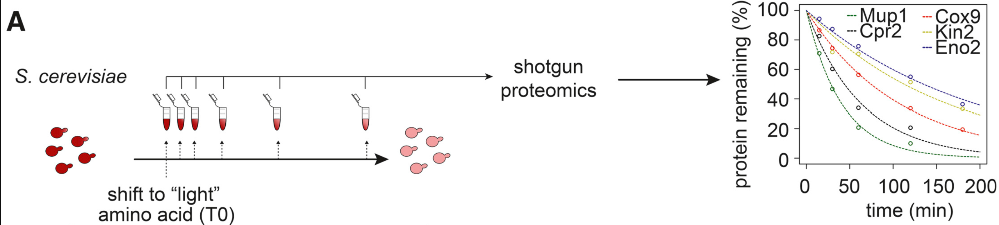
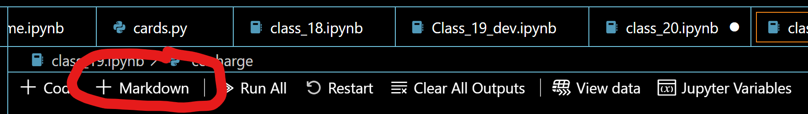

# CHE600 - class 20

# Homework III

Your assignment involves testing some hypotheses using publication data and online databases. The work should be done independently.

## I. Overview

Protein copy numbers are a critical aspect of their function. For example, enzymatic function is determined by an enzyme's catalytic rate and efficiency - but even the most efficient enzymes will not be effective if they exist in a single copy in the cell! Copy numbers are of course regulated by the rate of synthesis of the protein. However, an unappreciated component of copy numbers is the rate of protein degredation. 

1. Your task is to compile a database of protein degredation rates, and try to find correlates with different protein features. Protein degredation rates are measured by protein half life - the rate (in minutes) at which a protein population is reduced by half.

2. A paper by [Christiano et al from 2014](https://doi.org/10.1016/j.celrep.2014.10.065), quantified the halflife of over 4000 yeast proteins. This was done using mass spectroscopy, according to the scheme below:



3. The datasets, in CSV format, is available [here](./files/Christiano_etal_halflife.csv)

4. Your goal will be to pull the sequences of every protein in this dataset and use that to predict the degree of disorder in its structure

5. **The end goal** is to plot the halflife of each protein vs. disorder score.

6. The homework contains multiple questions which you should answer within your notebook using a markdown cell:




## II. Getting started

1. Start a new notebook called ```homework3.ipynb```. The entire exercise can be completed in a single notebook

2. Import pandas, matplotlib, numpy, and other libraries you may need in the first cell.

3. Import the dataset to a pandas dataframe

4. Plot the distribution of the _log10_ of the halflife using the ```hist()``` function of your [dataframe](https://pandas.pydata.org/docs/reference/api/pandas.Series.hist.html)

5. **What is the average, std, and median of the halflives?**

## IV. Pulling information from uniprot

1. The identifier of each protein in the dataset is a UniProt accession code. Open one of the files, and look up the uniprot ID on the [website](https://uniprot.org). Familiarize yourself with the database and the different categories of information this database provides.

2. A good overview tutorial on how to explore a uniprot entry is available [here](https://www.youtube.com/watch?v=BHu88Sv--mc)

3. We want to pull information from uniprot for every single entry. Specifically, we will want to pull the _sequence_ of each entry.

2. You can do this in several ways:
    1. a [REST API](https://www.uniprot.org/help/api_queries) for uniprot 
    2. [recommended] - a python library called [UniProt-Mapper](https://david-araripe.github.io/UniProtMapper/stable/index.html) that will pull (multiple) entries for you in a single line of code.

3. You are on your own! Figuring out the best way to do things is part of the challenge! Remember you will need to install libraries using ```!pip install <library name>``` if you have not installed them previously!

4. **Look through the data: Is there anything that pops up in the proteins with the shortest or longest halftime?**

## V. Sequence analysis

With the full length sequence for each protein, let's perform some further analyses. 

1. The question we are interested in is whether or not the degree of disorder in a sequence is correlated with the halflife of a protein. In other words - does increased protein disorder coincide with higher rates of degredation?

2. To do this, we will need to predict the disorder of each sequence. One way to do this is through a library called [metapredict](https://metapredict.readthedocs.io/en/latest/getting_started.html). Metapredict is a machine learning network trained to predict the degree of disorder (e.g. the percentage of residues that do not have a fixes 3D structure) directly from amino acid sequence. See the original paper [here](https://www.biorxiv.org/content/10.1101/2024.11.05.622168v1)

3. Install the library on your computer, and read the documentation. 

4. Using the predict_disorder() [function](https://metapredict.readthedocs.io/en/latest/usage/api.html#metapredict.meta.predict_disorder), predict the disorder of all sequences in your dataset. 

5. Add the disorder as a column to your main DataFrame.

6. Display a scatterplot of the disorder score _vs_ the halftime. Note that since halftimes might span multiple orders of magnitude it is better to show them on a log scale.

7. Using [scipy.stats.spearmanr()](https://docs.scipy.org/doc/scipy/reference/generated/scipy.stats.spearmanr.html) calculate and display the [spearman rank coefficient](https://en.wikipedia.org/wiki/Spearman%27s_rank_correlation_coefficient) between the disorder score and the halftime.

8. Do you find a correlation? 

9. Upload the full notebook, and answers written as comments or _markdown cells_ to blackboard by 4/18, 11:59 PM.

## Good luck!

