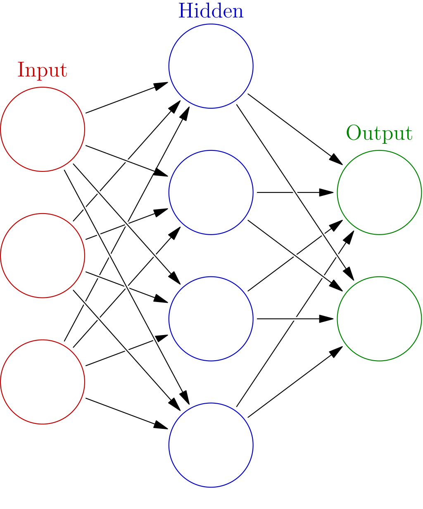
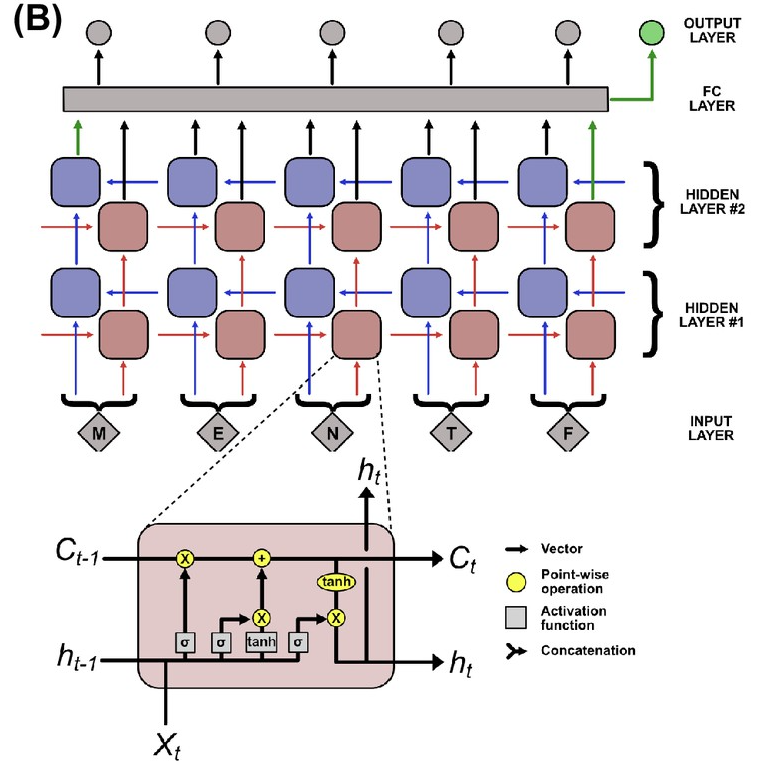
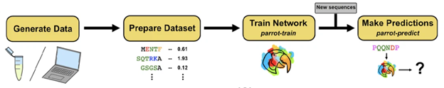
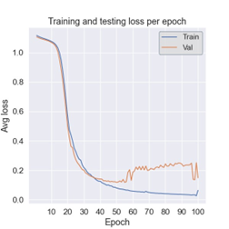
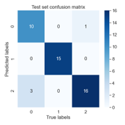
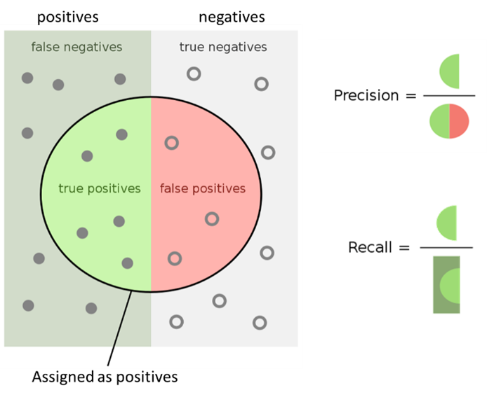

# CHE600 - Class 21

Topics today:
* [What is machine learning?](#what-is-machine-learning)
* [Predictions with ML](#predictions-with-ml)


# What is machine learning?

[Machine Learning](https://en.wikipedia.org/wiki/Machine_learning) (ML) describes a class of algorithms that improve automatically as they work through a dataset. While these ideas have been around for a while, it is only with the advent of “big data” that this concept really took off. These datasets, coupled to algorithms that process and classify information algorithmically, powered trained networks that can do anything. Today, ML trained networks can generate de novo paragraphs, predict protein structure or design previously unseen proteins, segment microscopy data, or come up with new artistic creations based on a user’s prompt. 

# I. What does ML do?

Broadly speaking, ML identifies patterns in your data that are not visible to the human eye. 

1. The larger and "higher quality" the dataset, the better the pattern identification. Once sufficient data is processed by the algorithm, we have a _trained (ML) network_.

2. A trained network can spot patterns in data it has not seen before if the data is _similar_ to the training set. In this way, ML networks can perform _prediction_. Note that if the data is _dissimilar_, or the training is insufficient, these predictions have a high potential to be wrong.

3. In the same vein, trained networks can also be used to _generate_ new data that adhered to these patterns.

# II. Terminology

ML has some terminology it will be important to understand before we dive in. You will often see graphs like these:



1. The input is the data you're feeding into the model. For example, a protein sequence. This is hands down the most important factor in building an ML network. Bad or poorly acquired data will still provide predictions - but they will be useless predictions (the famous "garbage in garbage out"). ML networks are also highly specific - trained to do one thing - and so will not perform other (even highly related) tasks. We will see more of this next class.

2. The data is then turned into a numerical representation - also known as _encoding_. For example, we can assign a number to each of the amino acids, or we can use a "one hot" representation - this is a binary matrix of Nx22 Booleans, where N is the length of the sequence and amino acid identity depends on which colum contains a one (with two additional position for N- and C-terminal).

3. This numerical representation is then fed into hidden layers, where "the magic happens". For example, the layers can start examining the chemical nature of the amino acids. It can examine the local region of the amino acid (what amino acids exist in sequence vicinity). It can incorporate other information - like evolutionary conservation data.

4. This is performed not for a single protein at a time, but for many. Because of this, certain rules can be learned about the dataset. For example, the network can quickly figure out that the initial amino acid of all sequences is methionine. Or that often regions are enriched in a certain type of amino acid. The larger the dataset, the more patterns are identified.

6. Once trained, the network can take a new sequence and provide an output that adds information it learned from the _training_ dataset to the initial input representation. This output is often referred to as _embedding_

# Predictions with ML

1. Today we will use machine learning to predict a property of amino acid sequences. Prediction can be of two types: _classification_ and _regression_. 

2. As the name implies, classification is the process of assigning datapoints to discrete classes. For example, assigning a description to objects in an image. For 
protein data, assigning things like cellular localization, presence of PTMs, biological function, etc., can be framed as a classification problems. 

3. Regression problems involve assigning each data point a continuous real number value. For example, proteins can be assigned values corresponding to their expression levels, disorder, binding affinities, etc.

4. To train a ML algorithm you will first need a curated dataset that will be used for training. The ML algorithm will then train to make predictions based on this data. Once trained, the network will be able to assign a class (for classification problems) or a value (for regression problems) when presented with a new, but similar case. 

5. It is important to note that ML can only _predict_. It cannot validate a result on its own, and is most effective when combined with follow-up experimental validation.

## I. Recurrent neural networks to analyze protein sequences

1. Today we will use [PARROT](https://idptools-parrot.readthedocs.io/en/latest/) – a general framework for training and applying predictors for large sequence-based datasets. Sequences can be composed of any string, so PARROT can be used for amino acids, nucleic acids, or similar.

2. Note that PARROT only provides the _framework_ for training - essentially pilling together algorithms from a bigger library called [pytorch](https://pytorch.org/) - one of the most popular, open-source, machine learning python libraries. PARROT on its own does NOT contain any trained networks - but it can be used to load and use them to make predictions.

3. The "hidden layers" in PARROT use a _bi-directional recurrent neural network_. In our context, this type of architecture allows layers to pass information between positions in both directions - letting each amino acid position be known to all others. Learning can then be done based on sequential data. This is unlike other network architectures that require a uniform size of input parameters or do not consider the sequence (order) of the data. This algorithm is probably the wrong choice for e.g. image segmentation. The choice of network depends on the dataset and what we want to predict from that dataset. A schematic of this is shown below:



4. The PARROT workflow is shown below:



## I. Setting up the network 

1. Let’s look at a prepared dataset. Download and open [seq_class_dataset.tsv](./files/seq_class_dataset.tsv). 

2. This is a SMALL dataset – with only 300 sequences. Datasets for real training can have hundreds of thousands of sequences. The file looks like this:

```
Frag0 WKHNPKHLRP 0
Frag1 DLFQDEDDAEEEDFMDDIWDPDS 1
Frag2 YHFAFTHMPALISQTSKYHYYSASMRG 2
Frag3 CNRNRNHKLKKFKHKKMGVPRKKRKHWK 0
Frag4 VDDDIEYDDVEVYPLQDE 1
Frag5 DMHIDWHSYVRCGVNWWPSNASAR 2
Frag6 CQVRPVRHWHRNKRKQQHRR 0
Frag7 DETDESDDDEEGDGMVIDS 1
Frag8 LQPSSYSVHERAC 2
```

3. The first column is the sequence ID (not actually used in network training – but is required to parse this file to prepare for training), the second column is the sequence, and the 3rd column is the classifier – in this case 0, 1, or 2. For this data:
    * class '0' sequences are randomly generated in a manner that strongly favors basic amino (K, R) acids. 
    * class '1' sequences are randomly generated in a manner that favors acidic amino (D, E) acids. 
    * class '2' sequences are generated such that all amino acids have the same probability. 

4. To run Parrot, we will need python 3.9 - it won't work well with newer versions. I can help do this with you If needed! 

5. Open a new jupyter notebook, and make sure to use Python 3.9 as your interpreter. In the first cell, install PARROT and torch by typing:

```python
!pip install idptools-parrot
```

5. While this is progressing, let’s have a look together at the first lines of code:

```python
import os
import torch
from parrot import process_input_data as pid
from parrot import brnn_architecture
from parrot import train_network
from parrot import brnn_plot
from parrot.tools import validate_args
from parrot.tools import dataset_warnings
```

6. Following the input cell, we set the parameters for training. First are the hyper-parameters. These describe the architecture of the network. 


    * ```hidden_size```, ```num_layers```, and ```learning_rate``` parameters describe the architecture of the ML network. Read more details here

    * The ```batch_size``` parameter tells the network how often many sequences are fed at a time for training. 

    * In machine learning, a single round of training is called an epoch. The ```num_epochs``` is the number of times the network will be exposed to every sequence in the training set. By default, PARROT trains for 100 epochs. Sometimes this can be insufficient. Other times, a network can be "overtrained" to the degree it becomes perfect at predicting the training set but terrible at anything else!

```python
# Hyper-parameters - definitions of the network
hidden_size = 10
num_layers = 1
learning_rate = 0.001
batch_size = 32
num_epochs = 100
```

7. Next, let’s look at the data formats. These are specific to PARROT:
    * ```dtype``` is specific to PARROT has two options – ```sequence``` or ```residue``` – sequence creates a network that will return a single class prediction for each sequence. ```residue``` will predict a class for each amino acid in the sequence. We will primarily use sequence datatypes today.

    * ```num_classes``` tells the network how many possible classes sequences can be classified into. In this case we have 3 classes (0, 1 and 2). If this number is set to 1, PARROT recognizes the training tast as regression training (we’ll deal with those later).

```python
# Data format
dtype = 'sequence'
num_classes = 3
```

8. Finally, we have a few other paramters. A few relevant ones are:
    * ```stop_cond``` tells the network at what epoch to stop running. ‘iter’ will use the specified number of epochs (default 100). ‘auto’ will wait until 10 epochs pass without any significant improvement and stop automatically.

    * ```encode``` tells the network how sequence information is encoded – essentially mapping letter to a numerical vector. For amino acids, each letter is converted to a vector of 19 zeros and a single one. The position of the one indicates the identity of the amino acid. One can use this method to encode other information. For example, if one wants to use this method to predict DNA sequences, nucleotides can be encoded by 3 zeros and a single one.

    * ```setFractions``` determines how the dataset is split between training set, validation set, and test set (in that order). The training set is what is used for learning. The validation set is used for every epoch to evaluate the improvement in prediction. Finally, the test set is used at the very end to evaluate the optimized network performance. Importantly, the test set has never been used in training or validating the network. By default, PARROT uses 70% of the data to train, 15% to validate, and 15% to test.

```python
# Other flags
stop_cond = 'iter'
encode = 'onehot'
verbose = True
silent = False
setFractions = [0.7, 0.15, 0.15]
excludeSeqID = False
probabilistic_classification = False
include_figs = True
ignore_warnings = False
ignore_metrics = False
device = torch.device('cuda' if torch.cuda.is_available() else 'cpu')
```


## II. Training the network

Next, we prepare the encoding (residue or sequence), initialize our network by assigning the datatype (classifying or regression) and architecture (hyper-parameters), and finally RANDOMLY split our dataset into the training (70%), validation (15%) and testing (15%) datasets. These datasets get parsed for the network to use.

1. Define input/output filenames

```python
# file I/O
# input file
data_file = 'seq_class_dataset.tsv'
# output file - trained network
network_file = 'seq_class_network.pt'
filename_prefix = network_file.split('.')[0]
output_dir = os.getcwd()
```

2. Next we create classes used to build the network

```python
# Set encoding scheme and/or validate user scheme
encoding_scheme, encoder, input_size = validate_args.set_encoding_scheme(encode)

# Initialize network as classifier or regressor
problem_type, collate_function = validate_args.set_ml_task(num_classes, dtype)

# Initialize network architecture
brnn_network = brnn_architecture.BRNN_MtO(input_size, hidden_size, num_layers, num_classes, device).to(device)
```

3. Finally, we prepare our dataset for training by splitting it randomly between training, validation, and test sets:

```python
train, val, test = pid.split_data(data_file, datatype=dtype, problem_type=problem_type,num_classes=num_classes, excludeSeqID=excludeSeqID, encoding_scheme=encoding_scheme, encoder=encoder, percent_val=setFractions[1], percent_test=setFractions[2], ignoreWarnings=ignore_warnings)
```

4. Finally we load the parsed dataset to be fed into the network:

```python
# Check if batch size is appropriate for training dataset size
dataset_warnings.eval_batch_size(batch_size, len(train))

# load train, validation, and test datasets
train_loader = torch.utils.data.DataLoader(dataset=train,batch_size=batch_size,collate_fn=collate_function,shuffle=True)
val_loader = torch.utils.data.DataLoader(dataset=val,batch_size=batch_size,collate_fn=collate_function,shuffle=False)
test_loader = torch.utils.data.DataLoader(dataset=test,batch_size=1,collate_fn=collate_function,shuffle=False)
```

5. We are now able to run the training:

```python
#%% output 

if silent is False:
    print()
    print("PARROT with user-specified parameters")
    print("-------------------------------------")
    print('Train on:\t%s' % device)
    print("Datatype:\t%s" % dtype)
    print("ML Task:\t%s" % problem_type)
    print("Learning rate:\t%f" % learning_rate)
    print("Number of layers:\t%d" % num_layers)
    print("Hidden vector size:\t%d" % hidden_size)
    print("Batch size:\t%d\n" % batch_size)
    print("Validation set loss per epoch:")

#%% Train network
train_loss, val_loss = train_network.train(brnn_network, train_loader, val_loader, datatype=dtype,
                                           problem_type=problem_type, weights_file=network_file, 
                                           stop_condition=stop_cond, device=device, 
                                           learn_rate=learning_rate, n_epochs=num_epochs, 
                                           verbose=verbose, silent=silent)

# Plot training & validation loss per epoch
brnn_plot.training_loss(train_loss, val_loss, output_file_prefix=filename_prefix)

# Test network
test_loss, test_set_predictions = train_network.test_labeled_data(brnn_network, test_loader,
                                                datatype=dtype, problem_type=problem_type,
                                                weights_file=network_file, num_classes=num_classes,
                                                probabilistic_classification=probabilistic_classification,
                                                include_figs=include_figs, device=device,
                                                output_file_prefix=filename_prefix)

if silent is False:
    print('\nTest Loss: %.4f' % test_loss)

# Output performance metrics
brnn_plot.write_performance_metrics(test_set_predictions, dtype, problem_type,
                                      probabilistic_classification, filename_prefix)

# Output the test set predictions to a text file
brnn_plot.output_predictions_to_file(test_set_predictions, excludeSeqID, encoding_scheme,
                                probabilistic_classification, encoder, output_file_prefix=filename_prefix)
```

## III. Understanding PARROT outputs

1. While running, the output looks like this:

```
PARROT with user-specified parameters
-------------------------------------
Train on:	cpu
Datatype:	sequence
ML Task:	classification
Learning rate:	0.001000
Number of layers:	1
Hidden vector size:	10
Batch size:	32

Validation set loss per epoch:
Epoch 0	Loss 1.1074
Epoch 1	Loss 1.1034
Epoch 2	Loss 1.0985
Epoch 3	Loss 1.0931
```

2. The first bit is the information about this training run that includes the settings we have provided. 

3. The next output describes the “Validation loss” over successive epochs. The “Loss” is essentially the performance the network has for predicting a dataset – lower loss is better, where 0 loss means no information is lost – the network has 100% accuracy in prediction. 

4. Recall that an epoch is a run through the entire training dataset. As ML networks train on a dataset, they become better and better at predicting the data they are seeing. For a sufficiently complex network, after infinite training epochs the network will achieve 100% accuracy on the training dataset (we have designated 70% of the data to this set). However, this is not particularly helpful, since the “ground truth” of the training dataset is already known. Rather, we are interested in the performance of the network on unseen data.

5. That is why we have set aside the validation set (15% of the data). This set of data is not used at all for the actual training of the network. Instead, after every epoch, the performance of the network on the validation set is evaluated. If training for an infinite number of epochs, the performance on the training set (AKA “training loss”) will continue to improve, but after a while the performance of the validation set (AKA “validation loss”) will plateau, then eventually decline as the network begins to overfit the training set. 

6. The state of the network when the max validation set performance is achieved is ultimately what is conserved after training. We can then take this network and test it on a previously unseen dataset – the test set (the last 15% of the data). Notice this is different than the validation set because it is not used during the training in any way! The last line of output describes the loss against this test set. It is usually not as good as the loss for the validation set.

## IV. Training results

1. At the end of the run, two graphs are generated. You can find these in the directory your script is in. This blue line shows the average loss of the training set over epochs. Notice how it monotonically approaches 0. The orange line shows the loss of the validation set. Why is this higher than the training set? Why does it suddenly jump up? 



2. The other graph is what is called a confusion matrix. It describes the accuracy of the predictions of the final, trained network on the test dataset. It can help show an overview of prediction accuracy and also identify if some classes are predicted better than others.



3. How do we evaluate our results? Evaluating network performance can be tricky. For example, let’s consider the accuracy of the network – assume our network is supposed to differentiate between two classes, A and B, and does a terrible job by predicting everything to be class B. If we feed it a validation set that is 20% A and 80% B it will still have 80% accuracy – but do a very bad job with an unseen dataset. These biases in the training/validation dataset need to be accounted for in order to get a realistic assessment of the network’s predictions. This also means that training and validation datasets should have a relatively even distribution of classes or values. 

4. The assessment of network prediction performance is based on its performance on the test data and is written to the file seq_class_network_performance_stats.txt. Contents of this file is shown below:

```
Matthews Correlation Coef : 0.868
F1 Score : 0.910
Accuracy : 0.911
```

5. For the different classes (regression or classification) we have different metrics to assess network performance. For classification we need to consider false positives and false negatives – both will be bad for predictions (but some cases are worse – ie a false negative for COVID test is usually worse than a false positive). The image below helps us understand these metrics:



6. We are interested in two main metrics: the precision – or how many items are assigned correctly as positives – is the positive predictive value. The Recall is how many positives of the TOTAL positives are assigned correctly. Notice these are both fractions ranging between 0 and 1

7. Both metrics (F1 and MCC) consider the balance between false positives and false negatives in the test dataset. The ideal MCC and F1 score are 1, and the worse (ie – a totally random assignment) is 0. Together these three metrics effectively describe how well a network is performing on the test dataset.

# Using a trained network

1. PARROT creates a trained network file with the suffix .pt. In our case, the file is seq_class_network.pt. This file is not human readable (feel free to try and open it if you’d like). However, it can be fed into a PARROT interpreter and used to make predictions.

2. Let’s use our trained network to predict the classification (0, 1, or 2) for an arbitrary sequence. To do this, open a new jupyter notebook called makePred.ipynb in the same directory where you ran the training algorithm. The file should include the following:

```python
from parrot import py_predictor as ppp

my_predictor=ppp.Predictor('seq_class_network.pt', dtype='sequence')
```

3. The function that uses the network is called ```py_predictor.Predictor()```. This creates a predictor object (in our case called my_predictor) with a predict() function. This function can be fed any sequence, and will throw out a prediction value. Let’s try it out:

```python
value = my_predictor.predict('MYTESTAMINACIDSEQ')
print(value)
```

4. The value is a list of numbers that has the length of the number of classes in our training dataset (3 classes in our set). For the sequence we input, the value gives the probability of belonging to each class. The numbers should sum up to 1. Recall the classes:
    * class '0' sequences are randomly generated in a manner that strongly favors basic amino acids. (K or R)
    * class '1' sequences are randomly generated in a manner that favors acidic amino acids. (D or E)
    * class '2' sequences are generated such that all amino acids have the same probability. 

5. Now let’s try running this on a set of sequences. You can find a list of some generated sequences in the [seqfile.txt](./files/seqfile.txt) file. Feel free to copy paste into the predictor, or alternatively feed them line by line using a for loop. Notice how quickly predictions are made! 

6. Class assignment: Write a script to iteratively go over each sequence in seqfile.txt, make a prediction using your trained network, and assign a class based on the prediction. Upload a csv file with sequence, the result of the network, and the predicted class (0, 1, or 2) for each one. Upload this to Blackboard. 
