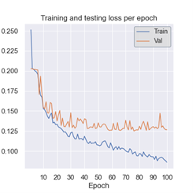
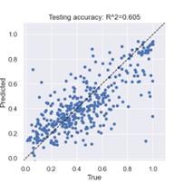

# CHE600 Class 21

Topics today:
* Solving regression problems with PARROT
* Homework IV: comparisons between networks trained on similar but different datasets.


# Regression training with PARROTT

1. Last week we saw how PARROT can be used to classify amino acid sequences into one of 3 classes. This is a broad problem that can be applied to many types of datasets. However, other datasets map a dataset (in our case a sequences) onto a value that is non-discrete. For example, one can design train a network to predict the average radius of a protein given its sequence. The average radius is not a class, and can assume any positive real number. This is a regression problem.

2. In today’s class we will be looking at transcription activation domains – these are protein regions that mediate DNA transcription into mRNA, which then gets expressed into a protein. The rules the determine how “potent” these activation domains are remain an open question in biology.

3. Recent papers have used high-throughput approaches to experimentally measure the activity of hundreds of these activation domains. We will look at two of these datasets:

    * [erijman_ad.tsv](./files/erijman_ad.tsv) contains data from Erijman et al.: A High-Throughput Screen for Transcription Activation Domains Reveals Their Sequence Features and Permits Prediction by Deep Learning. Mol. Cell 78, 890–902.e6 (2020).

    * [staller_ad.tsv](./files/staller_ad.tsv) contains data from Staller et al: A High-Throughput Mutational Scan of an Intrinsically Disordered Acidic Transcriptional Activation Domain. Cell Syst 6, 444–455.e6 (2018).

4. Our goal is to train a PARROT network on each of these datasets, assess how well the training went, and then try out the network on the other dataset. We will then measure how well the network trained on one dataset will perform on the other.

## I. Exploring the datasets

1. In essence – both datasets are similar. Both contain sequences that are of similar length (44 residues in Staller, 52 in Erijman). In both sequences activities are mapped on to a relative scale, with higher numbers being more active and lower numbers being less active. However, there are some differences between the datasets.

2. Let’s check out some statistics on each of these datasets. In a new notebook, import each of the datasets into a pandas dataframe and plot a histogram of the activity score using ```plt.hist()```.

3. When you’ve done this for both datasets, you’ll notice that the activity values between the two datasets are different. However, they mean the same thing – when activity is high these values are high. When it is low, the values are low. Let’s normalize both datasets such that the activity ranges between 0 and 1 by using the following formula:

$$y_{norm}=\frac{y-y_{min}}{y_{max}-y_{min}}$$

4. Here y is the activity, and $y_{min}$ and $y_{max}$ are the global minimum and maximum activity in the entire dataset. Each dataset should have its own minimum and maximum.

5. Assign these values into a new column on your pandas dataframe, and plot the histograms again to compare the two datasets. Pay attention to differences between these.

## II. Creating training datasets for PARROT

We next want to create a text file that will be used for ML training. We've seen the format for a classification training set last week. 

1. For this, we'll create a new dataset using the ```.to_csv()``` command that includes the normalized activation. Below is an example of such an export:

```python
df[['index','seq','norm_act']].to_csv('staller_ad_norm.tsv',sep=' ',header=False, index=False)
```

2. Make sure to open the text file that you created and see that it's in the right format.

# Training a network for a regression problem

Next we want to use PARROT to train a network to predict "activation" from sequence.

1. The procedure is very much similar to what we’ve seen for classification problems – we will train on entire sequences (ie dtype is sequence and not residue) but instead of 3 classes we will tell PARROT there is only a single class. By setting the variable ```num_classes = 1```  we tell PARROT this is a regression (not calssification) problem.

2. Adapt the code we wrote [last week](../Class_21/README.md) to run the regression. Because the dataset is 10-20 times larger than what we’ve seen before, training will take longer.

3. Use this code to train two networks – one on the normalized Staller dataset, and one on the normalized Erijman dataset.

# Assessing the accuracy of a regression network

For regression networks, we no longer get a confusion matrix like we did for classification problems. 

1. assessment is generally done using an $R^2$ or pearson coefficient analysis. Let’s look at the figures generated during our training. First, the value loss per epoch is shown in the graph below:




2. It’s easy to see that while the training loss continues to drop, we’ve reached a steady state for the validation loss, and haven’t over-trained our network (remember that these results will differ from yours because dataset splitting into training/validation/test sets is done randomly!)

3. To assess the predictive capability of our network, we look at the correlation between the predicted and the real values of the test dataset:



4. We can see that there is a strong positive correlation – but it is by no means perfect. Some points miss by a lot. The output text file contains only two parameters – the Spearman and Pearson R values – both relate to the correlations between the predicted value and the true value, where 0 implies very poor correlation and 1 is a perfect correlation.

5. **Make sure the correlation plot for each network is displayed in your notebook for homework submission (or upload it directly)!**

# Using networks on different datasets

1. On a basic level, both the Staller and Erijman experiments meansure the same thing: the ability of short segments of amino acids to activate gene expression. Naively, we might assume that they should be able to make accurate prediction for the other experiment's dataset. Is this the case?

2. To answer the question, you will take the network trained on one experiment, and use it to predict the activity values of the other experiment. The code to use PARROT for prediction is available in [class 21](../Class_21/README.md#predictions-with-ml). 

3. **Plot the value of the activity predictions vs their experimental values for each of the two experiments using the other network, and calcuate the pearson correlation (using ```scipy.stats.pearsonr()```). Display the r value in text or in the graph.**

4. **In a markdown cell, write your insights about this process. Do the networks do a good job of predicting experimental results from a different experiment? **

# **Bonus** Training on both datasets

Finally, to see if we can do better, let’s combine both datasets to train a single network. Repeat all the operations we’ve done so far. Show the results of each training on the test dataset. With this network, predict only the staller dataset, then only the erijman datasets, and show the pearson correlation coefficient. Is it any better than individually trained networks?
