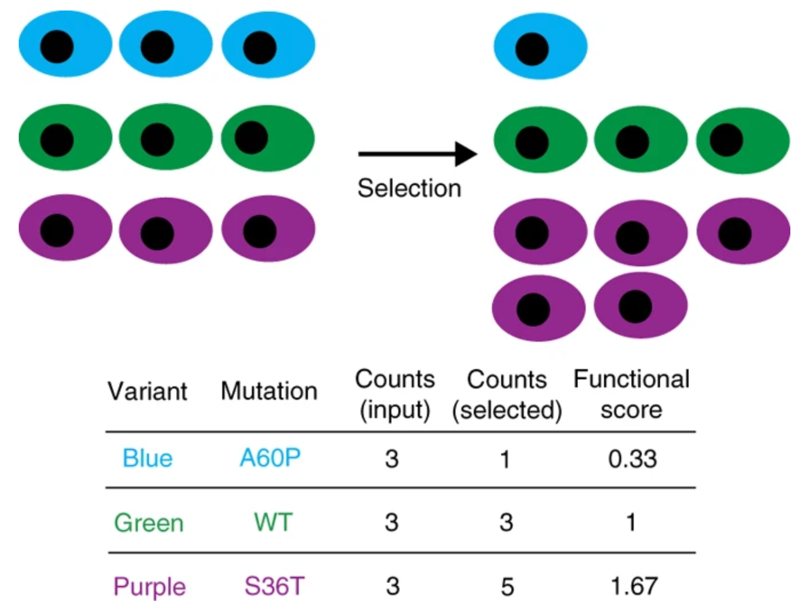
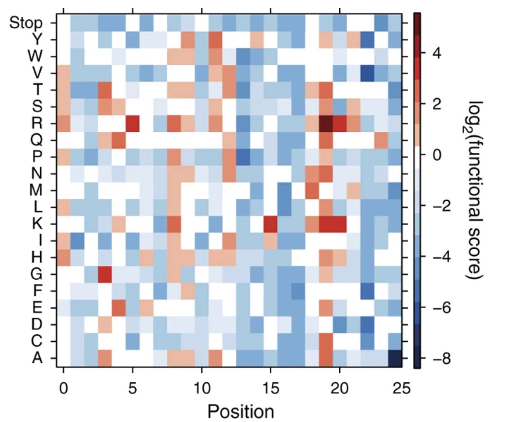

# CHE600 - class 23

Topics today:

* [Using pre-trained networks](#using-pretrained-networks)
* [Introduction to ESM](#introduction-to-esm)
* [ESM Embeddings](#esm-embeddings)
* [Using embeddings for prediction](#using-embeddings-for-prediction)
* [Turning embeddings into a predictor](#turning-embeddings-into-a-predictor)

# Using pretrained networks

Last class we've seen how we can train a machine learning network. We've also seen this can take a long time, and is not very effective with small datasets. Often, it's better to let other train the networks - we can just use these trained networks!

1. For ChatGPT - we of course do not need to train the network every time we want to use it. It is alrady trained, and provided an input (prompt), can make a prediction (the output text)

2. For our application, if we had a network trained on related data to ours, we might be able to use the trained network to predict our experimental results. Note that this is different from "training the network"!

3. Ultimately, network predictions rely on the network converting our input to a _latent representation_ that contains far more information than what we provided.

4. Because this _latent representation_ contains far more information than just what we provide, it becomes a powerful tool to make connections to experimental data.

5. Today we will use Meta's Evolutionary Scale Model (ESM) - a protein language model trained on hundreds of millions of protein sequences.

# Introduction to ESM

Evolutionary Scale Model (ESM) was developed over several years, with the first major paper appearing in [2021](https://www.pnas.org/doi/full/10.1073/pnas.2016239118). The model was trained on 250 million protein sequences taken across all of evolution.

1. The training here was done using similar bidirectional networks used in PARROT, but in a far larger scale.

2. In parrot, our learning objective was to map sequence to a class or numerical parameter. Here, the training objective was to guess "masked" amino acids.

3. Essentially, the model is fed full length sequences, and the validation set is a set of sequences with specific amino acids "masked":

```
> wildtype sequence
MQIFVKTLTGKTITLEVEPSDTIENVKAKIQDKEGIPPDQQRLIFAGKQLEDGR
> masked sequence
MQIFVKTLT_KTITLEVEPSDTIE_VKAKIQDKEGIPP_QQRLIFAGKQLEDGR
```

4. To assess the loss of the model, it will need to guess the masked residues in the validation set. This is sometimes called "self-supervised learning" - since the model trains itself to learn one part of the input from another part of the input

5. The resulting model can read and create a latent representation (also known as an _embedding_) of any protein sequence. This representation contains information about biological properties including structure and homology.

6. Because of this, ESM sequence embeddings are extremely powerful, and can be used to predict structure, activity, and mutational effects to name a few.

# ESM embeddings

Our first task will be to embed a protein sequence in ESM and have a look at what this embedding looks like. 

1. To perform this embedding, we will first need to install the esm library, as well as torch which may already be installed

```python
%pip install torch
%pip isntall fair-esm
```

2. Next, lets import esm and write in a sequence:

```python
import torch
import esm
```
```python
seqs = [
    ("protein1", "MKTVRQERLKSIVRILERSKEPVSGAQLAEELSVSRQVIVQDIAYLRSLGYNIVATPRGYVLAGG"),
    ("protein2", "KALTARQQEVFDLIRDHISQTGMPPTRAEIAQRLGFRSPNAAEEHLKALARKGVIEIVSGASRGIRLLQEE")]
```

3. We're now going to import the model, and the alphabet that converts our sequence into numerical tokens:

```python
# Load ESM-2 model and the tokenizer (alphabet)
model, alphabet = esm.pretrained.esm2_t33_650M_UR50D()
# helper tool to tokenize multiple sequences
batch_converter = alphabet.get_batch_converter()
```

4. Next we're going to use the alphabet's batch converter to convert both of our sequences to tokens:

```python
# create tokens for all proteins in seqs
batch_labels, batch_strs, batch_tokens = batch_converter(seqs)
# get the protein lengths (because tokenizing will be of the length of the longest sequence!)
batch_lens = (batch_tokens != alphabet.padding_idx).sum(1)
# print out the tokens
print(batch_tokens)
# print out the shape of the tokens
print(batch_tokens.shape)
# print out the length of the proteins
print(batch_lens)
```

5. You'll notice that this tokenized version of our sequences contains a list of integers. In ESM2, the index 0 is the start of the sequence (N-terminal), the index 2 is the end of the sequence (C-terminal), and the index 1 is used for padding. There are integers for each of the amino acids, and then several values for other options (e.g. masking)

6. Next we are going to take these tokens and embed them in the model:

```python
# do not include gradients
with torch.no_grad():
    # embed the tokens into ESM2
    results = model(batch_tokens, repr_layers=[33])
```
```python
# let's look at the results (which contrain the embeddings):
print(type(results))
print(results.keys())
print(type(results['representations']))
print(results['representations'].keys())
print(type(results['representations'][33]))
print(results['representations'][33])
print(results['representations'][33].shape)
```

7. The embedded representations of our sequences is taken from the final hidden layer (aka the output layer) consist of a 1280 matrix for every position in the token. To get a more useful value, we will average all of these that represent amino aicds to a single 1280 vector for each amino acid:

```python
# extract the token representation from the results
token_representations = results["representations"][33]
# create a list that will not contain SEQUENCE representation
sequence_representations = []
for i, tokens_len in enumerate(batch_lens):
    # average the embeddings of each sequence according to their length
    sequence_representations.append(token_representations[i,1:tokens_len-1].mean(0))
```
```python
# now let's look at the representation of each sequence
print(sequence_representations[0].shape)
print(sequence_representations[1].shape)
```

8. Note that now we have a 1,280 vector for each of our two sequences - these are the sequences _embedded_ into the ESM algorithm.

```python
print(sequence_representation[0])
```

9. The actual content of these vectors is a series of numbers - it is meaningless to us, but it contains information not only about the actual sequence but its context and patterns in relation to the training set (that is hundreds of millions of sequences strong)!

# Using embeddings for prediction

Because ESM emebeddings contain much information beyond mere sequence, they can be used to find "rules" that connect the sequence to experimental results. We will next use these embeddings to predict the effect of mutations on an ezyme

## I. Deep mutational scanning

1. Deep mutational scanning refers to experiments where every single amino acid in a protein is mutated to every other amino acid type - this is generally using sequencing based approach. The underlying hypothesis is that mutations that are deleterious will cause a drop in population, and mutations that are beneficial will cause a rise in population of cells expressing the constructs (images adapted from [Fowler & Fields, Nat Methods 2014](https://www.nature.com/articles/nmeth.3027)):



2. Based on the enrichement or depletion of population (as discerned by sequencing), one can assign a score for every single mutations:



3. We focus on a deep mutational scan performed by [Fernberg et al](https://academic.oup.com/mbe/article/31/6/1581/2925654?login=false) of $\beta$-lactamase - an enzyme that breaks down the beta-lactam ring in beta-lactam antibiotics, rendering them ineffective and leading to antibiotic resistance. 

## II. Preparing the job

1. Start a new notebook for this class.

2. You will need to have the following libraries installed in your python kernel. Use ```%pip install``` to install them if you haven't yet: 
    * torch
    * scikit-learn
    * xgboost
    * fair-esm
    * scipy

3. The following imports will need to be placed in the first cell:

```python
import torch
import numpy as np
import pandas as pd
import matplotlib.pyplot as plt
from sklearn.model_selection import train_test_split
import xgboost as xgb
import esm
```

## III. Embedding single-point mutation variants into ESM

1. The dataset of the sequence of all single point mutations is provided [here](./files/dms.csv) - this is a comma seperated values file that contains each mutation and the log2 fold-change in the activity of the mutant variant (as measured antibiotic survival). Import it and explore the data:

```python
data = pd.read_csv('dms.csv',index_col=0)
data['log2FC'].hist()
```

2. There are 5,397 variants with activities mapped. We next need to embed each of these sequences into ESM.

3. Since embedding all these sequences will take a long time, I've provided a pre-embedded tensor for each sequence. Get them by downloading the [compressed embeddings file](./files/embeddings.zip) and unzipping it in the same directory. 

3. Next we're going to want to make one big matrix from all these embeddings. Use the followinf code to import every embedding from the ```./embeddings``` directory:

```python
# sequence embedding list
X = []
# activity value list
y = []
# loop over every variant
for var in data.index:
    # append the log2FC (activity) value to ys
    y.append(data.loc[var,'log2FC'])
    # load the embedding of the variant
    emb = torch.load('./embeddings/'+var+'.pt')
    # append the embedding to Xs
    X.append(emb['mean_representations'][33])
# convert Xs to a pytorch tensor
X = torch.stack(X, dim=0).numpy()
```
```python
print(X.shape)
print(len(y))
```

4. We now have a 5,397 x 1,280 matrix - the 1,280 element embedding for each of our 5,397 sequences.

# Turning embeddings into a predictor

1. Now that we have our embeddings, we can use regression to find the relationship between an embedded sequences and its activity value. The problem we are trying to solve is:

$$y = \textbf{X}\beta + \epsilon$$

* $y$ is an n-element vector (our activities)
* $\textbf{X}$ is an $n \times p$ matrix of inputs (our 5397 X 1280 embedding matrix)
* $\beta$ is a p-element vector of coefficients
* $\epsilon$ is an error vector

2. We solve to find $\beta$ such that the error is minimized (notice this is an optimization problem!):

$$\min_\beta ||y-\textbf{X}\beta||^2$$

3. With $\beta$ found, we can now use beta on ANY embedding to get a prediction (remember there is still an error $\epsilon$ for the activity:

$$ y + \epsilon = x\times \beta$$

4. The vector $\beta$ is essentially a series of weights that describes the significance of each of the 1,280 elements in our embeddings to the provided activity.

5. There are many methods and libraries implementing these methods that can solve these multiple regression problems. We will use an algorithm called extreme gradient boosting, implemented in the [XGBoost](https://xgboost.readthedocs.io/en/stable/index.html) library.

## I. Creating the training, validation, and test datasets

1. We'll first want to divide our datasets into training, validation, and test, similar to what we've done with PARROT. To do this, we use the ```train_test_split()``` function from scikit-learn:

```python
# first create the training dataset (70% of the data)
X_train, X_temp, y_train, y_temp = train_test_split(X, y, test_size=0.7)
# next split the remaining 30% into validation and testing (15% each)
X_val, X_test, y_val, y_test = train_test_split(X_temp, y_temp, test_size=0.5)
```

2. Explore the datasets. How many sequences in each embedding? Are the activity values evenly distributed?

## II. Setting up the regression model and training

1. Next will build the regression model. XGBoost has a classifier and a regressor - of course since we are mapping to a continuous value we should be using a regressor - the function is ```xgb.XGBRegressor()```. There are MANY paramteres that can be passed to this function, we will only set a few and leave the rest at default value:

```python
# Train with early stopping
xgb_model = xgb.XGBRegressor(n_estimators=1000,
                             early_stopping_rounds=10, 
                             eval_metric='rmse',
                             objective='reg:squaredlogerror',
                             learning_rate=0.1,
                             max_depth=6,
                             subsample=0.8,
                             colsample_bytree=0.8)
```

2. We next use the regression model we created to fit the training set's embeddings to activity using the model's ```fit()``` function. To avoid over-training, we set an evaluation metric (rmse) against the validation dataset that will tell the fitting to stop once 10 rounds (epochs) complete without significant improvement to loss:

```python
xgb_model.fit(X_train, y_train, eval_set=[(X_val, y_val)])
```

3. With training done, let's have a look at the prediction of our test dataset. To do this, we use the ```predict()``` function of the model we created (```xgb_model```)

```python
# predict the activities of the test set embeddings
y_pred = xgb_model.predict(X_test)

# plot prediction vs experimental data
fig,ax = plt.subplots(figsize=[5,5])
ax.scatter(y_test,y_pred,s=2)
ax.plot([-1,2],[-1,2],'--',c='k')
ax.set_xlim(-0.1,1.2)
ax.set_ylim(-0.1,1.2)
ax.set_xlabel('experiment')
ax.set_ylabel('prediction')

# calculate pearson's r:
from scipy.stats import pearsonr
ax.text(0,1,"pearson's r: %.2f"%(pearsonr(y_test,y_pred).statistic))
```

4. Try playing around with the regression parameters and see if you can get any improvement in prediction.

5. Finally, let's look at the importances of each element of the embedding (essentially the value of $\beta$ in our first equation). These are obtained from the ```.feature_importances_``` attribute of our fitted model ```xgb_model```:

```python
importance = xgb_model.feature_importances_

# Plot feature importance
fig,ax = plt.subplots(figsize=(10, 6))
ax.bar(range(len(importance)), importance)
```

## III. Saving our model for reuse

1. XGBoost allows us to save a model to a JSON file, and this model can then be loaded and re-used using the ```save_model()``` function:

```python
xgb_model.save_model('model.json')
```

2. To load the model, we'll create a new regression model and then use its ```load_model()``` function:

```python
loaded_model = xgb.XGBRegressor()
loaded_model.load_model('model.json')
```

3. We can now use this loaded model to get a prediction for an all new sequence - but we will first need to embed the sequence in ESM:

```python
# define the sequence list
seq = [('test_seq','MSIQHFRVALIPFFAAFCLPVFAHPETLVKVKDAEDQLGARVGYIELDLNSGKILESFRPEERFPMMSTFKVLLCGAVLSRVDAGQEQLGRRIHYSQNDLVEYSPVTEKHLTDGMTVRELCSAAITMSDNTAANLLLTTIGGPKELTAFLHNMGDHVTRLDRWEPELNEAIPNDERDTTMPAAMATTLRKLLTGELLTLASRQQLIDWMEADKVAGPLLRSALPAGWFIADKSGAGERGSRGIIAALGPDGKPSRIVVIYTTGSQATMDERNRQIAEIGASLIKHW'),
       ('test_seq2','MSIQHFRVALIPFGGAFCLPVFAHPETLVKVKDAEDQLGAGGGGGLNSGKILESFRPEERFPMMSTFKVLLCGAVLSRVDAGQEQLGRRIHYSQNDLVEYSPVTEKHLTDGMTVRELCSAAITMSDNTAANLLLTTIGGPKELTAFLHNMGDHVTRLDRWEPELNEAIPNDERDTTMPAAMATTLRKLLTGELLTLASRQQLIDWMEADKVAGPLLRSALPAGWFIADKSGAGERGSRGIIAALGPDGKPSRIVVIYTTGSQATMDERNRQIAEIGASLIKHW')]
```
```python
# create the model and alphabet
model,alphabet = esm.pretrained.esm2_t33_650M_UR50D()
# get the batch converter
batch_converter = alphabet.get_batch_converter()
# tokenize sequences using batch converter
batch_labels, batch_strs, batch_tokens = batch_converter(seq)
# create the emebeddings
results = model(batch_tokens, repr_layers=[33])
# extract the final layer of the embedding and average it
emb = results['representations'][33].mean(1).detach().numpy()
```

4. Look at the embeddings to see that they make sense

5. Try the prediction, both from the original trained model and the loaded model:

```python
xgb_model.predict(emb)
```
```python
loaded_model.predict(emb)
```

