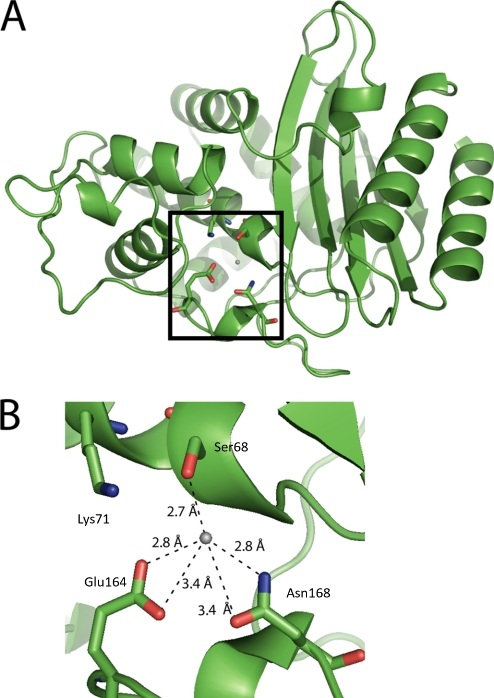

# CHE600 - class 24

Topics today:

* [Turning embeddings into a predictor](#turning-embeddings-into-a-predictor)
* [Insights from predictors](#using predictors)

# Turning embeddings into a predictor

Last class we've used the XGBoost regressor to obtain a regression model that, when applied to an ESM embedding, can provide a prediction for the activity of a $\beta$-lacatamase variant.

1. Start a new jupyter notebook, and import the following libraries:

```python
import pandas as pd
import matplotlib as plt
import numpy as np
import esm
import xgboost as xgb
```

1. The regression model was saved last week as ```model.json``` - make sure it exists in your current working directory.

2. Let's load the regression model:

```python
# create an empty regression model object
model = xgb.XGBRegressor()
# load our model into it using the model.load() function
model.load_model('model.json')
```

3. We can now use this loaded model to get a prediction for an all new sequence - but we will first need to embed the sequence in ESM:

```python
# define the sequence list
seq = [('test_seq','MSIQHFRVALIPFFAAFCLPVFAHPETLVKVKDAEDQLGARVGYIELDLNSGKILESFRPEERFPMMSTFKVLLCGAVLSRVDAGQEQLGRRIHYSQNDLVEYSPVTEKHLTDGMTVRELCSAAITMSDNTAANLLLTTIGGPKELTAFLHNMGDHVTRLDRWEPELNEAIPNDERDTTMPAAMATTLRKLLTGELLTLASRQQLIDWMEADKVAGPLLRSALPAGWFIADKSGAGERGSRGIIAALGPDGKPSRIVVIYTTGSQATMDERNRQIAEIGASLIKHW'),
       ('test_seq2','MSIQHFRVALIPFGGAFCLPVFAHPETLVKVKDAEDQLGAGGGGGLNSGKILESFRPEERFPMMSTFKVLLCGAVLSRVDAGQEQLGRRIHYSQNDLVEYSPVTEKHLTDGMTVRELCSAAITMSDNTAANLLLTTIGGPKELTAFLHNMGDHVTRLDRWEPELNEAIPNDERDTTMPAAMATTLRKLLTGELLTLASRQQLIDWMEADKVAGPLLRSALPAGWFIADKSGAGERGSRGIIAALGPDGKPSRIVVIYTTGSQATMDERNRQIAEIGASLIKHW')]
```
```python
# create the model and alphabet
model,alphabet = esm.pretrained.esm2_t33_650M_UR50D()
# get the batch converter
batch_converter = alphabet.get_batch_converter()
# tokenize sequences using batch converter
batch_labels, batch_strs, batch_tokens = batch_converter(seq)
# create the emebeddings
results = model(batch_tokens, repr_layers=[33])
# extract the final layer of the embedding and average it
emb = results['representations'][33].mean(1).detach().numpy()
```

4. Look at the embeddings to see that they make sense

5. Try the prediction, both from the original trained model and the loaded model:

```python
xgb_model.predict(emb)
```
```python
loaded_model.predict(emb)
```

# Insights from predictors

Our regression model was trained only on single-point mutations. Can it predict multi-point mutations? Let's find out.

1. Our multiple point mutations should test specific hypotheses. The wildtype sequence is shown below. Create at least 10 different multiple point mutations, each of which should involve mutating at least 2 of the 4 residues involved in the active site:

```
MSIQHFRVALIPFFAAFCLPVFAHPETLVKVKDAEDQLGARVGYIELDLNSGKILESFRPEERFPMMSTFKVLLCGAVLSRVDAGQEQLGRRIHYSQNDLVEYSPVTEKHLTDGMTVRELCSAAITMSDNTAANLLLTTIGGPKELTAFLHNMGDHVTRLDRWEPELNEAIPNDERDTTMPAAMATTLRKLLTGELLTLASRQQLIDWMEADKVAGPLLRSALPAGWFIADKSGAGERGSRGIIAALGPDGKPSRIVVIYTTGSQATMDERNRQIAEIGASLIKHW
```

2. I recommend making these mutations in a text editor. Here are some ideas for hypotheses:

3. The active site of $\beta$-lactamase, shown below (adapted from [Brown et al., JBC 2009](https://pmc.ncbi.nlm.nih.gov/articles/PMC2785212/)):



We hypothesize that multiple point mutations to these residues will dramatically decrease the activity of the enzyme. Make some mutations that you expect to completely destroy protein activity (for example, changing all active site residues to Gly or Ala).

4. We can hypothesize that mutations that conserve the chemical nature of the active site will conserve the activity, or at least not destroy it completely. Make some mutations that might retain activity - for example, mutate to chemically similar amino acids (Lys to Arg, Glu to Asp)

5. We can hypothesize that mutations that individually increase activity will have a synergistic effect. Look at the [experimental dataset from last week](../Class_23/files/dms.csv) and make several multiple-point mutations that you expect will, together, increase activity! 

6. We can hypothesize that mutations that do not affect activity indivdually will not have an effect together. Make several point mutations that test this.

## I. Embedding new sequences and predicting the results


With your sequences prepared, we next embed them into ESM. Today we will do this manually, but generally speaking this can be done programmatically on thousands of sequences.

1. Copy and paste the sequences you designed in a list of tuples, similar to the one shown above. I recommend specifiying the mutations in the seqnece name field, or the specific hypothesis they belong to:

```python
seqs = [('S68K,K71P','MSIQ....'),('S68K,K71S','MSIQ....'),...]
```

5. With your list of sequences done, embed them into ESM and run ```model.predict()``` as shown above.

6. Describe the result of each of the hypotheses you tested. Do you believe the predictions? Why or why not? Answer in a markdown cell in your notebook.

7. Upload the completed notebook to Blackboard.

